## Overview

### IaaS+

**I**nfrastructure **a**s **a** **S**ervice is the cloud service model we support with the Exoscale platform and a bit more, hence, IaaS+.

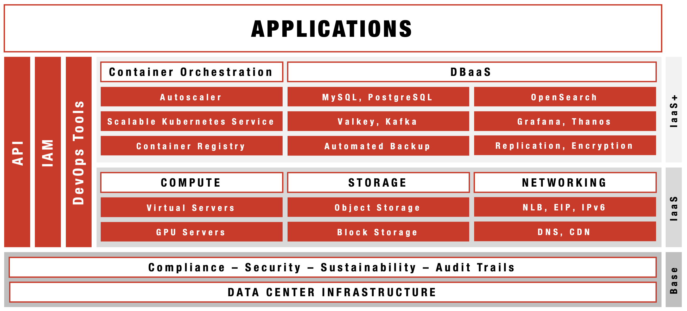

#### VIDEO
[IaaS+](https://sos-de-fra-1.exo.io/exoscale-academy/videos/csa-overview-01.mp4)

### Data Centers

Getting the necessary cloud infrastructure components is easy. In Europe, there is always an Exoscale data center near you.


#### VIDEO
[Data Centers](https://sos-de-fra-1.exo.io/exoscale-academy/videos/csa-overview-02.mp4)


### Benefits

Before we start the Solution Architect journey, we need a quick overview of the main benefits of using the cloud infrastructure provided by the Exoscale platform and the portfolio of products it consists of.

The real beauty of the cloud is that everything is customizable and automatable in a variety of ways:

* __OpenAPI__ with all platform functions available
* __Exoscale CLI__ a flexible command-line interface
* __Terraform__ plugins for extensive automation
* __IAM/Keys__ for extensive configuration and access control
* __Custom Templates__ for the ultimate support in OS version choice

#### VIDEO
[Benefits](https://sos-de-fra-1.exo.io/exoscale-academy/videos/csa-overview-03.mp4)

### Platform

A state-of-the-art IaaS platform providing the building blocks for your application infrastructure.

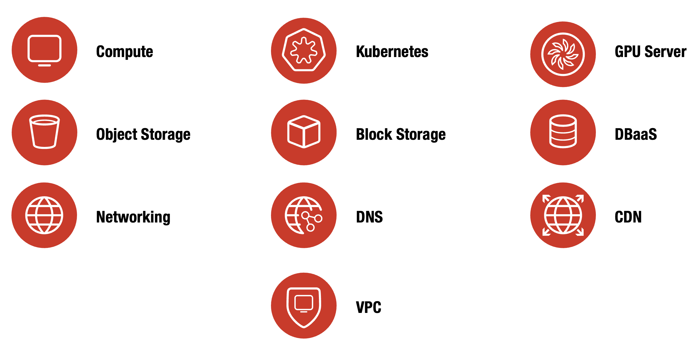

#### VIDEO
[Platform](https://sos-de-fra-1.exo.io/exoscale-academy/videos/csa-overview-04.mp4)


## Compute

### Compute

Exoscale provides a comprehensive, flexible, and scalable cloud computing platform, offering powerful compute instances, advanced networking, and integrated management tools to meet the needs of businesses of all sizes.

> __! NOTE__
Here, you can find more details on 
[Compute](https://community.exoscale.com/documentation/compute/).

#### VIDEO
[Compute](https://sos-de-fra-1.exo.io/exoscale-academy/videos/csa-overview-05a.mp4)


### Instances

Exoscale Instances are flexible, scalable virtual machines that provide dedicated compute resources with a variety of performance options, support custom images, and integrate seamlessly with Exoscale networking and storage. Well-suited for a wide range of workloads, Instances offer reliable performance, automation support, and easy management through API, CLI, or web interface.

> __! NOTE__
Here, you can find more details on 
[Instances](https://community.exoscale.com/product/compute/instances/).

#### Feature Overview
* Instance families tailored for diverse workloads
* Standard, CPU-, Memory-, Storage-Optimized 
* GPUs: NVIDIA A30, V100, A40, A5000, 3080ti 
* Flexible sizing and easy horizontal scaling
* Deployment from standard or custom templates
* Support for private and public networking
* Integrated with block- and object-storage

#### VIDEO
[Instances](https://sos-de-fra-1.exo.io/exoscale-academy/videos/csa-overview-05b.mp4)


### Instance Pools

Instance Pools provide a way to provision and manage groups of identical virtual machines on Exoscale. They support automation of deployment and updates, enable efficient scaling, and are designed for reliability in distributed and stateless application environments.

> __! NOTE__
Here, you can find more details on
[Instance Pools](https://community.exoscale.com/product/compute/instances/how-to/instance-pools/).

#### Feature Overview
* Automated instance group management
* Easy scaling of instances
* Flexible template selection
* Private and public networking support
* Rolling upgrades and replacements
* Integrated load balancing

#### VIDEO
[Instance Pools](https://sos-de-fra-1.exo.io/exoscale-academy/videos/csa-overview-06.mp4)


### SKS (Scalable Kubernetes Service)

SKS provides a managed Kubernetes service on Exoscale. It automates cluster deployment and management, integrates with native cloud resources, and supports simplified scaling and updates, making it suitable for running containerized workloads reliably and efficiently.

> __! NOTE__
Here, you can find more details on
[SKS](https://community.exoscale.com/product/compute/containers/overview/).

#### Feature Overview
* Managed Kubernetes clusters
* Easy node pool scaling
* High-availability control plane
* Automated updates & patching
* Built-in security and isolation
* Seamless load balancing

#### VIDEO
[SKS (Scalable Kubernetes Service)](https://sos-de-fra-1.exo.io/exoscale-academy/videos/csa-overview-07.mp4)


### Block Storage

Block Storage offers persistent, high-performance storage volumes that can be attached to virtual machines. It supports dynamic resizing and is suitable for data-intensive applications requiring reliable, flexible storage solutions.

> __! NOTE__
Here, you can find more details on
[Block Storage](https://community.exoscale.com/product/storage/block-storage/overview/).

#### Feature Overview
* High-performance SSD volumes
* On-demand volume provisioning
* Easy volume resizing
* Data durability and redundancy
* Availability zone integration
* Snapshot and backup support
* Secure encryption at rest

#### VIDEO
[Block Storage](https://sos-de-fra-1.exo.io/exoscale-academy/videos/csa-overview-08.mp4)


### Templates

Templates enable rapid provisioning of virtual machines by providing pre-configured system images. They support consistent deployments, simplify environment setup, and can include custom OS configurations or application stacks.

> __! NOTE__
Here, you can find more details on
[Templates](https://community.exoscale.com/product/compute/instances/how-to/custom-templates/).

#### Feature Overview
* Wide selection of OS images
* Ready-to-use application templates
* Custom template creation
* Regular updates & maintenance
* Verified and secure images
* Cloud-Init and automation support

#### VIDEO
[Templates](https://sos-de-fra-1.exo.io/exoscale-academy/videos/csa-overview-09.mp4)


### Security Groups

Security Groups define network traffic rules for Exoscale instances. They enable you to control inbound and outbound communications at the instance level, supporting isolation and enforcement of security policies in the cloud.

> __! NOTE__
Here, you can find more details on
[Security Groups](https://community.exoscale.com/product/networking/security-group/).

#### Feature Overview
* Network traffic control rules
* Stateful firewall management
* Easy rule definition and editing
* Instance group assignment
* Inbound and outbound filtering
* Fast rule application and updates

#### VIDEO
[Security Groups](https://sos-de-fra-1.exo.io/exoscale-academy/videos/csa-overview-10.mp4)


### Elastic IP

Elastic IP provides static, public IPv4 addresses that can be dynamically associated with instances. This ensures stable external connectivity, supporting failover and IP re-assignment as workload needs change.

> __! NOTE__
Here, you can find more details on
[Elastic IPs](https://community.exoscale.com/product/networking/eip/).

#### Feature Overview
* Public, static IPv4 addresses
* Instant provisioning
* Easy attachment to instances
* Persistent across reboots
* Supports reassignment between resources
* Reverse DNS management

#### VIDEO
[Elastic IP](https://sos-de-fra-1.exo.io/exoscale-academy/videos/csa-overview-11.mp4)

### Load Balancers

Network Load Balancer distributes incoming traffic across multiple instances for improved availability and scalability. It supports automated health checks and can handle high-throughput, low-latency workloads.

> __! NOTE__
Here, you can find more details on
[Network Load Balancer](https://community.exoscale.com/product/networking/nlb/).

#### Feature Overview
* High-availability load balancing  
* Integrated health checks  
* Supports automatic failover  
* Scales automatically with backend instances  
* Operates at Layer 4 (TCP/UDP) and supports all higher-level protocols

#### VIDEO
[Load Balancers](https://sos-de-fra-1.exo.io/exoscale-academy/videos/csa-overview-12.mp4)


### Private Networks

Private Networks allow you to create isolated, custom IP spaces for your instances on Exoscale. They support secure, internal communication between resources, and can be used to segment environments or applications.

> __! NOTE__
Here, you can find more details on
[Private Networks](https://community.exoscale.com/product/networking/private-network/).

#### Feature Overview
* Isolated virtual networks
* Custom IP address ranges
* Secure traffic segmentation
* Supports multiple zones
* Easy attachment to instances
* Flexible network configurations

#### VIDEO
[Private Networks](https://sos-de-fra-1.exo.io/exoscale-academy/videos/csa-overview-13.mp4)


### SSH Keypairs

SSH Keys enable secure, password-less authentication to virtual machines. You can centrally manage public keys within Exoscale to simplify secure access and orchestration of cloud resources.

> __! NOTE__
Here, you can find more details on
[SSH Keypairs](https://community.exoscale.com/product/compute/instances/how-to/ssh-keypairs/).

#### Feature Overview
* Secure SSH key management
* Simple key upload and registration
* Easy assignment to instances
* Supports multiple key pairs
* Centralized key administration
* Fast provisioning and updates

#### VIDEO
[SSH Keypairs](https://sos-de-fra-1.exo.io/exoscale-academy/videos/csa-overview-14.mp4)


### Anti-Affinity

Anti-Affinity groups ensure that member instances are placed on separate physical hosts. This reduces the risk of service disruption and supports high availability for critical, distributed workloads.

> __! NOTE__
Here, you can find more details on
[Anti-Affinity](https://community.exoscale.com/product/compute/instances/how-to/anti-affinity/).

#### Feature Overview
* Instance distribution across hosts
* Reduces single points of failure
* Improves workload availability
* Easy group assignment to instances
* Works with Compute & Instance Pools
* Flexible workload separation
* Seamless integration with deployments

#### VIDEO
[Anti-Affinity](https://sos-de-fra-1.exo.io/exoscale-academy/videos/csa-overview-15.mp4)

## Storage

### Storage

Exoscale’s storage solutions deliver secure, scalable, and high-performance object storage and global content delivery, seamlessly integrating with your workflows to ensure fast, reliable, and cost-effective data management and distribution.

> __! NOTE__
Here, you can find more details on
[Storage](https://community.exoscale.com/documentation/storage/)

#### VIDEO
[Storage](https://sos-de-fra-1.exo.io/exoscale-academy/videos/csa-overview-16a.mp4)


### Object Storage

Exoscale Simple Object Storage (SOS) is a scalable, cost-effective solution for storing and managing large amounts of data. It provides highly available, multi-redundant storage with at least three physical copies for maximum safety. You can securely store assets, backups, media, and other files, with your data always remaining in its original location.

> __! NOTE__
Here, you can find more details on
[Object Storage](https://community.exoscale.com/product/storage/object-storage/)

#### Feature Overview

* S3 compatible
* Direct HTTP/S access
* Metadata support
* ACL and CORS support
* For any data
* Pay for what you use
* Free inbound traffic
* Supports Object Lock and Versioning

The S3-compatible API allows for easy integration with existing workflows and applications. SOS provides low latency, high bandwidth, and secure HTTP(s) access, allowing fast and secure data management from any location. You can enhance this with Exoscale's CDN integration.

#### VIDEO
[Object Storage](https://sos-de-fra-1.exo.io/exoscale-academy/videos/csa-overview-16b.mp4)

### CDN

Exoscale's CDN service, developed with Ducksify, makes distributing your assets globally with Akamai's delivery network simple. It improves performance and user experience by caching assets in multiple locations. You can easily integrate it with our SOS service to make content available through the CDN endpoint.

> __! NOTE__
Here, you can find more details on
[CDN.](https://community.exoscale.com/product/networking/cdn/)

#### Feature Overview

* Modern protocol support
* World-class delivery availability
* Improved download completion rates
* Leveraging the Akamai Intelligent Platform
* QUIC (Quick UDP Internet Connections) support
* Enable on your SOS bucket
* Volume-based pricing
* Powered by Ducksify

The CDN offers predictable pricing and is a reliable solution for enhancing your application's performance.

#### VIDEO
[CDN](https://sos-de-fra-1.exo.io/exoscale-academy/videos/csa-overview-17.mp4)

## DBaaS

### DBaaS

Exoscale’s DBaaS provides secure, fully managed, and GDPR-compliant cloud database services—supporting leading open-source databases—for effortless deployment, maintenance, and scalability. With Exoscale’s DBaaS, you can rapidly deploy encrypted, production-ready databases using a broad selection of leading open-source technologies. Our fully managed service handles all ongoing maintenance, updates, and security, allowing you to concentrate on your core business while ensuring your data is always safe, compliant, and highly available.

> __! NOTE__
Here, you can find more details on
[DBaaS.](https://community.exoscale.com/documentation/dbaas/)

#### Feature Overview

* Full lifecycle management
* Termination protection
* Automatic backup policy
* Available in all zones
* Dedicated instances

Finally, Exoscale's DBaaS offering supports a wide range of open-source databases, allowing users to choose the best database and providing a robust and secure solution for businesses that host their data and databases in the cloud.

#### VIDEO
[DBaaS](https://sos-de-fra-1.exo.io/exoscale-academy/videos/csa-overview-18a.mp4)


### Database Services

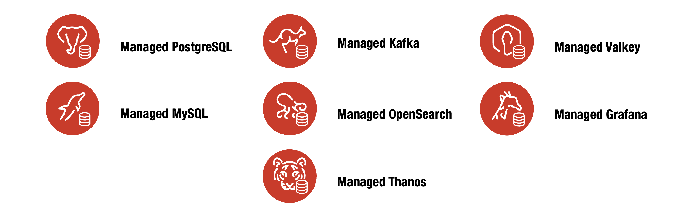

__Managed PostgreSQL Service__
often referred to as Postgres is an advanced, open-source relational database management system (RDBMS). Renowned for its robustness, performance, and extensive feature set, it supports complex queries, transactions, and advanced data types. PostgreSQL is highly extensible and standards-compliant with SQL. Due to its reliability, data integrity, and concurrency features, it is widely used in various environments, from small-scale applications to large-scale enterprise systems. Additionally, it supports numerous programming languages and can handle massive amounts of data efficiently.

__Managed MySQL Service__
is a widely used, open-source relational database management system (RDBMS) known for its speed, reliability, and ease of use. MySQL, developed by Oracle Corporation, supports standard SQL and provides a powerful, flexible, scalable database management solution. It is commonly used for web applications, often in conjunction with PHP, due to its integration with various platforms and ability to handle large volumes of data efficiently. MySQL offers strong support for transactional processing, data replication, and security, making it a popular choice for developers and enterprises seeking robust database performance.

__Managed Kafka Service__
is an open-source stream-processing platform developed by the Apache Software Foundation. It is designed to build real-time data pipelines and streaming applications. Kafka efficiently handles high-throughput, low-latency data transfer and can process millions of messages per second. It operates as a distributed system that ensures fault tolerance and scalability. Kafka's core components—producers, consumers, brokers, topics, and partitions—enable the reliable streaming and storage of data across various systems. It is widely used for log aggregation, event sourcing, real-time analytics, and integrating disparate systems.

__Managed OpenSearch Service__
is an open-source search and analytics engine derived initially from Elasticsearch and maintained by the OpenSearch community and Amazon Web Services (AWS). It provides capabilities for indexing, searching, and analyzing large volumes of data in real-time. OpenSearch is designed to be scalable, highly available, and secure, supporting full-text search, structured search, and complex data analysis. It includes OpenSearch Dashboards for data visualization, enabling users to create interactive charts, graphs, and dashboards. OpenSearch is widely used in log and event data analysis, monitoring, and business intelligence applications.

__Managed Valkey Service__ 
is an open-source, high-performance key/value data store with a Redis™ compatible interface suitable for a wide range of workloads, including caching and message queues. It even serves as a primary database, providing replication capabilities and high availability for critical data. Valkey natively supports robust data structures—such as strings, numbers, hashes, lists, sets, sorted sets, bitmaps, and hyperloglogs—allowing in-place data manipulation using an extensive command set. With built-in Lua scripting and the option to extend functionality through module plugins, Valkey enables developers to create new commands, data types, and more, making it a versatile choice for low-latency data operations and diverse application needs.

__Managed Grafana Service__
is an open-source analytics and monitoring platform that allows users to visualize, analyze, and alert on data from multiple sources. Known for its customizable and interactive dashboards, Grafana supports a wide range of data sources, including Prometheus, Graphite, InfluxDB, and Elasticsearch. It provides powerful query capabilities, real-time alerting, and flexible visualization options like graphs, heatmaps, and histograms. Commonly used for monitoring system performance, application metrics, and business KPIs, Grafana helps teams make data-driven decisions by providing clear, comprehensive insights into their data.

__Managed Thanos Service__
is an open-source, highly available, and scalable solution for long-term storage and global querying of Prometheus metrics. 
Built as an extension to Prometheus, Thanos enables seamless aggregation, deduplication, and querying of metrics data across multiple Prometheus instances and clusters. It provides efficient object storage-backed retention, allowing you to store years’ worth of monitoring data securely and cost-effectively. Thanos supports global, real-time queries through a unified API, making it easy to analyze historical and live metrics from different environments. 
With features like down-sampling, data compaction, and robust query performance, Managed Thanos Service is widely used for centralized monitoring, troubleshooting, and observability in cloud-native and enterprise infrastructure.

#### VIDEO
[Database Services](https://sos-de-fra-1.exo.io/exoscale-academy/videos/csa-overview-18b.mp4)

## DNS

### DNS

Exoscale’s cloud-native DNS delivers robust, automated, and globally resilient DNS management, ensuring fast, reliable, and highly available access to your applications. Exoscale’s cloud-native DNS offers full record management, zone control, and automation, all powered by DNSimple. Benefits include anycast low-latency resolution, per-zone pricing, easy redirects, ALIAS support, GEO replication, and seamless Let's Encrypt integration—ensuring uptime and reliability.

> __! NOTE__
Here, you can find more details on
[DNS.](https://community.exoscale.com/documentation/dns/)

#### Feature Overview

* All common records available
* GEO replication
* Easy redirects
* ALIAS support
* Anycast DNS
* Per zone pricing
* Powered by DNSimple
* Easily integrate with Let's Encrypt

Exoscale's DNS also offers geo-replicated redundancy, providing optimal uptime and ensuring that users' applications are always available, even in a failure. Overall, Exoscale's cloud-native DNS is a robust and reliable solution for businesses looking to manage their DNS and ensure the availability of their applications.

#### VIDEO
[DNS](https://sos-de-fra-1.exo.io/exoscale-academy/videos/csa-overview-19.mp4)

## IAM

### IAM

Exoscale IAM (Identity and Access Management) offers robust, fine-grained identity and access management, enabling secure, flexible control over user and service permissions across all cloud resources. It enables administrators to define roles and policies for both programmatic (keys) and portal users, enhancing security, compliance, and operational efficiency.

> __! NOTE__
Here, you can find more details on
[IAM.](https://community.exoscale.com/documentation/iam/)

#### Feature Overview

* User, Role, and Policy management
* Fine-grained access controls for resources
* Portal and API access support
* Security and compliance enforcement
* Flexible, custom permission scopes for users
* Streamlined management of user and service accounts

#### VIDEO
[IAM](https://sos-de-fra-1.exo.io/exoscale-academy/videos/csa-overview-20.mp4)

## Marketplace

### Marketplace

Exoscale Marketplace provides a curated selection of ready-to-use solution templates and managed services, enabling you to easily scale and extend your applications through seamless integration. Access a complete portfolio online or through the integrated portal, allowing easy deployment of ready-to-use cloud solutions directly from your Exoscale dashboard.

#### Feature Overview
* Curated solution templates  
* Ready-to-use managed services  
* Complete portfolio online and in-portal  
* Fast deployment for scaling applications  
* Easy integration with Exoscale environment

### Web
The complete marketplace portfolio with description can be found here:
[exoscale.com/marketplace](http://exoscale.com/marketplace)

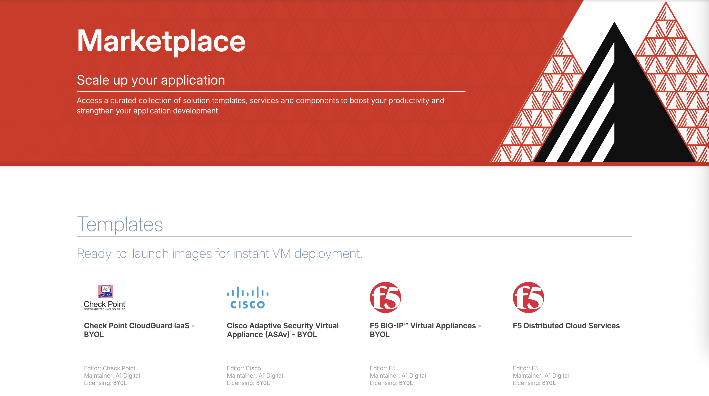

### Portal
The tighly integrated marketplace products are easy to reach in the product portal:
[portal.exoscale.com/marketplace](https://portal.exoscale.com/marketplace)

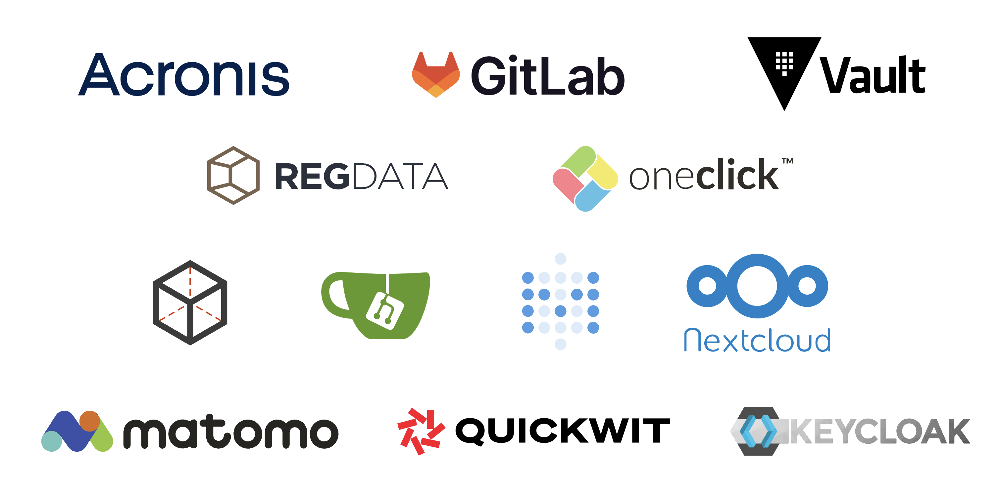

> __! NOTE__
You need to be logged in to your portal account!

#### VIDEO
[Marketplace](https://sos-de-fra-1.exo.io/exoscale-academy/videos/csa-overview-21.mp4)

## Organization

### Organization

The Organization section centralizes all aspects of billing, usage, subscriptions, quotas, audit trails, and compliance, giving you complete control and visibility over your Exoscale account and resources.	Get clear usage details, easily handle payments, manage resources and legal documents, and monitor activities—all within a secure and organized interface.

> __! NOTE__
Here, you can find more details on
[Organization.](https://community.exoscale.com/platform/organization/)

#### Feature Overview
* Account & billing info management  
* Credit cards & payment options  
* Usage and consumption details  
* Invoices lookup and sorting  
* Subscriptions management (DNS, Support)  
* Security audit-trail monitoring  
* Resource quotas overview & management  
* Centralized legal documents & compliance center  

#### VIDEO
[Organization](https://sos-de-fra-1.exo.io/exoscale-academy/videos/csa-overview-22.mp4)

## Support

### Support

Exoscale’s support services offer a range of flexible plans—from free built-in support to 24/7 enterprise assistance—ensuring every customer receives the right level of help and responsiveness for their unique needs. Plans vary by response time, hours, audit trail, compliance, and dedicated manager, ensuring scalable and reliable assistance for all needs.

> __! NOTE__
Here, you can find more details on
[Support.](https://www.exoscale.com/support/)

#### Feature Overview
* Support ticket management by status  
* Multiple plans: Built-In, Starter, Pro, Enterprise  
* Response times: best-effort up to 30 minutes  
* Support hours from Office to 24/7  
* Comprehensive audit trail options  
* 2FA and SSO support  
* Resource usage reporting  
* PEN-testing and right to audit

#### VIDEO
[Support](https://sos-de-fra-1.exo.io/exoscale-academy/videos/csa-overview-23.mp4)


## Compute

### Compute

Exoscale provides a comprehensive, flexible, and scalable cloud computing platform, offering powerful compute instances, advanced networking, and integrated management tools to meet the needs of businesses of all sizes.

### Add Instance – Process

* __Name__ – easier instance identification
* __Template__ – Linux, Windows, Custom, Marketplace
* __Zone__ – data center location
* __Instance Type__ – Standard, Memory, Disk, CPU, GPUs
* __Disk Size__ – define your storage size
* __SSH Keys__ – increase your login security (Linux)
* __Public IP Assignment__ – IPv4, IPv4+IPv6, none (private)
* __Private Networks__ – network configuration flexibility
* __Security Groups__ – instance firewall settings
* __Anti-Affinity Groups__ – increase redundancy/availability  
* __TPM__ – enabled/disabled
* __Secure Boot__ – enabled/disabled
* __Auto Start__ – enabled/disabled
* __User Data__ – automation after instance boot

### Add Instance - Example Linux

A step-by-step guide to manually creating a Linux-based compute instance with a web server:

* Configure a Security Group to allow HTTP and SSH access  
* Generate an SSH Key Pair for authentication  
* Launch a Compute Instance  
* Install a Web Server via SSH

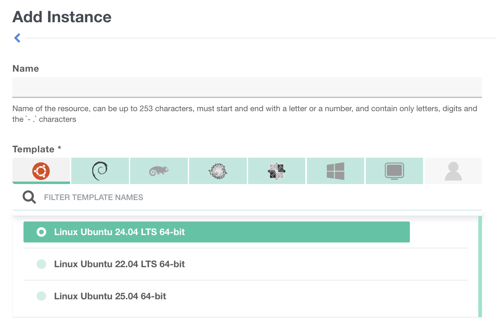 

__Example Specifications:__

* __Name__ = my-new-instance
* __Template__ = Linux Ubuntu 24.04 LTS 64-bit
* __Zone__ = AT-VIE-1
* __Instance Type__= STANDARD - Tiny
* __Disk__= 10 GiB SSD
* __Security Groups__= sample-group
* __SSH Keys__= my-key


#### Security Group - default

Security Groups are the Compute Instance firewall, all Instances are linked to at least one Security Group called __default__.

* BLOCK all incoming traffic
* ALLOW all outgoing traffic

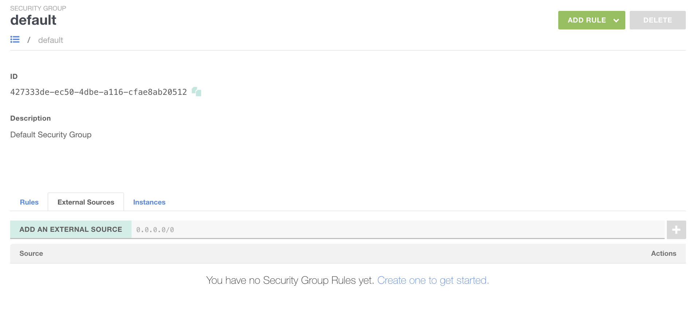 

#### Security Group - for Linux

Creating a Security Group called sample-group and ALLOW: 

* HTTP access (port 80)
* SSH access (port 22)

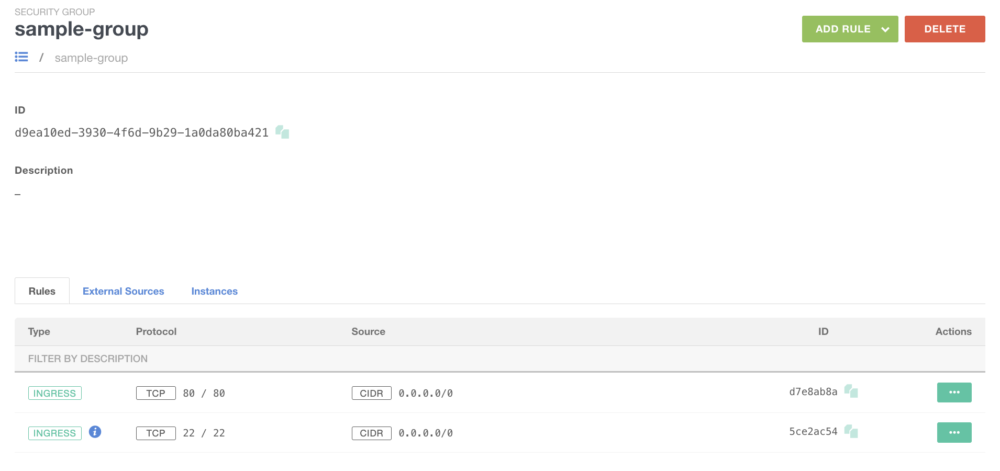 

#### SSH Keys - Linux
Generate an SSH key and import it into the portal under the name _my-key_.

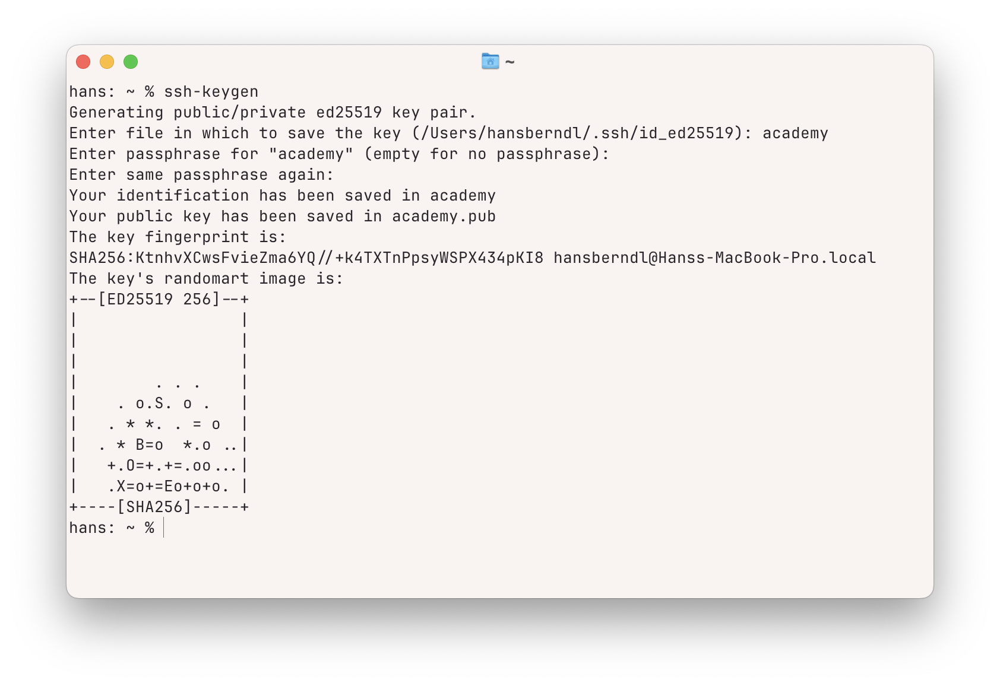

> __! NOTE__ 
Never share the private key with anyone !!!

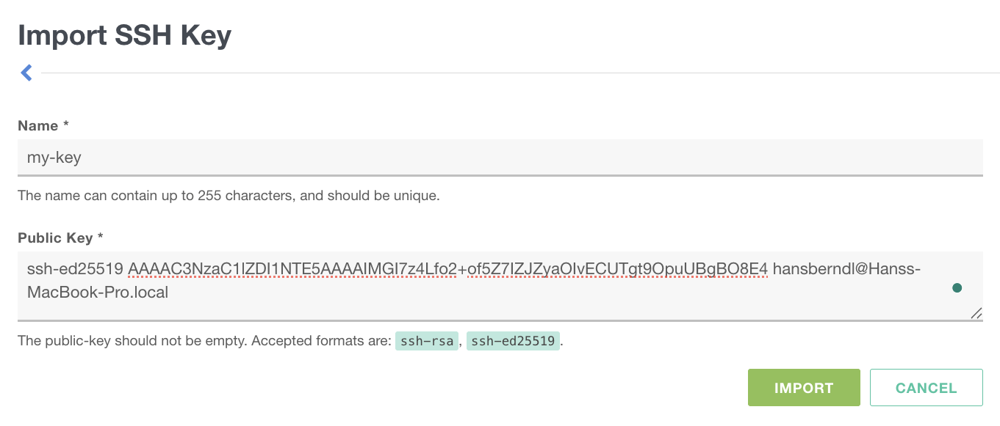

#### Compute Instance - Linux

* __SSH Key__ (my-key) generated and imported.
* __Security Group__ (sample-group) added and configured.
* __Instance__ (my-new-Instance) created.

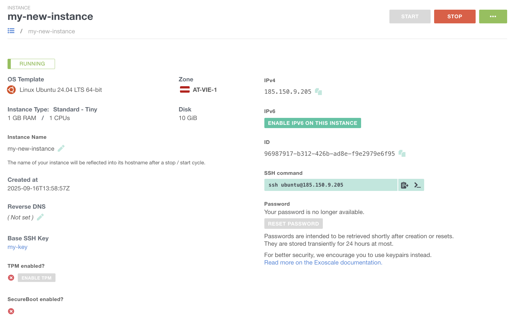

#### Instance Usage - Linux

Accessing your Linux server on the created instance using an SSH key allows you to connect without a password. The process involves a specific sequence of tools, which varies depending on the client operating system you use. 

__Access from Linux or Mac__

* `> ssh-add <ssh-key>` 
* `> ssh root@<server-ip>`

__Access from Windows__

* Start the PuTTY authentication agent program Pageant and add the `<ssh-key>` 
* Start the program PuTTY and enter the `<server-ip>`

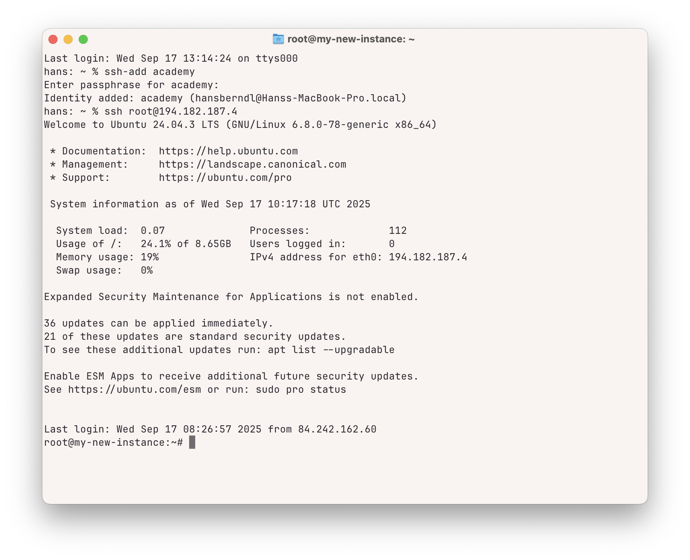

#### Web Server - Linux

Installing NGINX web server via the _apt-get_ package manager:

* `> apt install -y nginx`
* `> systemctl start nginx`

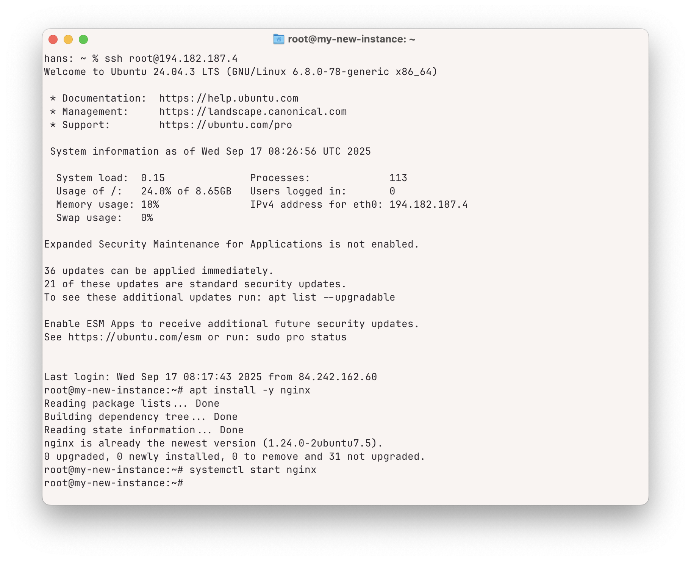

__Web Server accessible via Server-IP:__

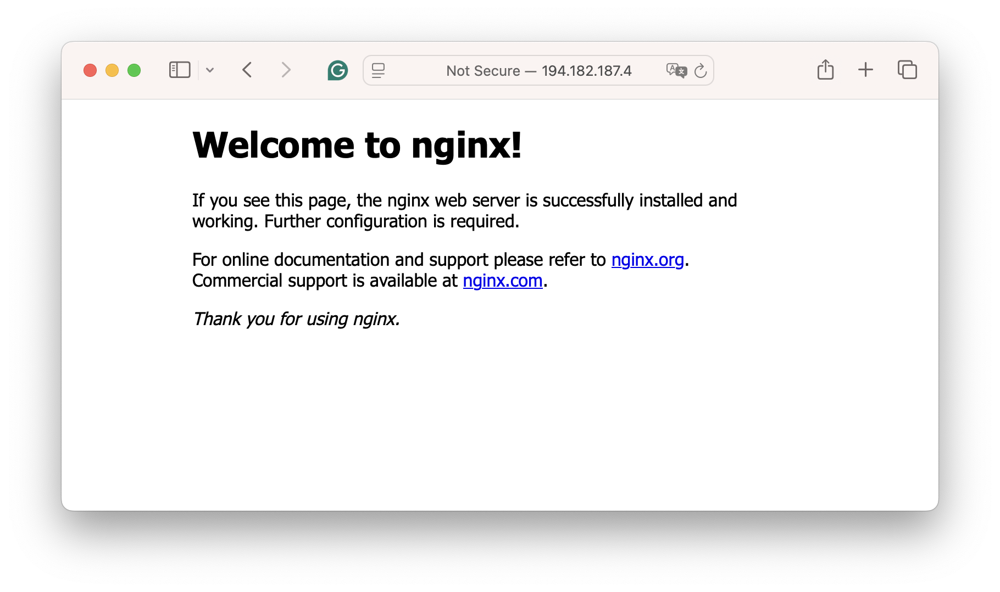

#### VIDEO
[Compute Linux](https://sos-de-fra-1.exo.io/exoscale-academy/videos/csa-basics-01.mp4)


### Add Instance - Example Windows

A step-by-step guide to manually creating a Windows-based compute instance and accessing it with RDP. 

* Configure a __Security Group__ to allow port 3389/TCP the protocol for remote desktop access. 
* Launch the __Compute Instance__ based on a Windows template.
* Use Microsoft __Remote Desktop__ app for access.

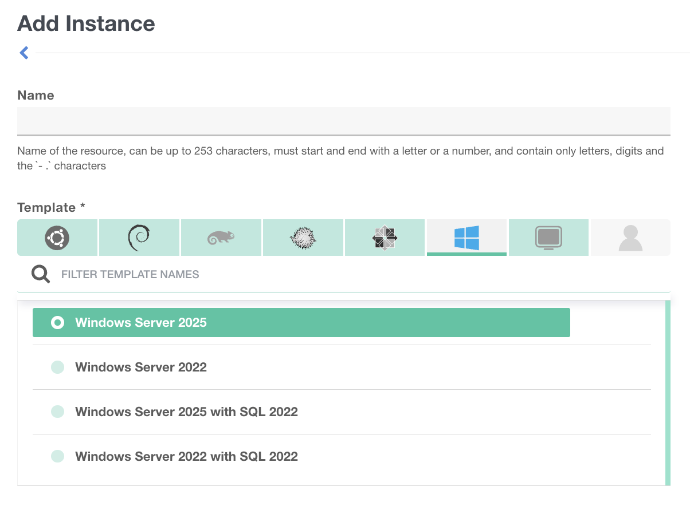 

__Example Specifications:__

* __Name__ = my-windows-instance
* __Template__ = Windows Server 2025
* __Zone__ = AT-VIE-1
* __Instance Type__= STANDARD - Tiny
* __Disk__= 50 GiB SSD
* __Security Groups__= sample-group


#### Security Group - for Windows

Creating a Security Group called sample-group and ALLOW: 

* RDP access (port 3389 )

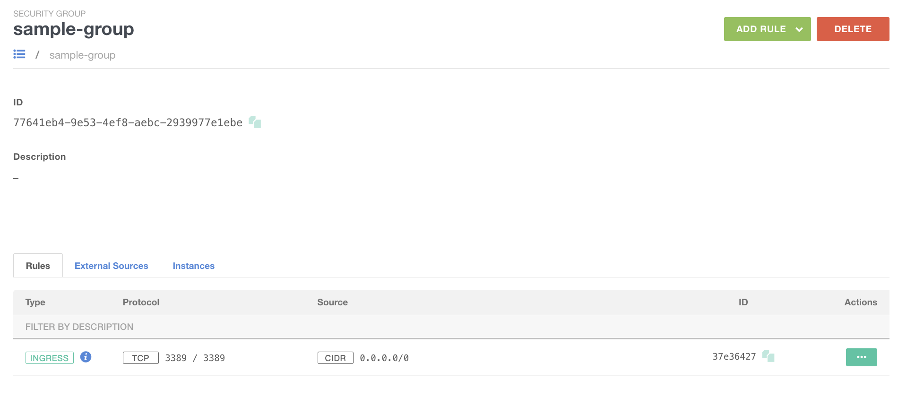 

#### Compute Instance - Windows

* __Security Group__ (sample-group) added and configured.
* __Instance__ (my-windows-Instance) created.

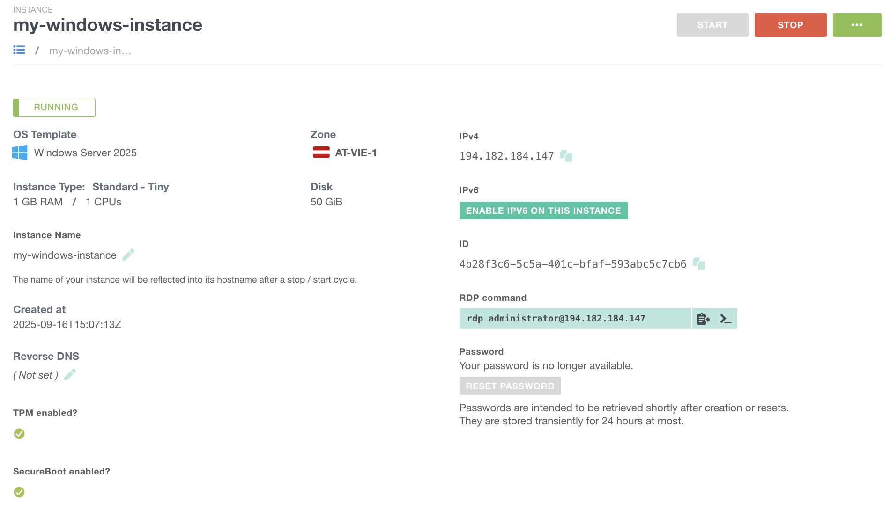

#### Instance Usage - Windows

To access a Windows Server instance, you need to configure a Security Group that permits port 3389/TCP, which is used for the Remote Desktop Protocol (RDP). 
Use the provided password and the Microsoft Remote Desktop application to connect as the administrator to the Windows Server.

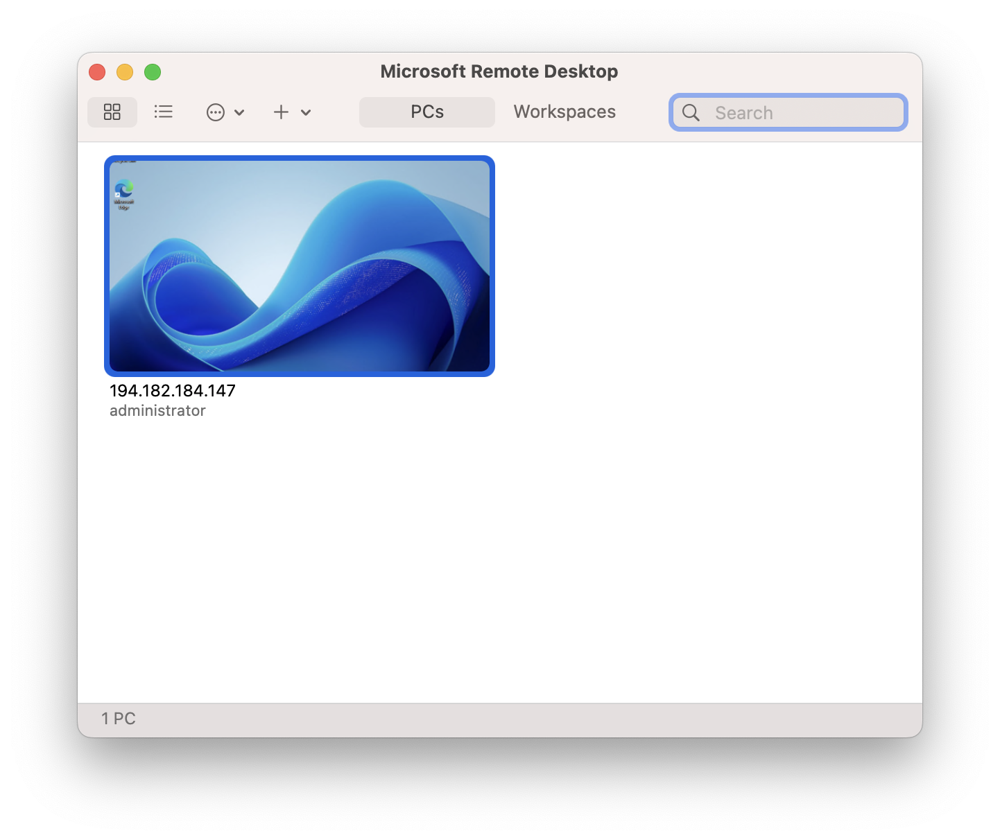

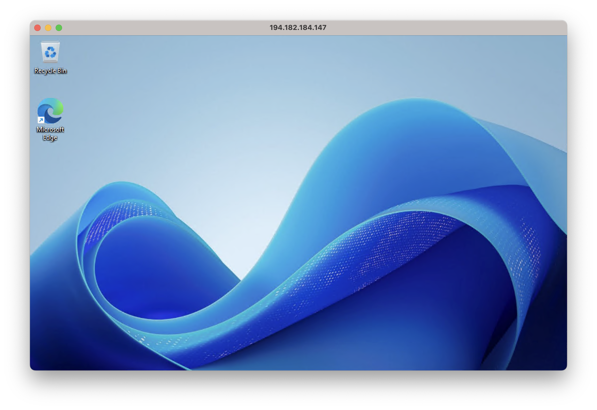

#### VIDEO
[Compute Windows](https://sos-de-fra-1.exo.io/exoscale-academy/videos/csa-basics-02.mp4)


### Anti-Affinity Groups

_To enhance availability and fault tolerance for your application, start by using multiple instances._

Running these instances on different hosts, which correspond to different hypervisors, further boosts availability. This behavior is managed through a feature called an __Anti-Affinity Group__. Instances within an Anti-Affinity Group are distributed across separate hypervisors by the platform, improving resilience against application failures.

#### Specifications

* Anti-Affinity Groups can be created freely, with instances assigned as needed.  
* Each group can contain up to 8 instances, ensuring they are distributed across different hypervisors.  
* Instance Pools are also supported within Anti-Affinity Groups.

#### VIDEO
[Anti-Affinity Groups](https://sos-de-fra-1.exo.io/exoscale-academy/videos/csa-basics-03.mp4)


## Cloud-Init

### Cloud-Init

__Cloud-Init__ is the industry-standard tool for initializing cloud instances across platforms, supporting all major public cloud providers and provisioning systems for cloud infrastructure setups. During boot, it detects its environment and configures the system accordingly. On first boot, instances are automatically set up with networking, storage, SSH keys, packages, and other configurations, ensuring they're ready for use immediately.

__User Data__ enables configurations to be applied after a cloud instance has booted. You can utilize either distribution-specific scripting languages (such as bash or PowerShell) or the distribution-independent method of cloud-config. For example, you might want to automate the installation of the Nginx web server immediately after the cloud instance completes its boot sequence.

For example, you might want to automate the installation of the Nginx web server immediately after the cloud instance completes its boot sequence.

### Simple Example

* Installing the webs server
* Starting the webserver

#### Distribution-Specific

```shell
#!/bin/bash

sudo apt-get update
sudo apt-get upgrade –y
sudo apt-get install –y nginx
sudo systemctl start nginx
```
This example is specific for a Linux distribution.

#### Distribution-Independent

```json
#cloud-config

package_upgrade: true
packages: 
   - nginx
runcmd:
   - systemctl start nginx
```
This example is independent and works cross-platforms. 

### Complex Example

* Set-up and configure web server.
* Download the application from an SOS bucket using a pre-signed key.
* Install the application.
* Launch the application.

```
#cloud-config
package_upgrade: true
packages:
  - nginx
  - nodejs
  - npm
write_files:
  - owner: www-data:www-data
    path: /etc/nginx/sites-available/default
    content: |
      server {
        listen 80;
        location / {
          proxy_pass http://localhost:3000;
          proxy_http_version 1.1;
          proxy_set_header Upgrade $http_upgrade;
          proxy_set_header Connection keep-alive;
          proxy_set_header Host $host;
          proxy_cache_bypass $http_upgrade;
        }
      }
runcmd:
  - systemctl restart nginx
  - cd "/home/webapp/myapp"
  - [ wget, "https://sos-de-muc-1.exo.io/demo-webinar/application.zip?X-Amz-Algorithm=AWS4-HMAC-SHA256&X-Amz-Credential=....", -O, /home/webapp/myapp/app.zip ]
  - unzip app.zip
  - npm init
  - nodejs index.js
```
This example is also independent and works cross-platforms. 

### Cloud-Init Overview

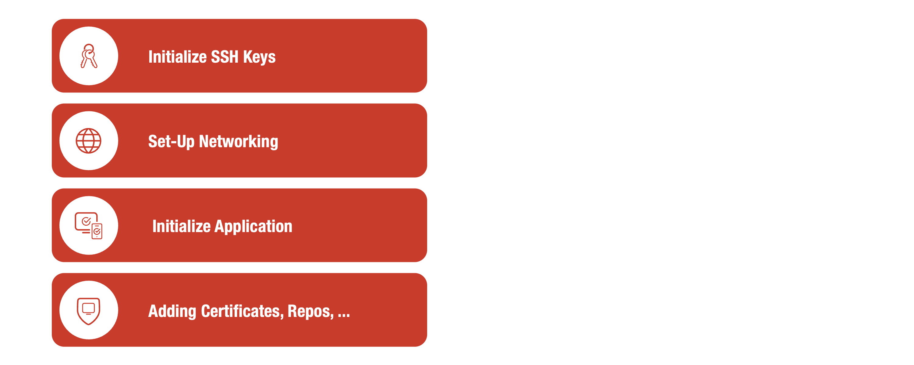

### Cloud-Init Documentation

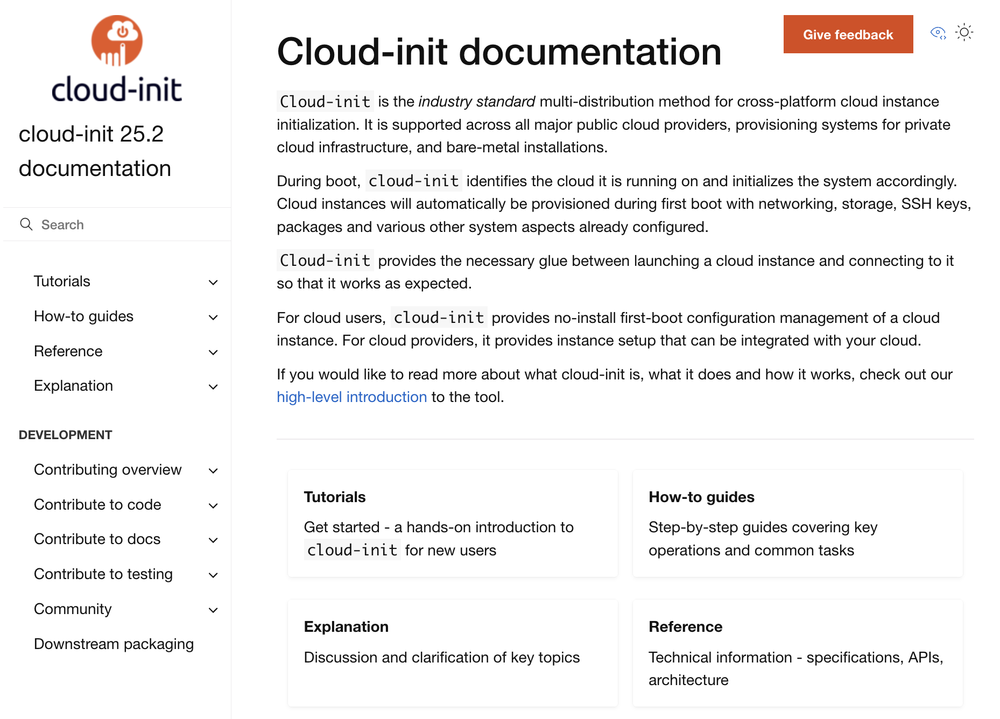

<a href="https://cloudinit.readthedocs.io/en/latest/#" target="_blank">__cloudinit.readthedocs.io__</a>

#### VIDEO
[Cloud-Init](https://sos-de-fra-1.exo.io/exoscale-academy/videos/csa-basics-04.mp4)

## Automation

### Automation

Exoscale empowers seamless cloud infrastructure automation with APIs, CLI tools, and Infrastructure as Code, enabling efficient deployment, management, and scaling of resources with control, speed, and consistency.

Elevate `cloud-init` by incorporating:

* `CLI`: Command Line Interface
* `API`: Application Programming Interface
* `IaC`: Infrastructure as Code

### Infrastructure as Code (IaC)

`IaC` employs machine-readable definition files to manage and provision data centers, eliminating the need for physical hardware or manual configurations.

* Define entire infrastructure as code
* Automate infrastructure management
* Rapidly launch, alter, or remove infrastructure
* Code serves as documentation

Exoscale offers a __Terraform Plugin__ to support this model.

By focusing on __immutable infrastructure__, this approach emphasizes __replacement over updates__.

#### Example

```
data "exoscale_compute_template" "ubuntu" {
  zone = local.zone
  name = "Linux Ubuntu 24.04 LTS 64-bit"
}

resource "exoscale_security_group" "web" {
  name = "web"
}

resource "exoscale_compute_instance" ”webserver" {
  zone               = local.zone
  name               = "webserver"
  type               = "standard.medium"
  template_id        = data.exoscale_compute_template.ubuntu.id
  disk_size          = 10
  security_group_ids = [
    data.exoscale_security_group.default.id, 
    exoscale_security_group.web.id,
  ]
  user_data          = <<EOF
#cloud-config

package_upgrade: true
packages:
  - nginx
write_files:
  - owner: www-data:www-data
    path: /var/www/html/index.html
    content: |
      Hello world!
runcmd:
  - systemctl restart nginx
EOF
}
```

A simple example of `IaC` usage in a Terraform script.


### Application Programming Interface (API)

Access all Exoscale functionalities through the `Exoscale API`:

<a href="https://community.exoscale.com/reference/api/" target="_blank">__https://community.exoscale.com/reference/api/__</a>


* Unlock automation's full potential
* Compatible with any programming language
* Restrict access precisely using IAM

#### Example

```
import requests

from exoscale_auth import ExoscaleV2Auth

import secret
auth = ExoscaleV2Auth(secret.api, secret.key)
response = requests.get("https://api-de-fra-1.exoscale.com/v2/instance", auth=auth)
print(response.text)
```

A simple example of `API` usage in a python script.


### Command Line Interface

Exoscale CLI – `exo`


<a href="https://community.exoscale.com/tools/command-line-interface/" target="_blank">__https://community.exoscale.com/tools/command-line-interface/__</a>


`exo` is Exoscale’s official CLI, providing access to all platform services. This user-friendly tool allows you to manage infrastructure and offers the advantage of scriptability.

#### Example

```
> exo compute instance create my-new-instance
 ✔ Creating instance "my-new-instance"... 16s
┼──────────────────────┼──────────────────────────────────┼
│   COMPUTE INSTANCE   │                                  │
┼──────────────────────┼──────────────────────────────────┼
│ ID                   │ xxx-...-xxx                      │
│ Name                 │ my-new-instance                  │
│ Creation Date        │ 2022-11-30 14:39:19 +0000 UTC    │
│ Instance Type        │ standard.medium                  │
│ Template             │ Linux Ubuntu 22.04 LTS 64-bit    │
│ Zone                 │ ch-gva-2                         │
│ Anti-Affinity Groups │ n/a                              │
│ Security Groups      │ default                          │
│ Private Networks     │ n/a                              │
│ Elastic IPs          │ n/a                              │
│ IP Address           │ 159.100.242.231                  │
│ IPv6 Address         │ -                                │
│ SSH Key              │ -                                │
│ Disk Size            │ 50 GiB                           │
│ State                │ running                          │
│ Labels               │ n/a                              │
┼──────────────────────┼──────────────────────────────────┼
```

```
> exo compute instance list
┼─────────────┼─────────────────┼──────────┼─────────────────┼─────────────────┼─────────┼
│      ID     │       NAME      │   ZONE   │      TYPE       │   IP ADDRESS    │  STATE  │
┼─────────────┼─────────────────┼──────────┼─────────────────┼─────────────────┼─────────┼
│ xxx-...-xxx │ my-new-instance │ ch-gva-2 │ standard.medium │ 159.100.242.231 │ running │
┼─────────────┼─────────────────┼──────────┼─────────────────┼─────────────────┼─────────┼
``` 

```
> exo compute instance delete my-new-instance
[+] Are you sure you want to delete instance "my-new-instance"? [yN]: y
 ✔ Deleting instance "my-new-instance"... 12s
```

Simple examples of `exo` CLI usage to manage platform resources. 

#### VIDEO
[Automation](https://sos-de-fra-1.exo.io/exoscale-academy/videos/csa-basics-05.mp4)

## Scaling

### Scaling

Exoscale supports efficient vertical and horizontal scaling, featuring automatable Instance Pools for quick group resizing. Easily adjust resources to match demand, ensuring high availability and streamlined cloud operations.

The Exoscale Platform provides two ways of scaling:

* __Vertical__ (scale up)
* __Horizontal__ (scale out)

Which way should be used also depends on your app's architecture, and there is an impact on the operational procedures as well.


#### Vertical

Adjustments can be made at any time while the __instance__ is __stopped__. Billing is calculated by the second.

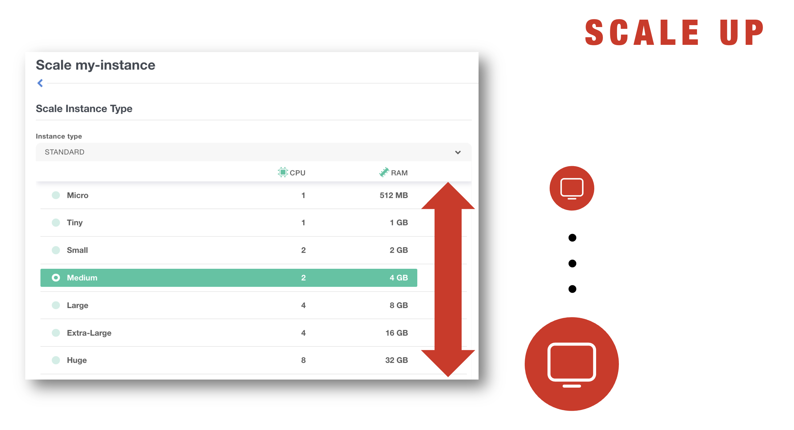


#### Horizontal

Make changes any time __without stopping__ the __instance__. Billing is calculated by the second.

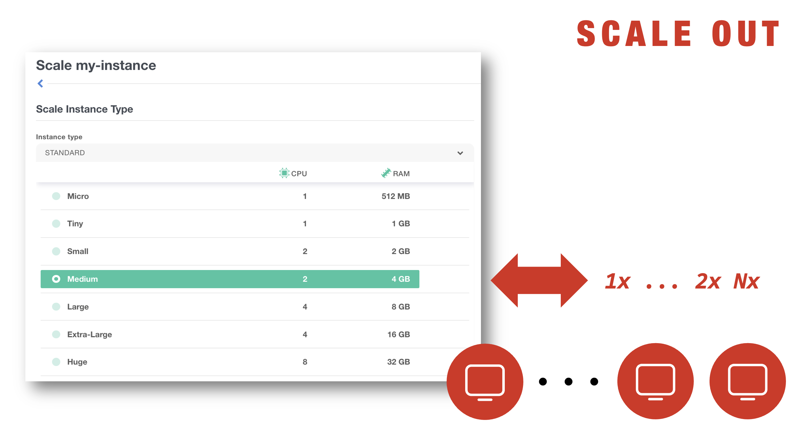


### Instance Pools

Group multiple compute instances with identical configurations:

* Seamlessly adjust the number of instances in a Pool
  * Increase: Automatically boots a new instance with identical parameters. 
  * Decrease: Removes the oldest VM, allowing for pool cycling.
* Commonly paired with cloud-init for application provisioning.

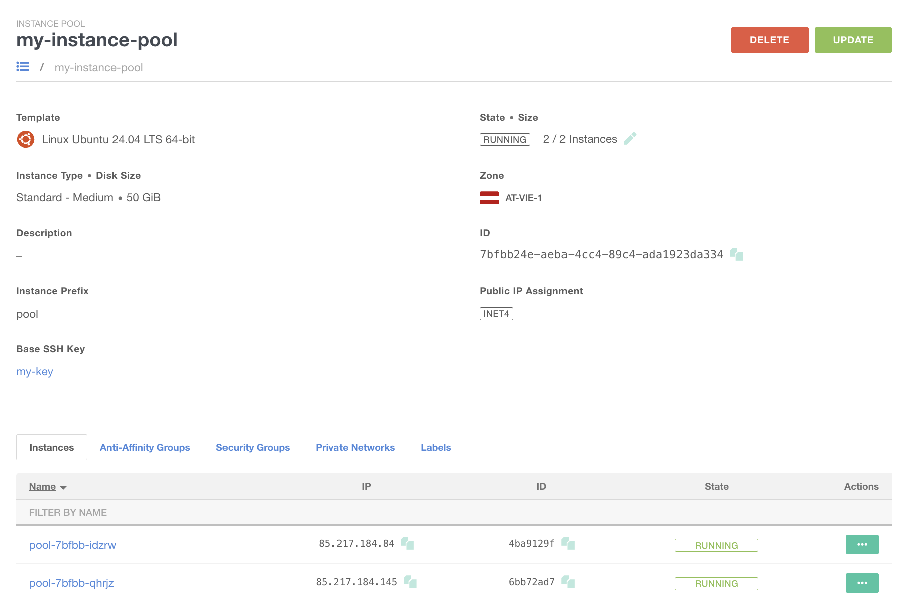

#### Automation

* Scale up or down via Exoscale API or CLI commands.
* Fully automatable with Kubernetes right out of the box.

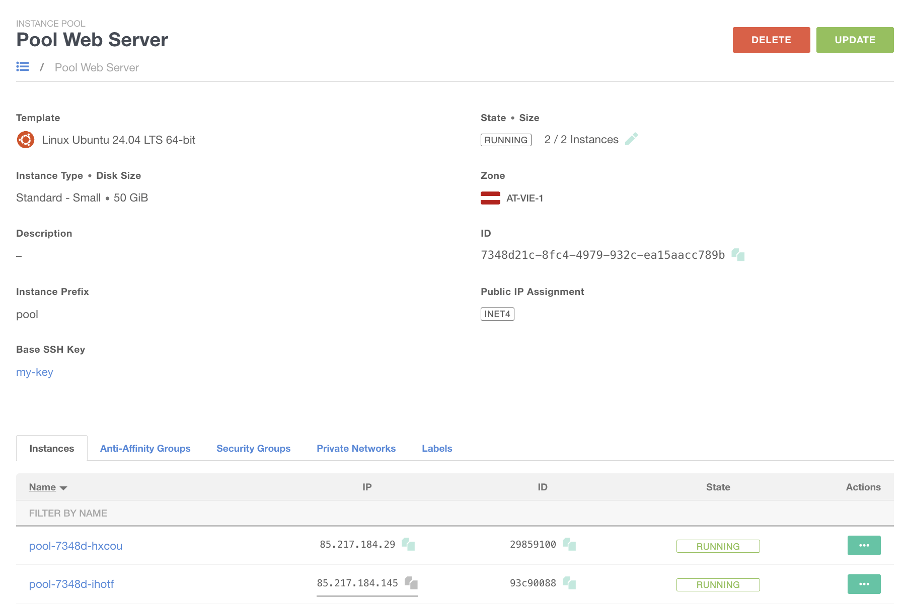

#### VIDEO
[Scaling](https://sos-de-fra-1.exo.io/exoscale-academy/videos/csa-basics-06.mp4)

## Traffic

### Traffic

Exoscale optimizes cloud traffic with free internal and incoming data, plus an outgoing traffic free tier per instance. Benefit from cost-effective, high-performance connectivity and transparent data usage across your cloud services.

Is the exchange of data between computers, is vital in cloud computing from two perspectives:

* __Performance:__ Includes throughput and latency
* __Cost:__ Encompasses data volume and timeframe

_Let's examine this aspect._


### Internal Traffic
__Internal traffic is free of charge!__

* Exoscale services within a zone
* Exoscale services across zones

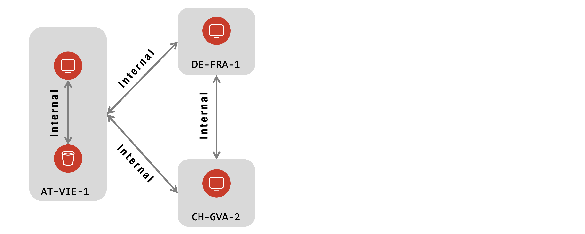


### Incoming Traffic
Traffic coming from the internet is free of charge!

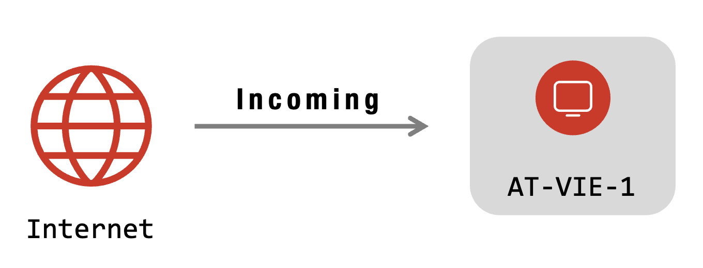


### Outgoing Traffic
Traffic towards the Internet is billed.
BUT, it comes with a free tier at Exoscale:

* 1.42 GB per instance in the period of one hour
* Free traffic is shared in the organization
* Free traffic is only available in the hour created

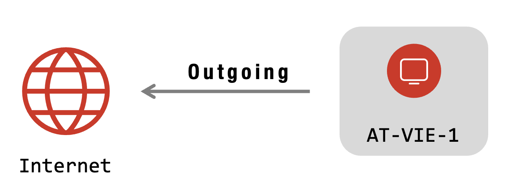


### Traffic Examples
Two examples to illustrate the free tier and the billing aspects:

* Instance A and B
  * A creates 2 GB of outgoing traffic
  * B creates 0.5 GB of outgoing traffic
  * Completely under free tier, as both together have 2.84 of free traffic
* Instance A exist inside one hour
  * A creates 2 GB of outgoing traffic
  * 1.42 GB are free, 580 MB are to be paid

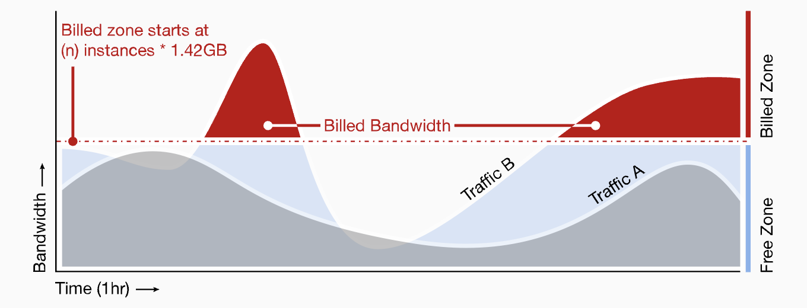

#### VIDEO
[Traffic](https://sos-de-fra-1.exo.io/exoscale-academy/videos/csa-basics-07.mp4)

## Storage

### Storage

Exoscale delivers secure, scalable cloud storage with S3-compatible Object Storage, high-performance Block Storage, and fast local NVMe—all easy to manage, cost-efficient, and ideal for backups, apps, and high-demand workloads.

### Object Storage

Simple Object Storage (SOS) is an S3-compatible solution for storing assets, files, and metadata. It offers a cost-effective way to support your applications, back up data, or serve files from any Exoscale zone—without hidden fees. SOS works seamlessly with existing S3-compatible tools and APIs, providing a familiar and reliable experience.

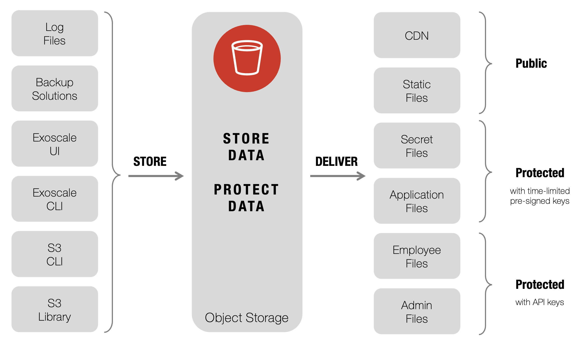

* Easy to use - Quick setup and seamless S3 integration.
* Highly available - Each object is replicated across three copies  
* Configurable file URLs - Manage access with ACLs (Access Control Lists)

ACLs (Access Control Lists) permission control:

* __private__- accessible only with an API key  
* __public-read__- anyone can read  
* __public-read-write__- anyone can read and write !!!
* __manual edit__- assign specific permissions to other organizations

#### Encryption – Purpose and Scope

SOS Encryption protects stored data from physical theft, unauthorized access, and meets compliance requirements.
Data is encrypted at the smallest shareable unit (Inode), enabling efficient range access and secure copy operations.

__Benefits__

* Strong Security: Minimal plaintext exposure; only root keys require strict protection. Compromise of one key has limited impact.
* Performance: Bulk encryption is handled by application instances, reducing load on central key management systems. Hardware acceleration (AES-NI) ensures high throughput.
* Compliance & Integrity: Meets regulatory requirements and provides tamper-evidence for both data and metadata.
* Flexibility & Scalability: Per-bucket keys allow for segmented protection and flexible encryption policies.

#### Encryption – Implementation

__Key Hierarchy__

Uses a layered key structure:

* Inode Data Encryption Key (DEK)
* Object Key Encryption Key (KEK)
* Bucket Key
* Root Key (master, protected in Vault)

__Data Model Changes__

Keys are stored in metadata, with additional columns added for tracking encryption keys at various levels.

__Algorithm__

Employs DAREv2 for packetized encryption and AES-GCM (AEAD) for authenticated encryption and tamper detection 256bit strong.

__Operational Features__

Supports key rotation, bucket-level encryption enable/disable, and provides query interfaces for key management.


#### Use Cases

__Case – Static Files:__

* Backups
* HTML-Files
* Pictures
* Videos
* Archives of various files (`*.zip`, `*.tar`)
* Best suitable for Integrated in the app itself (S3)
* Not suitable for Shared File Systems & Storage under Databases

__Case – Static Web Files:__

* Upload static files to S3
* Set ACL public-read either manually or automatically
* Embed links to files directly in HTML
* Users will download files from SOS bucket
* Providing fast access and high-availability

__Case – Backup Files:__

_Backup:_

* Install a backup agent on a VM 
* Configure S3 bucket as target
* Backups are saved securely and privately in the S3 bucket

_Restore:_

* Create VM
* Install agent
* Configure as restore from S3 bucket


#### Access Methods

_Access Interfaces:_

* Exoscale UI
* Exoscale CLI
* S3 CLI

_Programming Library with S3 support:_

* PHP
* Java
* NodeJS
* Python
* ...

#### Applications with S3 support
* Cyberduck - Browse files with a GUI, delete files, and upload large files.
* MountainDuck - Mount SOS as a Windows drive for seamless file access.
* Rclone - Linux CLI tool for copying directories and synchronizing multiple buckets or zones.
* Flexify.IO - Easily migrate data between on-premises storage and various cloud providers.
* Backup Software - CloudBerry, Acronis, Veeam, ... reliable solutions for data backup and recovery.


### CDN - Content Delivery Network

* Automatically distributed all public-read files to the Akamai network if activated
* 120 locations worldwide 
* Users can download static files with low latency from the nearest server
* Used when high scalability and low latency are requirements
* Easy to use; just the read-URL of the files changes
* Files must be set to public-read

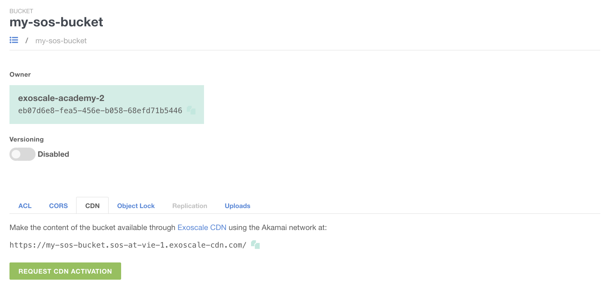
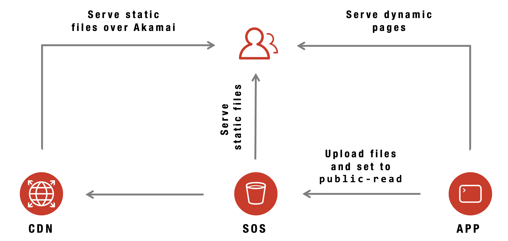


### Pre-Signed Keys

* Give temporary access to private files
* Give unique access to private files (e.g., for cloud-init scripts)
* Key included in the URL
* Must be created using the CLI or a S3 library

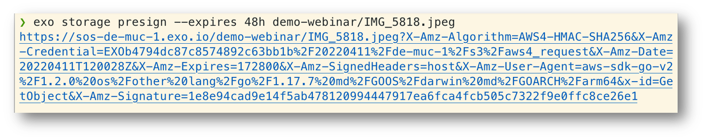


### Block Storage

Exoscale Block Storage is a highly available, scalable solution for persistent storage on your instances. 
Easily expand capacity and control costs without sacrificing performance or data durability. Block Storage integrates seamlessly with virtual instances, allowing for the independent management of storage volumes throughout their lifecycle.

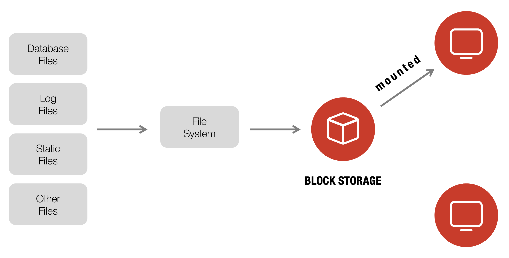

* Highly available, scalable, and durable persistent storage  
* Flexible management: easily attach, detach, and scale volumes  
* In-zone data replication for high durability  
* Seamless integration with virtual instances  
* Performance: up to 5000 IOPS & 250 MB/s transfer rates  
* Snapshots for data protection and disaster recovery  
* Manual mounting required; local storage needed for OS

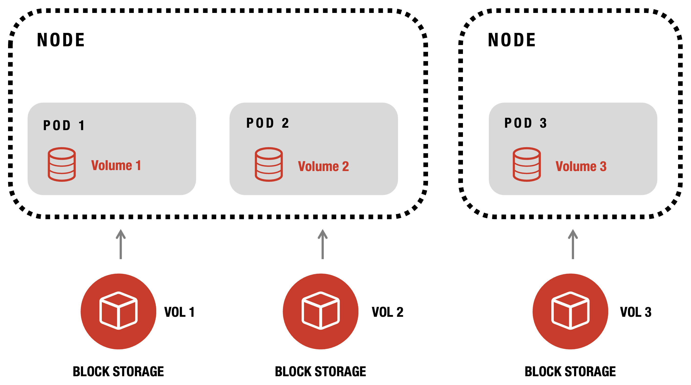

#### Features

* __Read-Write-Once__ - attach to one instance at a time (ideal for databases)
* __Block Device__ - requires filesystem initialization by OS
* __Incremental Snapshots__ - cost-effective backups  
* __Comprehensive Protection__ - supplement snapshots with Object Storage  
* __Read-Write-Many__ - use NFS server for shared access


### Local Storage

Each Exoscale instance is equipped with a minimum of local storage, which serves as the installation medium for the operating system. 

- Minimum 10GB high-performance NVMe storage per instance  
- Optimized for OS installation and demanding workloads  
- Exceptional IOPS and bandwidth  
- Volume is permanently bound to its instance  
- Volume size can be scaled up  
- Not transferable or shareable between instances


#### VIDEO
[Storage](https://sos-de-fra-1.exo.io/exoscale-academy/videos/csa-basics-08.mp4)

## Backup

### Backup

Exoscale supports flexible backup strategies, from full VM snapshots to incremental agent-based backups in S3. Restore files or entire systems easily, and choose the best-fit solution for your data protection needs—no vendor lock-in. Backup practices have been in place long before the advent of cloud services, and organizations often rely on their own preferred methods. Exoscale does not enforce a specific backup solution, allowing users the flexibility to choose from multiple supported options.


### Snapshots

#### Full VM snapshots

* Simple to implement and automate  
* Enables easy full restores  
* Quickly create templates from snapshots  

#### Limitations

* Partial restores are not supported  
* Always snapshots the entire disk, leading to higher storage usage and costs  
* Snapshots are deleted when the VM is removed  
* May be inconsistent—database recovery is not always guaranteed

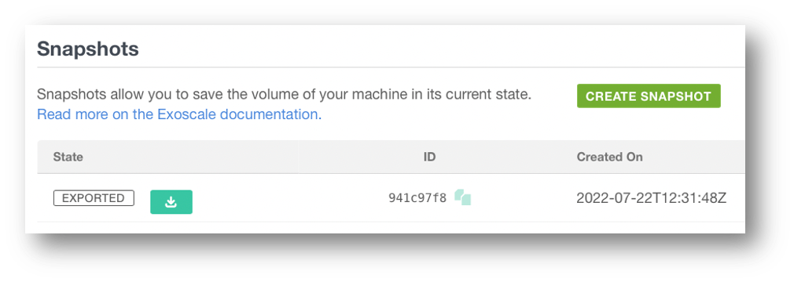


### Agent Based Backup

__Backup the filesystem directly to an S3 bucket__

* Incremental
* Partial restores
* Great flexibility
* Economical 
* Harder to implement -> Requires a third-party application

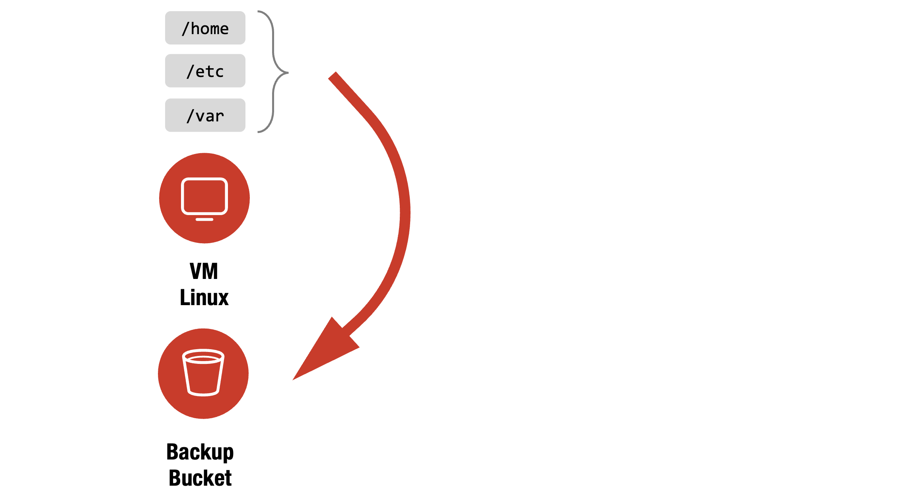


### Agent Based Restore - Option A

Restore the filesystem directly from an S3 bucket.

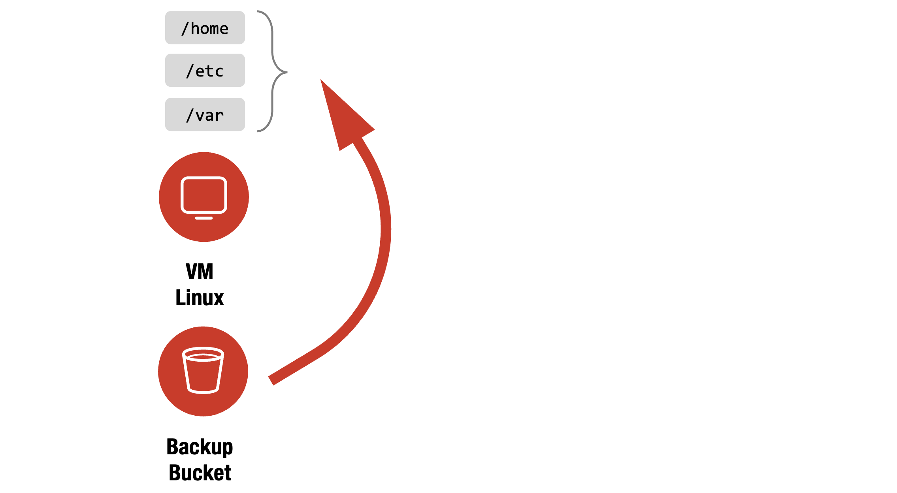


### Agent Based Restore - Option B

Restore the whole system from an S3 bucket.

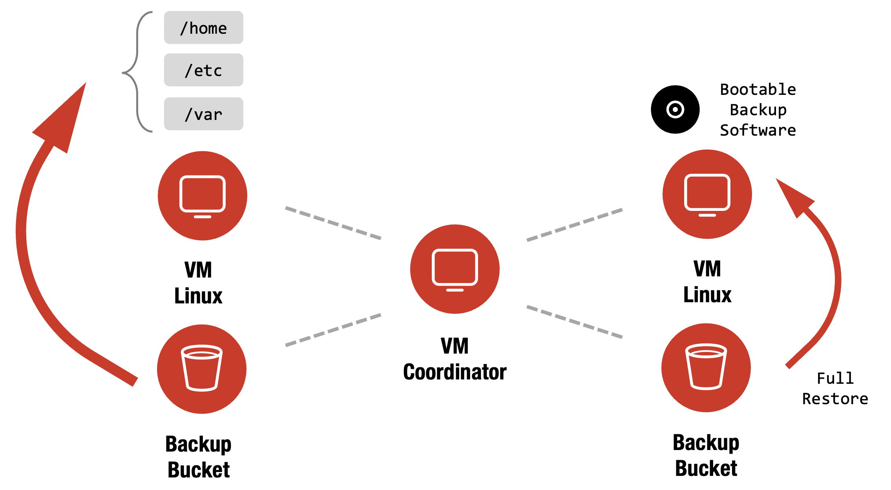


#### VIDEO
[Backup](https://sos-de-fra-1.exo.io/exoscale-academy/videos/csa-basics-09.mp4)


## Networking

### Networking

Exoscale demystifies cloud networking by breaking it into practical parts -- switching, routing, load balancing, and private networks -- making secure, scalable connectivity intuitive and manageable for every cloud user.

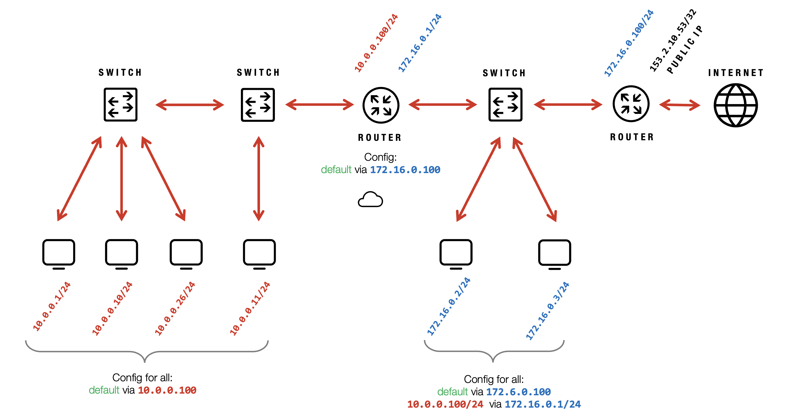

### Network Layer Model
Throughout, we’ll reference the network layer model and align each topic accordingly.

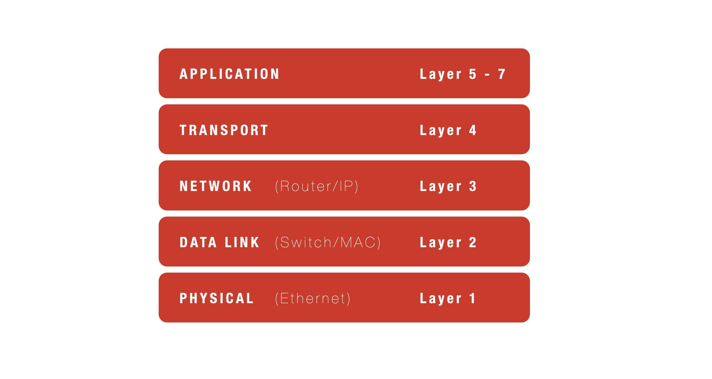

Next, we’ll explore and clarify the following areas:

* Switching/Routing
* Load Balancing 
* Private Networks


#### VIDEO
[Networking](https://sos-de-fra-1.exo.io/exoscale-academy/videos/csa-networks-01.mp4)


## Switching/Routing

### Switching/Routing

Exoscale distinguishes local Layer 2 switching with MAC addresses from global Layer 3 routing with IPs, enabling flexible, efficient network segmentation and seamless connectivity within and across cloud environments.

#### Layer 2 - Switching

* Operates using MAC addresses (_unique to each device_)
* Handles traffic within local or private networks
* Managed by switches
* Example MAC address: `f8:4d:89:84:eb:8e`

#### Layer 3 - Routing

* Uses IP Addresses
* For traffic and routing in a global manner
* Done by routers
* Example IP address: `10.55.22.1/32


### Local Network

* Switches operate at Layer 2, using only MAC addresses—not IP addresses  
* Devices on the same local network and subnet can communicate directly

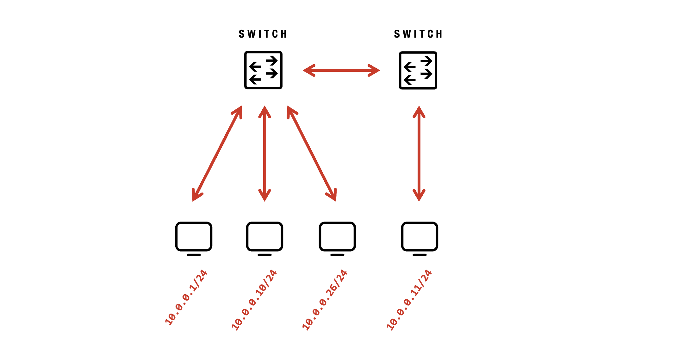

### IP Addresses

#### A subnet for one IP address
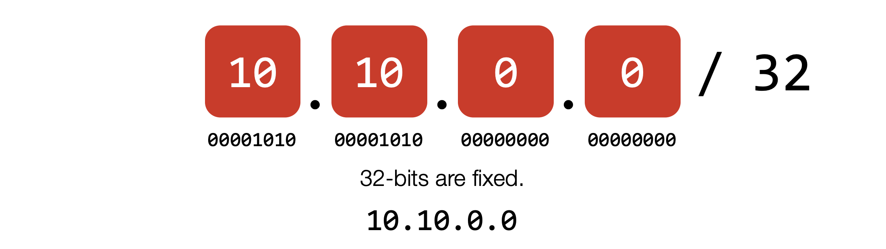

#### A subnet for two IP addresses
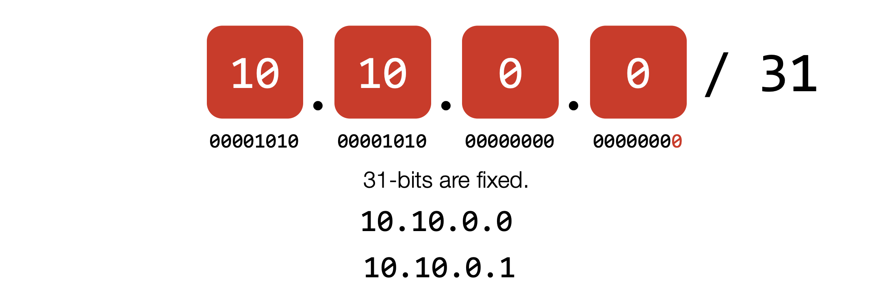

#### A subnet for 256 IP addresses
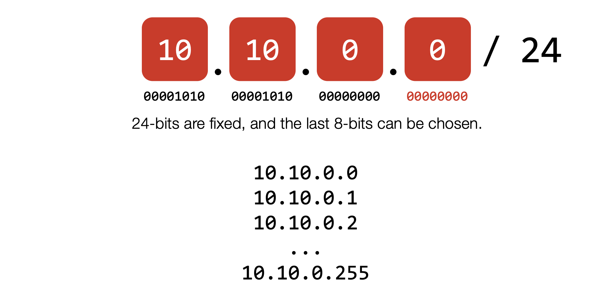

#### Subnets 
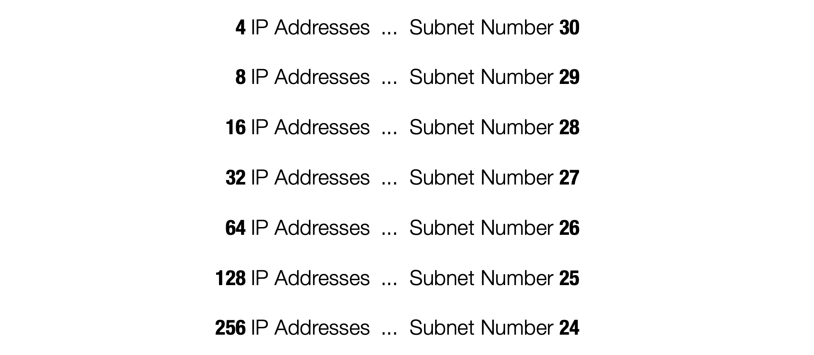


### Routing Subnets

Communication between different subnets requires a router (gateway).
The gateway IP must be specified and is typically within the same subnet.


#### VIDEO
[Networking](https://sos-de-fra-1.exo.io/exoscale-academy/videos/csa-networks-02.mp4)

## Private Network

### Private Network

Exoscale Private Networks enable secure, isolated Layer 2 connectivity for instances in the same zone, with customizable IPs, granular DHCP, and flexible gateway options for advanced cloud networking and seamless app integration.

* Local network between instances within the same zone  
* Private networks can be created freely  
* No Security Groups between instances  
* Operates at Layer 2—like a switch connecting all instances  
* Private IP addresses/subnets can be chosen from reserved ranges  
* IPs must be configured via SSH/RDP or Cloud-Init  
* Managed Private Networks can assign IPs automatically via DHCP

__Reserved Subnets__ - can be used for private networks:

* `10.0.0.0/8`
* `172.16.0.0/12`
* `192.168.0.0/16`

### Granular DHCP Support via the CLI
Exoscale's Managed Private Networks support granular DHCP configurations, providing enhanced control over network settings through the CLI.

- [DHCP Option 3] Default Gateway (Router): Sets the IP of the default gateway for external traffic.
- [DHCP Option 6] DNS Servers: Specifies DNS server IPs for domain name resolution.
- [DHCP Option 42] NTP Servers: Defines IPs for time synchronization with NTP servers.
- [DHCP Option 119] Domain Search List: Supplies a list of domain suffixes supporting multi-domain environments (limited to 255 octets).


### Gateway Considerations

#### A gateway is needed for
* Connecting private networks across zones  
* Linking private networks to company networks or the internet  
* Interconnecting multiple private networks

#### A gateway can be implemented using
* Ubuntu instances with routing configuration  
* VyOS router templates


#### VIDEO
[Private Network](https://sos-de-fra-1.exo.io/exoscale-academy/videos/csa-networks-03.mp4)

## Load Balancing

### Load Balancing

Exoscale enriches app reliability with flexible load balancing and elastic IPs, supporting secure, automated port or IP routing, health checks, and fine-grained traffic distribution for seamless cloud performance and high availability.

### Network Load Balancer

* Highly available and performant Layer 4 (TCP/UDP) load balancing for Instance Pools  
* Routes traffic only to healthy pool members, based on configurable health checks  
* Preserves the source IP of client requests  
* For public access, configure Ingress Rules for the target port and health checks in the Instance Pool’s Security Group  
* To restrict access, allow only specific subnets or security groups to reach the target port, and set up health check rules for public sources  
* Health check status is accessible via API

#### Routing Strategies
* Round-Robin - Evenly distributes traffic across all pool members. 
* Source-Hash - Consistently routes traffic from the same source address to the same instance.

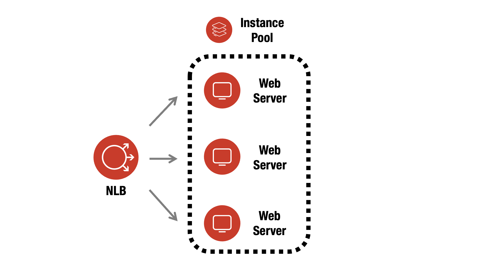


### Managed Elastic IP

* Forwards traffic to a single instance or distributes it across multiple instances  
* Traffic distribution may not be even  
* No configuration required on target instances  
* Forwards traffic on all ports  
* Health checks are performed, but not visible to users  
* To ensure reachability, open the relevant ports for the Elastic IP  

> __! NOTE__
This cannot be used for outgoing traffic.

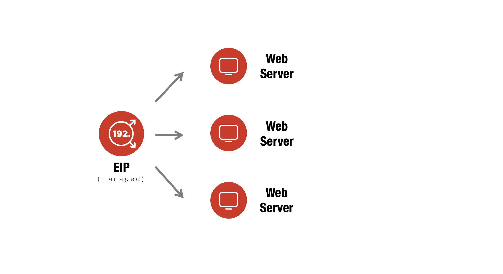


### Comparison - Network Load Balancer vs Managed Elastic IP


__Network Load Balancer__

* Routes traffic to Instance Pools  
* Distributes traffic evenly across pool members  
* Supports routing of individual ports and services  
* Health check status is observable


__Managed Elastic IP__

* Routes traffic to individual Instances
* Does not guarantee even traffic distribution  
* Forwards all ports on the assigned IP  
* Health checks are performed, but not observable


### Unmanaged Elastic IP

* Provides a simple failover IP address  
* Can be used as an outgoing IP via a loopback interface  
* Security Groups apply as usual
* Must be manually configured on the instance  


__cloud-init configuration__

```
#cloud-config
write_files:
  - path: /etc/netplan/51-eip.yaml
    content: |
      network:
        version: 2
        renderer: networkd
        ethernets:
        lo:
          match:
            name: lo
          addresses:
            - 159.100.241.235/32
runcmd:
  - [ netplan, apply ]
```

### Security Groups

* Define and combine firewall rules for flexible network security  
* Functions like VLANs, providing network segmentation  
* Block incoming traffic by default; Allow outgoing traffic by default  
* Optionally block all internet traffic for private instances  
* Specify source addresses as subnets, other Security Groups, or Public Security Groups

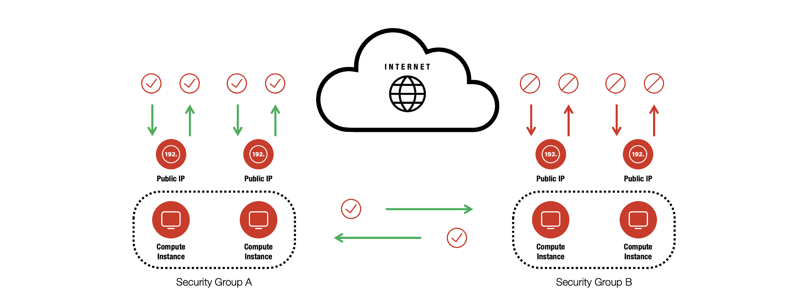

#### Security Groups Examples

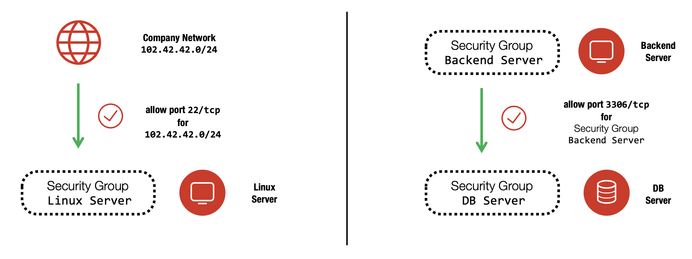

__Frontend Security Group__

* Allow inbound traffic from `0.0.0.0/0` on port `80/tcp` (HTTP)
* Allow inbound traffic from `0.0.0.0/0` on port `443/tcp` (HTTPS)
* Allow inbound traffic from `90.80.60.0/24` on port `22/tcp` (SSH)`*` 

`*` ... Allows SSH access only for clients from the specified subnet (e.g., company network)

__Backend Security Group__ 

* Allow traffic from the Frontend Security Group on port `8080/tcp`
* Allow traffic from the Backend Security Group on port `8080/tcp` `*`

`*`... Enables backend instances to communicate with each other on port `8080`

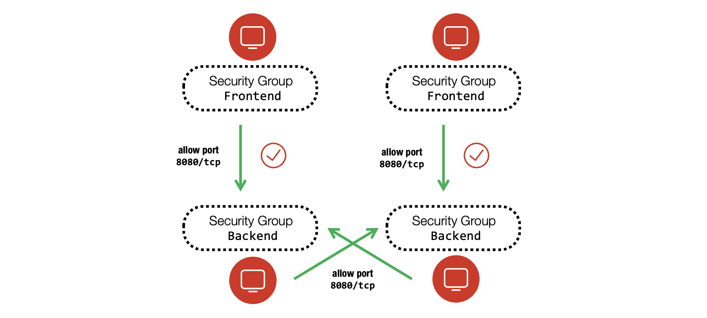


#### VIDEO
[Load Balancing](https://sos-de-fra-1.exo.io/exoscale-academy/videos/csa-networks-04.mp4)


## Cloud Challenges

### Cloud Challenges

Exoscale highlights key cloud challenges—like unique legacy setups, oversized resources, backup complexity, migration hurdles, network limits, and licensing pitfalls—helping you build resilient, future-ready cloud architectures.

#### Special Snowflake
* Single, manually installed server with no documentation  
* Hard-coded IP addresses or credentials across systems  
* IP addresses may not be transferable to the cloud  
* Migration requires a planned downtime and a rollback strategy

#### Huge Instance
* Requests for very large resources (e.g., 512 GB RAM, >15 TB disk, or a small CPU with a large disk)  
* Often impractical or costly in the cloud, especially for databases  
* May not be supported by cloud providers

#### Migration
* Options include file transfer (e.g., rsync), backup tools, or converting images (e.g., VMware to QCOW2)
* Advanced migrations require custom templates and careful management
* Templates cannot be deleted while instances are booted from them

#### Network Throughput
* No cloud provider guarantees bandwidth or latency between VMs  
* On-premises SLAs are easier to achieve with dedicated infrastructure  
* Cloud services should be designed for smaller, fault-tolerant deployments

#### Licensing
* Some software licenses are not cloud-friendly  
* Licensing may require coverage for all possible CPU cores
* Support may be limited to certified hypervisors only

#### Backup
* On-premises backups often use full VM images, which are inefficient and expensive in the cloud 
* Cloud backups should be re-tooled for software-level recovery

#### VIDEO
[Cloud Challenges](https://sos-de-fra-1.exo.io/exoscale-academy/videos/csa-advanced-01.mp4)


## Architecture

### Architecture

Design resilient, scalable cloud solutions by following proven architectural best practices—embracing stateless apps, high availability, microservices, managed Kubernetes, thorough backups, and effective disaster recovery planning.

### Simple Architecture
* Easily scale resources up or down to match performance needs and control costs  
* Ensure data and configurations are securely backed up  
* Design for high availability to minimize downtime

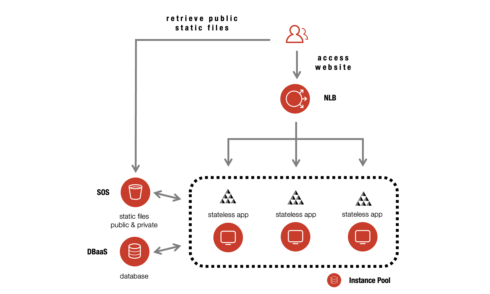

### Stateless Architecture
* Stateless applications are easy to scale and manage  
* Store data in databases or object storage, not locally  
* Avoid saving session states in app memory
  * use JWTs (JSON Web Tokens)
  * use external databases (Valkey)  
* Stateless apps can be deployed multiple times with load balancers and Cloud-Init


### Monolith vs Microservices

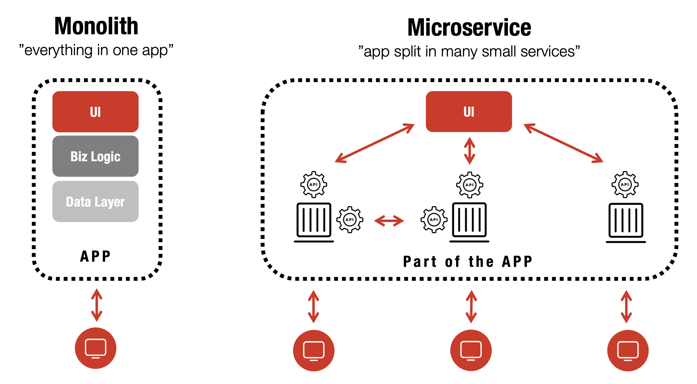

### Kubernetes
Managed Kubernetes Service (SKS) supports:  

* High Availability  
* Automated Scaling (vertical and horizontal)  
* Zero-Downtime Updates  
* Self-Healing  
* Load Balancing  
* Cost Efficiency  
* Streamlined Development and Release Processes


### High Availability & Disaster Recovery
* Prepare for unexpected events with proactive planning 
* Use Kubernetes and load balancers for high availability  
* Store backups in different zones for added resilience  
* Balance recovery time against complexity and cost  
* Always maintain a disaster recovery plan
* Zone failover is possible, but complex and expensive, plan for realistic downtime


#### VIDEO
[Architecture](https://sos-de-fra-1.exo.io/exoscale-academy/videos/csa-advanced-02.mp4)

## Database

### Database

Exoscale DBaaS offers managed open-source databases with automated backups, high availability (99.99% SLA), and GDPR compliance. Easily deploy, update, and scale databases via web, CLI, or API, with no vendor lock-in. 

Managed databases simplify provisioning and maintenance, though some database experience is still needed for effective app development and scaling.

Exoscale DBaaS offers a robust portfolio of open-source data services for diverse applications and business needs, with key benefits and features.

### DBaaS Features

__No Vendor Lock-In__   
Maintain flexibility with managed open-source databases—no cloud dependency.

__Termination Protection__    
Safeguards against accidental deletion for all DBaaS services.

__Multiple Plans__    
Choose from a range of plans with scalable resources and redundancy options.

__Automatic Backups__   
Daily backups are included; frequency and retention depend on your selected plan.

__Available in All Zones__    
DBaaS is offered in every Exoscale zone, supporting multi-zone setups and geo-replication.

__European Data Residency__   
Data is stored in your chosen country and zone, ensuring full GDPR compliance.


### DBaaS Plans - Examples

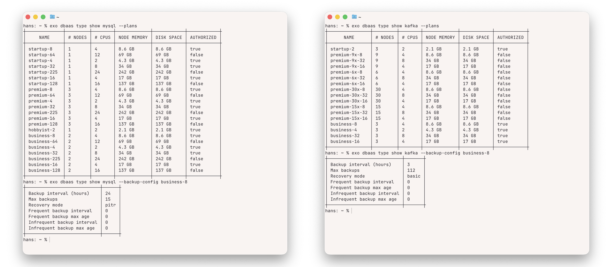


### DBaaS Update
How does it work?

* The database is always accessible via a DNS address
* Update Process handles everything fully automatically in the background:
* Fork the database, and synchronize all data
* Test whether the new databases are healthy
* Point DNS now to the new DBaaS instance
* The old instance is discarded
* Clients will reconnect

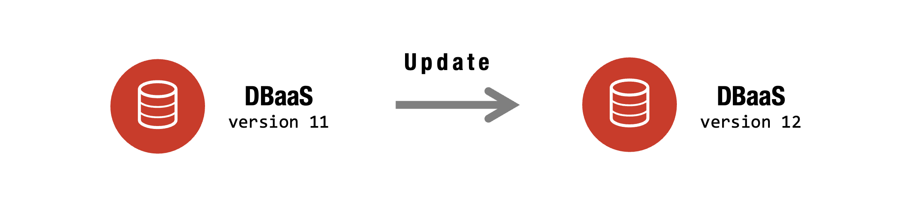

> __! NOTE__ 
--> Downtime of less than 10 seconds!


### Step-by-Step - Update Process 


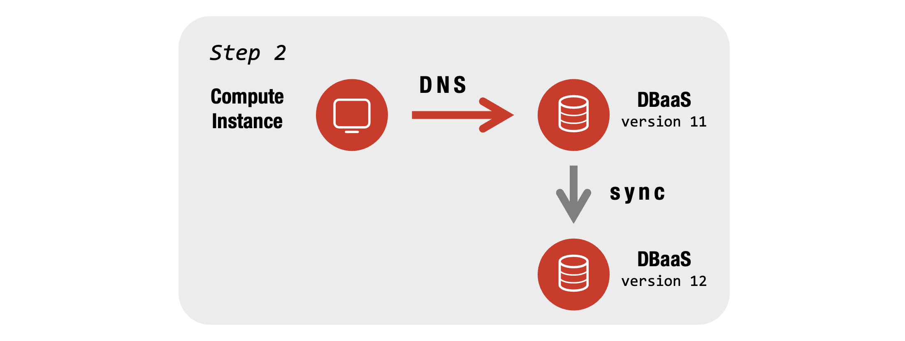
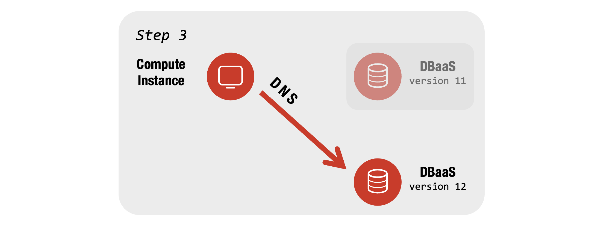


### DBaaS – Additional Capabilities
Depending on the database: 

* Attach external read replicas  
* Utilize a wide range of extensions  
* Deploy multiple nodes  
* Adjust specific database parameters  
* Migrate from previous providers  
* Enable connection pooling

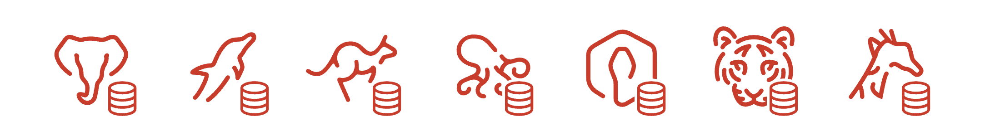


