## Data

### Data

Data is the fuel of our society. Can we agree on that? There were many bold statements over the years to underline the importance of data. Data is the new oil; Data is the new gold; all variations you have probably come across if you follow the news, media, or social media. Data is the new water - is a fresh analogy you can find in researching the data topic.

> "Like water, data needs to be accessible, it needs to be clean, and it is needed to survive." - Dan Vesset (IDC)

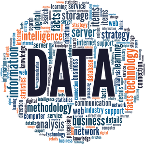

The water analogy is probably more appealing because we should be more fond of water than gold or oil for many reasons, but it is pretty evident from a pure survival point of view.

We are getting back to our core topic data and databases. The collection of (important) data in the past and storing it in databases for reuse and archiving it for preservation is as old as humanity. For example, the Sumerians already used clay tablets to keep the index of medical prescriptions as a form of database, so databases started long before computers were even invented.

The increase in the volume of data we produce every year has reached an almost frightening value. The digital revolution induces the reason for this exponential increase in data production. Keeping track and oversight in this data situation, we have to improve and invent new data tools, or otherwise, we would get lost in data.

## Volume of Data

### Volume of Data

Statista provides incredible insights into our world via the looking glass of statistics. The mind-boggling statistic about the created volume of data we make worldwide every year can be found just below this paragraph.

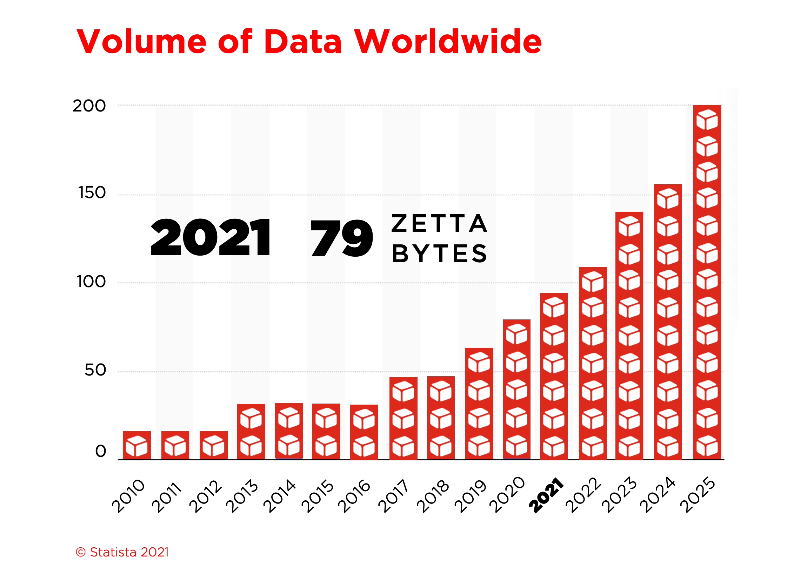

You can quickly see that the amount of data we produce every year doubled, tripled, or even quadrupled in the last years. Depending on how many years you look back, the internet, the smartphone, social media, digital photography, digital music, digital films, and the Internet of Things, to name a few of the contributors to this enormous peak in the growth of data.

However, if we look beyond today's development, it's even more shocking or astonishing. But what the heck are zettabytes? The majority is undoubtedly familiar with Megabyte, Gigabyte, and if you are into digital photography or video making Terabyte. But then we still have to jump further powers of ten - Petabytes and Exabytes - to reach the Zettabytes. Zettabyte equals 1.000.000.000.000.000.000.000 bytes, yes 21 zeros.

It is difficult to grasp this amount of data. Therefore, follow the experiment of visualizing this enormous data volume and setting it into relation to something that could demonstrate Zettabytes' monstrosity. The diagram below uses floppy disks from the digital old age and the solar system as a size reference to make the experiment work.

The figure the statistic gave us was 79 Zettabytes in 2021. In 2021 the world population is stated as 7.9 billion people. This means; statistically, every person on the planet is creating 10 Terabyte of data in 2021. But, what if we would store all the 79 Zettabytes on good old Floppy Disks? How high, or how long would this stack be?

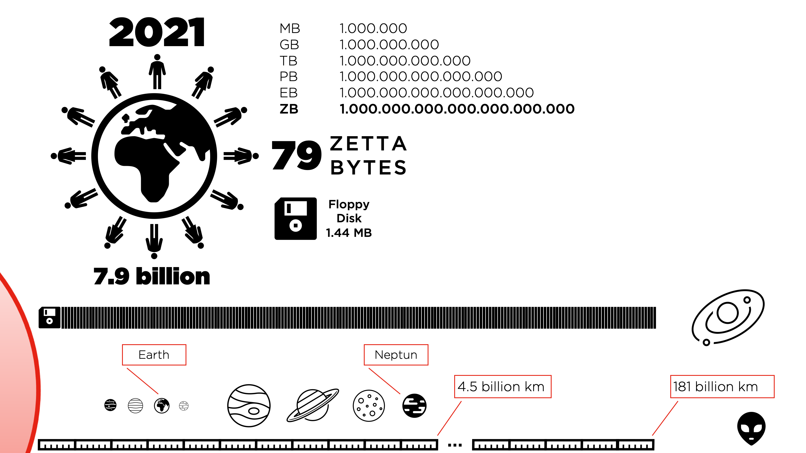

As you can see, the stack out of Floppy Disks in the diagram is pretty BIG. Our solar system expands 4.5 billion km into space there, and you can find the last planet, Neptune. But the stack of Floppy Disks would go on and finally point 181 billion km into space. There is nothing exceptional there, and in terms of interstellar travel, this is a short trip, but we would never get there in a lifetime with the means of transportation available today. All these astronomical facts and figures aside, the horror of Zettabytes starts probably taking shape in your mind now.

A long and diverting intro for an IT topic like databases, but as we have seen, storing data is an old topic. Moreover, depending on the volume of data, the evolution of the data tools is becoming essential. Hence, database technology is evergreen in information technology.

Before we jump into the database topic, let's explore one last important facet of data today, the data value chain and companies based on data.

## Value Chain of Data

### Value Chain of Data

>"Like water, data needs to be accessible, it needs to be clean, and it is needed to survive." - Dan Vesset (IDC)

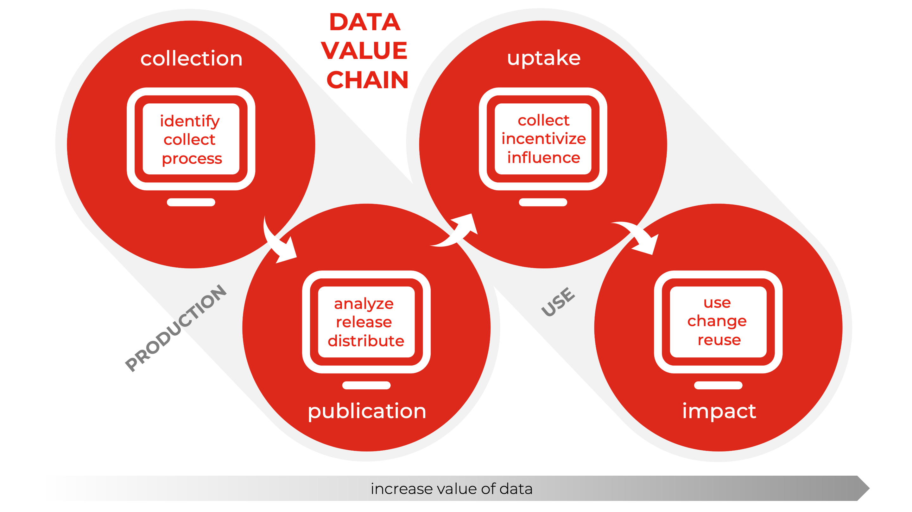

We looked at the importance of data and want to briefly cover the last introduction aspect relevant to our database and database as a service journey. If you break down the diagram above, you see two significant aspects of data interactions. Production of data and usage of data, those two categories are further divided into collection and publication on the left-hand side and uptake and impact on the right-hand side.

Relevance? Think about the tools and the required features to address those tasks effectively and efficiently, keep on thinking, and factor in scalability, availability, and performance. These are all traits of good data handling tools, and there are prominent examples of very successful companies out there who mastered that data value endeavor perfectly.

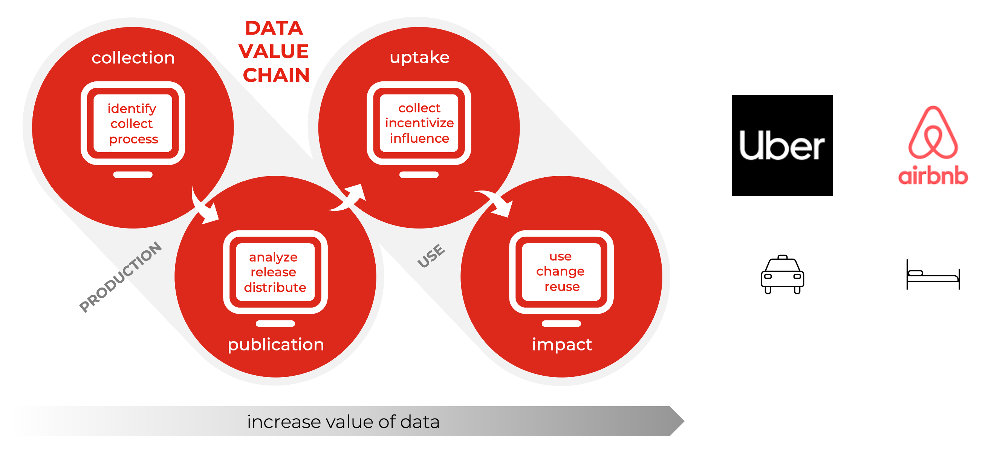

Look at Uber and Airbnb and how they successfully challenged their respective industries with an approach based on data, software solutions, and a customer-first mindset focused on convenience. And convenience always wins.

## Tools for Data

### Tools for Data

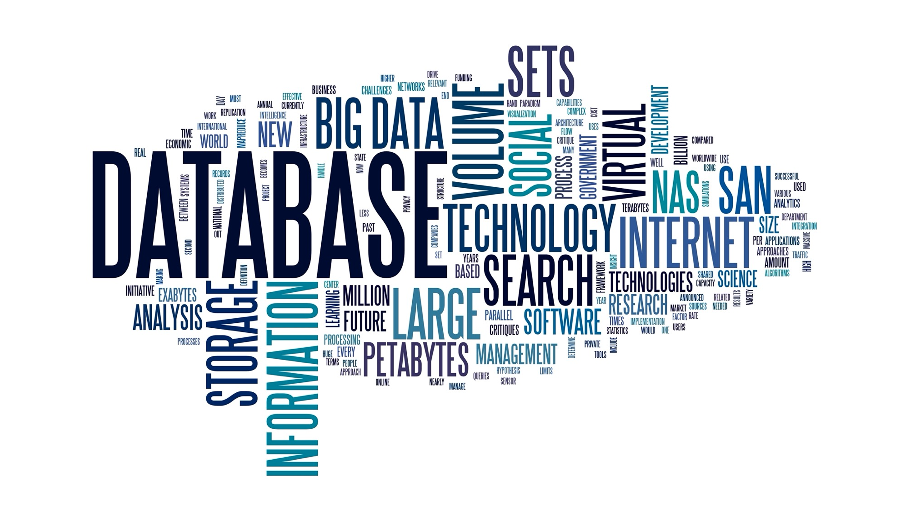

Using databases to organize data started long before the age of computers. Sumerian clay tablets, ship manifests, card catalogs, and product inventories are all databases. Computers enabled the automation of databases. For computer-based databases, we have to distinguish the database model from the software implementation of that model.

The first database model in the computer era was the Flat File Model, a simple consecutive list of records that mimicked the non-computational model from the past as card catalogs or ship manifests. In the mid-1960s, IBM developed a hierarchical database model for their software solution called IMS (Information Management System), which was debuted in 1968 and supported NASA's Moon Mission efforts.

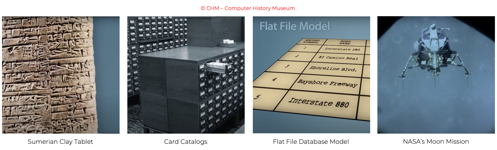

The Dawn of the Database as we know it today was initiated in 1970 by Ted Codd, a computer scientist at IBM. A relational database model organized the data in simple tables, making it easier to access, merge, and change. In hindsight, this was the game-changer, and the seed from that grew an entirely new industry. The idea was picked up by academia first (UC Berkley) and enterprises later to release new software products based on the new relational database model. Even IBM started implementing an experimental solution called System R in 1975.

If you want to know the entire history with more details, you can watch it (History of Databases by Computer History Museum) on YouTube in less than six minutes <a href="https://www.youtube.com/watch?v=KG-mqHoXOXY" target="_blank">__here__</a>. A quick structured overview of the History of the Database Evolution is put together in the next unit.

## History of Databases

### History of Databases

__Part 1__ of the History of Database Evolution covers the events until the initiation of an industry around database technologies. This was also illustrated in the last unit and the linked _History of Databases_ YouTube video. 

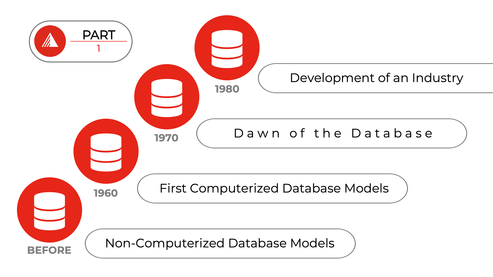

__Part 2__ of the History of Database Evolution is about the influence of new technologies and the emergence of new players with new clever ideas (new database models). Today is all about combining, improving, optimizing, and automizing all available database models and their respective implementations (closed source and open source). The future is focused on driving business innovations with specialized database models specifically built/developed for business requirements.

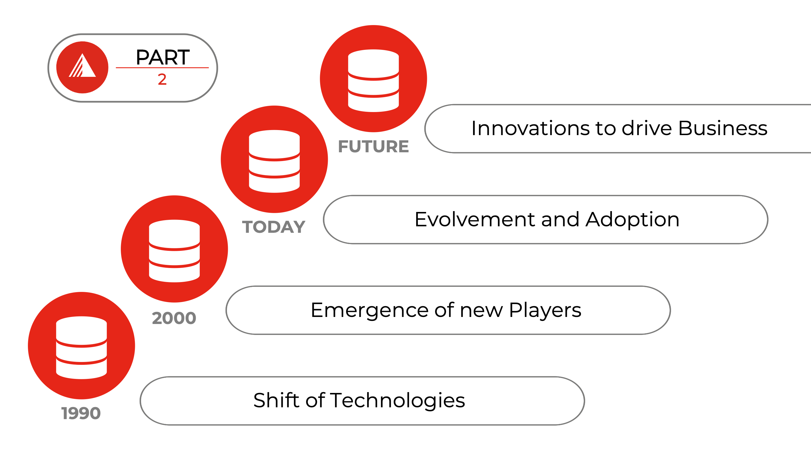

A glimpse of the future can be found in this excellent wired.com blog post infographic from approx. 2016 (The Future of the Database -- © wired.com). Unfortunately, the article is not available anymore, but the graphic survived on the internet. It gives an excellent summary of the past and predicts the future, as seen in 2016.

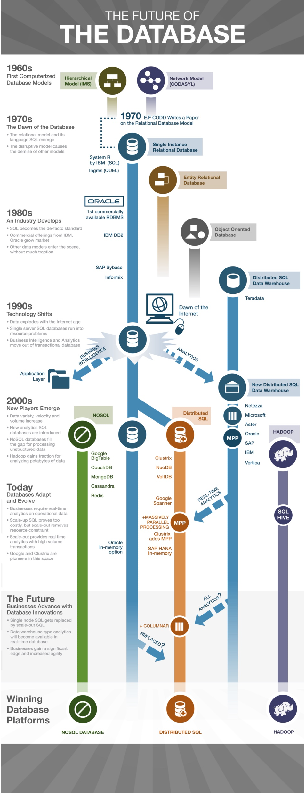

## Benefits of Databases

### Benefits of Databases

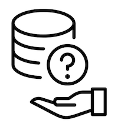

#### Why use computerized Databases?

Because it makes it easier to:

* sort data
* search and find data
* add, edit or delete data
* store large data sets efficiently
* access data at the same time by multiple users
* import and export data from and to other applications

If there are advantages, then there are also disadvantages, and to get a complete picture of the database situation, let us contrast them.

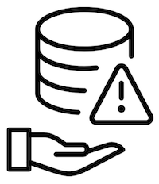

#### Advantages of Databases:

* Data Sharing
* Data Security
* Data Abstraction
* Concurrent Access
* Easy Data Manipulation
* Support Multi-User Views
* Data Redundancy Controlling
* Data Inconsistency Minimizing

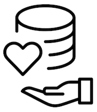

#### Disadvantages of Databases:

* Cost of Software
* Cost of Hardware
* Cost of Staff Training
* Cost of Data Conversion
* Complexity of High Availability
* Complexity of Backup & Restore

## Selection of Databases

### Selection of Databases

The prolific database situation makes the pick of a particular technology not easy. Many theorems, models, and concepts support that selection process, meaning no universal solution for database choices is available.

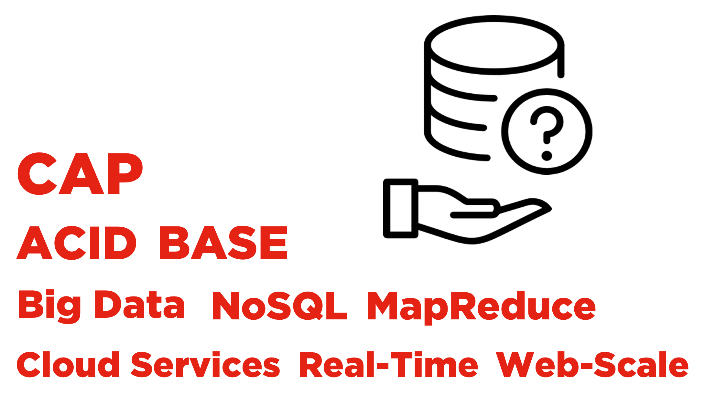

The CAP theorem gives guidance and is still relevant when designing distributed applications and choosing a data store for such scenarios. Still, you have to decide if availability is the preference or consistency gets the vote.

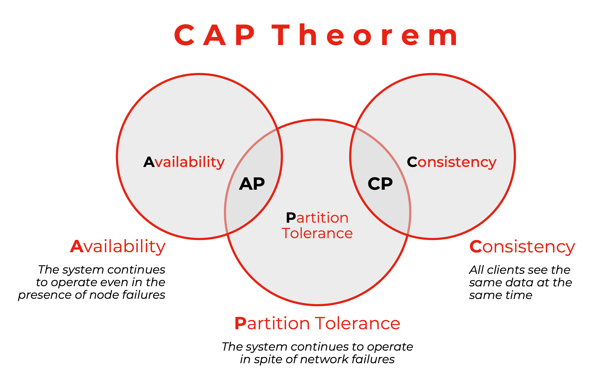

Due to the broad spectrum of database types, a different approach for selecting the right technology for the data store is to choose based on the kind of data that needs storage. Let’s have a look at some examples:

### Managed PostgreSQL

PostgreSQL is a popular open source relational database known for its variety of features. It supports both SQL and JSON querying. The database offers a high level of integrity, correctness, and reliability. Rich features like MVCC, point in time recovery and asynchronous replication are part of the PostgreSQL database. You find more details about this database here.

### Managed MySQL

MySQL is the most widely used open source, object-relational database. It serves as a primary database for many known applications and is well known for its reliability and stability. MySQL has a very active developer community that continuously expand the MySQL functionalities. You find more details about this database here.

### Managed Apache Kafka

Apache Kafka is a distributed, open source data source optimized for real-time processing of streaming data. The database enables low latency due to decoupled data streams, which makes it extremely high performing. Apache Kafka is highly scalable thanks to its distributed nature and makes it easily scalable. You find more details about this database here.

### Managed Redis™
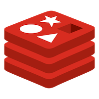

Redis™ is an open source, key-value data store used as database, cache or message broker. The in-memory dataset allows for top performance, making it a good choice for caching, session management or real-time analytics. Redis™ supports atomic operations, rich data types, and Lua scripting. You find more details about this database here.

### Managed OpenSearch

OpenSearch is a community-driven, open source search and analytics suite derived from Apache 2.0 licensed Elasticsearch 7.10.2 & Kibana 7.10.2. It consists of a search engine daemon, OpenSearch, and a visualization and user interface, OpenSearch Dashboards. OpenSearch enables people to easily ingest, secure, search, aggregate, view, and analyze data. You find more details about this database here.

### Selection Process Support
For example, are you dealing with structured or unstructured data, or do you have a mixed data environment?

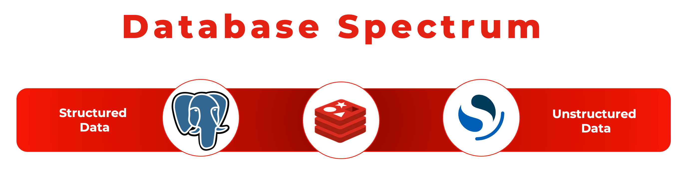

Is one database technology sufficient to provide the functionality, or is it a blend of database technologies that deliver the solution?

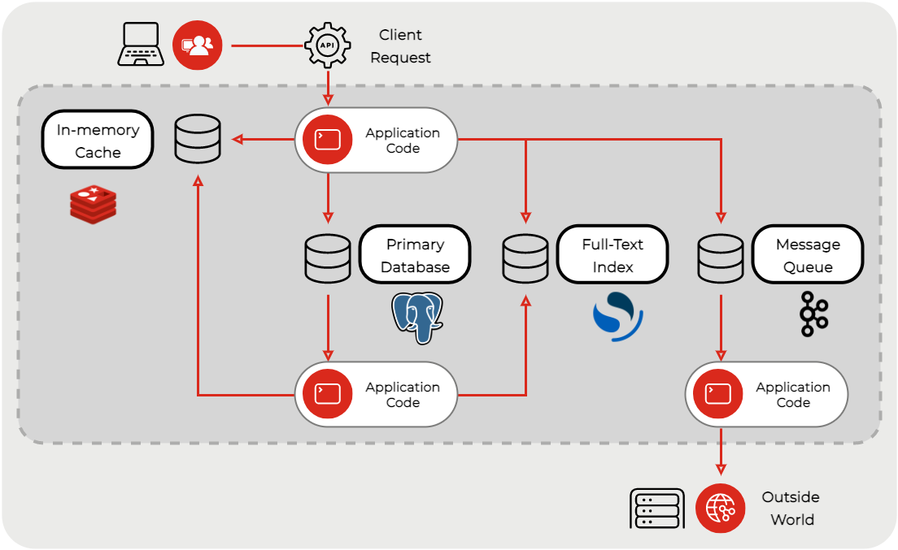

Guidance is challenging to find, especially if you want to see the complete picture of available technology offers and not choosing a vendor first and then picking what is available in the portfolio.

Fortunately, a book supports in a very structured way with a map of all the relevant topics this vital selection process—this desired holistic approach to data store selection for data-intensive applications is a source of wisdom.

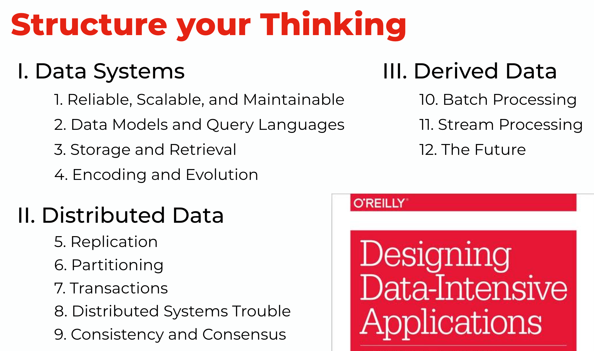

## Responsibility and Expertise

### Responsibility and Expertise

Is running a data center your core business? If the answer to this question is yes, you will have a different opinion and see managed databases in a different light. But the majority here will probably answer with no, and then a common view will open regarding the entry question.

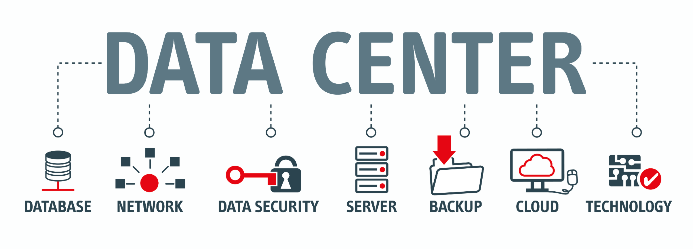 

It is like with utilities. Do you run a wind farm or a hydroelectric power plant to produce your needed electricity? Or do you rely on a managed service from a utility provider? Information Technology (IT) services have become a utility for many areas anyway. So, specialists are defining and often dominating the market. Use those specialists to become a better specialist in your field of expertise.

## Managed Databases

### Managed Databases

Looking at managed databases specifically, we see the benefits of simplifying the tasks associated with provisioning and maintaining a database. However, it is still likely that you need some level of experience working with databases to interact with them as you build and scale your app.

Suppose we do such evaluations in the context of IT services and factor in moving traditional data center services to the cloud. In that case, two trendy acronyms pop up immediately, CAPEX and OPEX.

Please don't put your data center glasses away too quickly. Instead, let us dig into more details about infrastructure and operations costs and look at the table below.

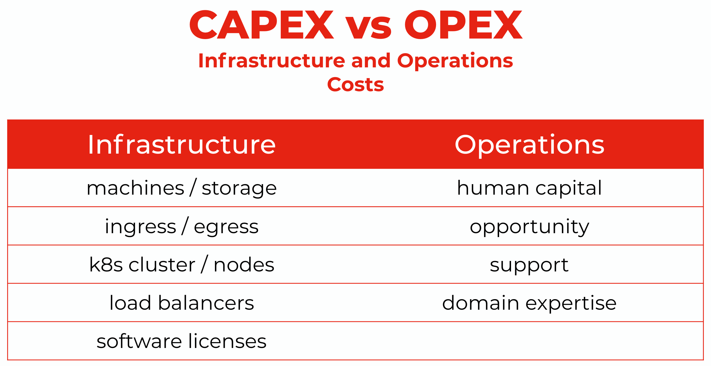

Running modern applications is a demanding business. Besides the always needed machine and storage components, more sophisticated elements like Kubernetes (k8s) clusters/nodes, load balancers, software licenses, and last but not least, required connectivity to those applications in the form of ingress and egress.

Owning all of it is a CAPEX game; taking care of it is an OPEX game, very demanding businesses, both regarding time and expertise. The time you miss following up on business opportunities is potentially lost business, valid for all who are not in the business of running data centers.

## Evolution of Data Services

### Evolution of Data Services

There is a rapidly increasing popularity of managed data services, and many companies are on the lookout to find the most fitting service for the tasks at hand. So, not over stressing running a data center but still trying to drive this essential message home. Questions like:

* How many servers do I need?
* Do I have to cluster my services?
* Which database do I need?
* Do I need more than one database technology?

The questions can go on and on; thinking about them and solving them can easily cause bad headaches. So, finally, it comes down to an easy decision on the question: "Self-Hosted vs Managed?" And if you are not in the hosting business, you're set and done.

The last question from the list above is essential in modern applications because usually one database technology is not enough. Application architecture has changed a lot, and the usage of data technologies with it. Look at the diagram below for a glimpse into the new application design and the impact on database features needed and used. Self-hosted is out of the race; managed is the way to go, end of the story. Managed Databases are the next step in the evolution, but an extensive DBaaS portfolio is the ultimate goal.

Looking back on the diagram of the example application shows that more and more data technologies are being utilized. So, sourcing different database technologies from a managed service provider is definitely not the final solution there. However, they are reducing complexity, increasing convenience for data service usage.

Meaning we have to look for a managed database technology portfolio, ideally from one provider. Hence, Exoscale DBaaS is precisely that.

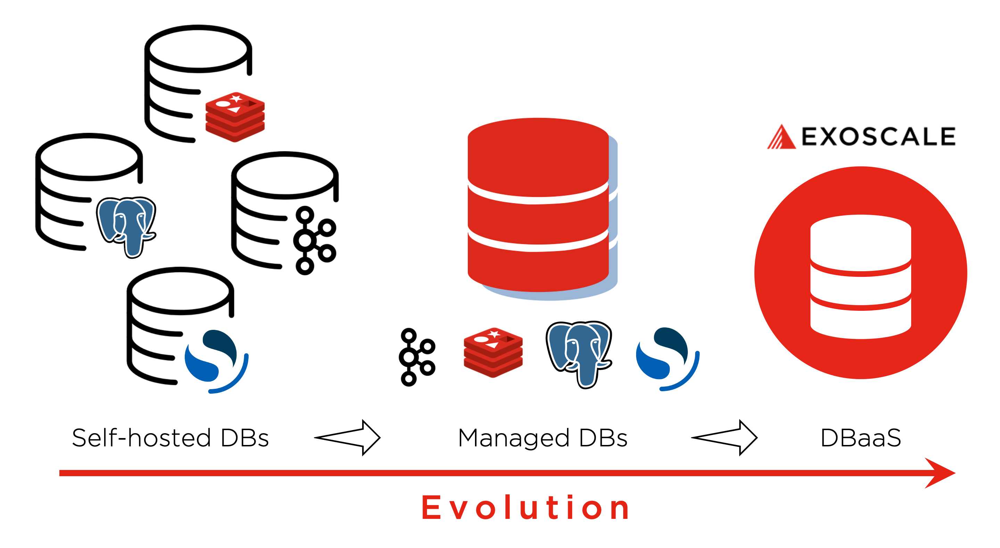

If you want to have a QuickStart with these technologies, go to our DBaaS Documentation <a href="https://community.exoscale.com/documentation/dbaas/quick-start/" target="_blank">__here__</a>.

## Exoscale DBaaS Benefits

### Exoscale DBaaS Benefits

Exoscale DBaaS is an excellent solution for everyone looking for a diverse portfolio of open-source data services used in all types of applications and business solutions.

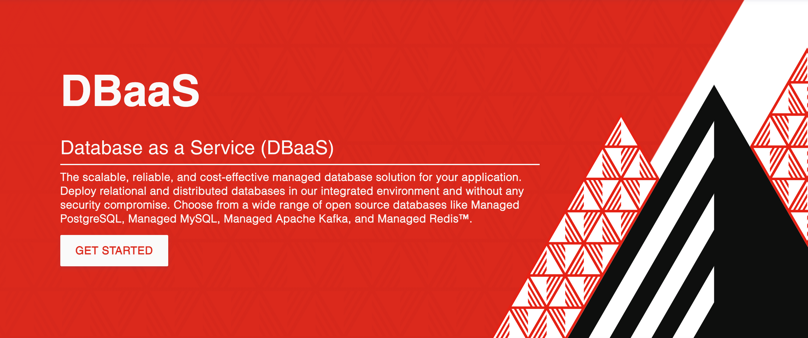

If you want to know more about the actual service offers, please go to <a href="https://www.exoscale.com/dbaas/" target="_blank">__Exoscale DBaaS__</a> on our website.

Exoscale DBaaS is deeply integrated into the Infrastructure as a Service platform and is easy to use with well-known user interfaces like the CLI, the API, and Terraform automation to-do your Infrastructure as Code (IaC) as usual.

#### Quick Start
Set up your database within minutes. Focus on your application; we take care of the rest.

#### Open Source
Choose between a wide range of open-source databases: PostgreSQL, Apache Kafka, Redis and many more to come.

#### Fully Managed
You don't have to care about maintenance or upgrades. Launch your database; we take care of the rest.

## Exoscale DBaaS Features 

### Exoscale DBaaS Features 

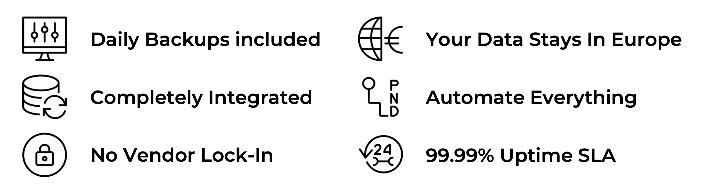

#### Daily Backups included
Backups are done on a daily basis and are included with every DBaaS offering.

#### Completely Integrated
Integrated DBaaS for your instances. Easily manage your database, instance, or storage from the same interface.

#### No Vendor Lock-In
Keep your cloud infrastructure independent and flexible with our offering of open source databases.

#### Your Data Stays In Europe
All data is stored in the country of your chosen zone, fully GDPR-compliant. DBaaS is available across European zones.

#### Automate Everything
Easily automate everything with our simple web portal, CLI, API or tools like Terraform.

#### 99.99% Uptime SLA
All DBaaS (cluster) offerings come with an uptime SLA of 99.99%.

## Powered by Aiven

### Powered by Aiven

* Our DBaaS is powered by __Aiven__, one of the leading European companies for managing Open Source data infrastructure in the cloud.
* The partnership offers __Exoscale__ customers an integrated environment for their complete cloud infrastructure – without any security compromise.
* Both companies are __GDPR-compliant__ to ensure the highest standards for customers’ data. The sole use of __Open Source__ projects ensures that customers are not vendor locked-in and always at the latest technology standard.

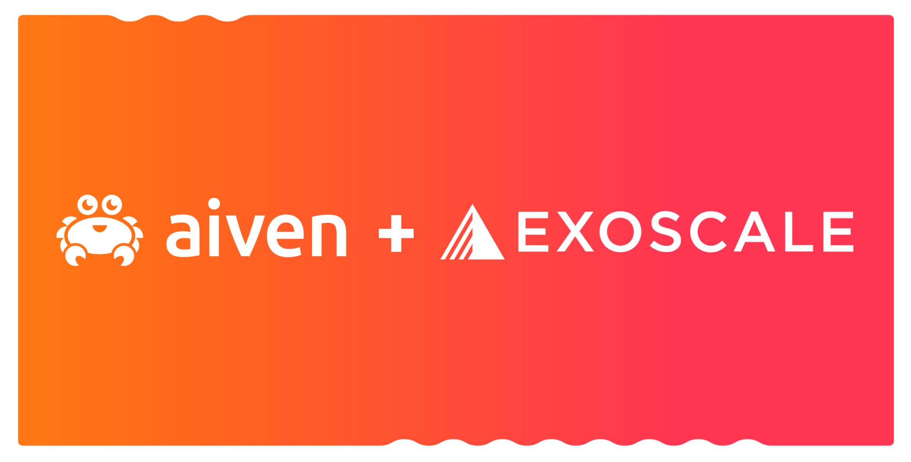

### About Aiven

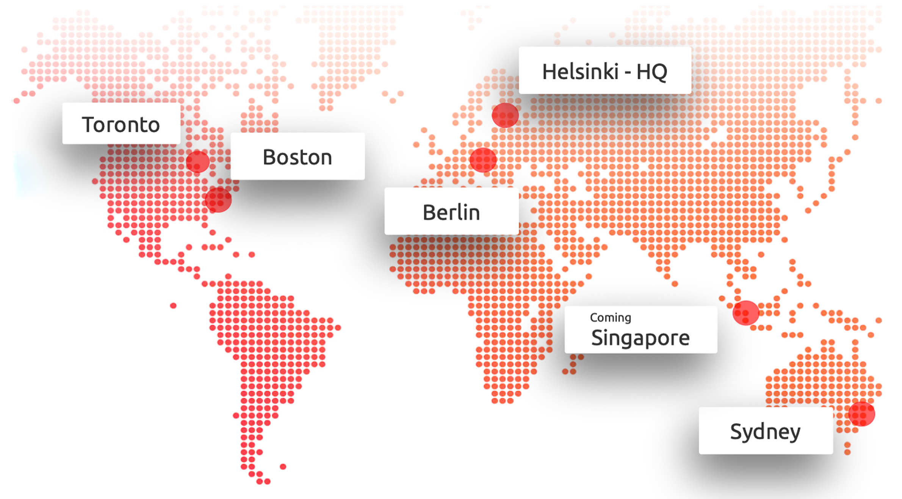

#### Fast Facts Aiven

* aiven.io
* founded in 2016
* team of 200 employees
* delivering bullet-proof data ops
* global team of open-source and cloud experts
* compliant: SOC2, ISO27000, GDPR, HIPPA & PCI-DSS

