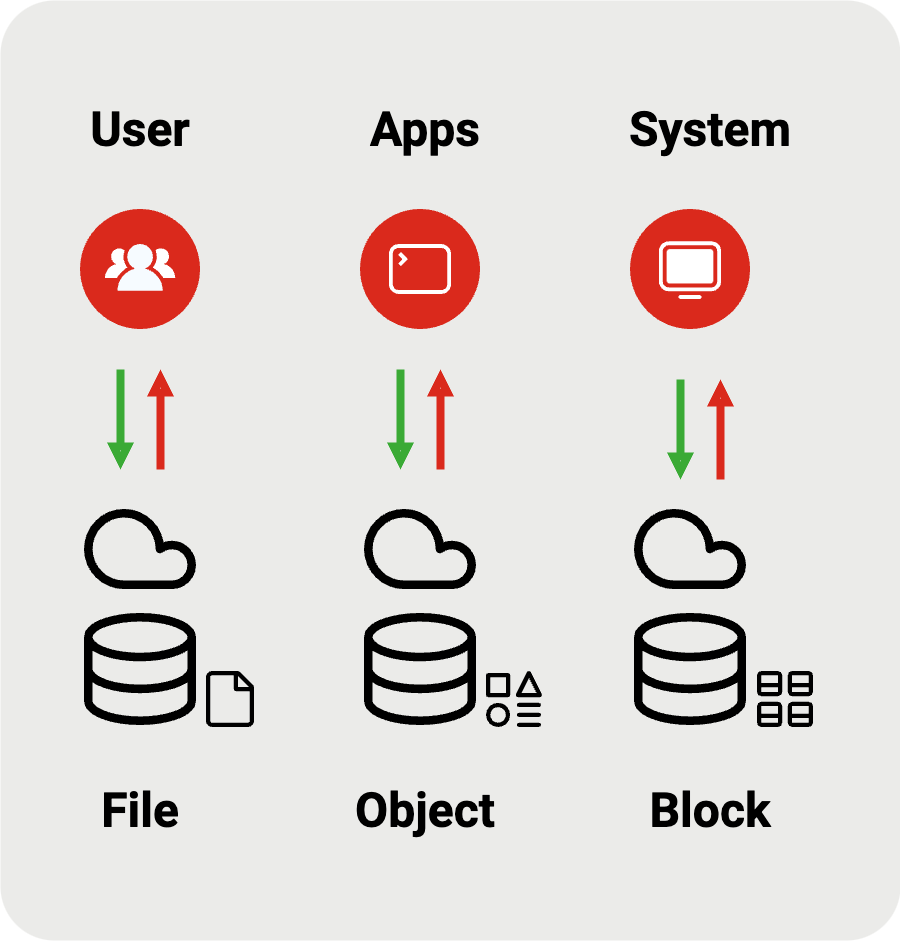

## Storage

### Definition

Storage is crucial for preserving and accessing computer data, files, applications, and other digital content. Storage refers to the process of storing and retrieving data or information. It is an essential component of any computer system.

### Basic Storage Types
There are several basic types of storage that are commonly used in computing systems. Here are the most common types:

#### Primary Storage
It is volatile, meaning its contents are lost when the computer is powered off or restarted. The computer's immediate storage space that holds processed data is also known as main memory or RAM (Random Access Memory). Primary storage is much faster than secondary storage but has limited capacity and is more expensive.

#### Secondary Storage
It is non-volatile and long-term storage for data and programs, meaning it retains data even when the power is turned off. It includes devices such as hard disk drives (HDDs), solid-state drives (SSDs), optical discs (CDs, DVDs, Blu-ray), USB flash drives, and network-attached storage (NAS) devices. Secondary storage is slower than primary storage but offers much larger storage capacities at a lower cost.

#### Tertiary Storage
Tertiary storage is used for archival purposes and is typically slower and less accessible than primary and secondary storage. Examples include magnetic tape drives and optical jukeboxes.

### Usage Storage Types
There are several usage types of storage that are commonly used in computing systems. Here are the most common types:

#### Offline Storage
Offline storage refers to storage devices that are not constantly connected to the computer system. Examples include external hard drives, USB flash drives, and memory cards.

#### Network Storage
This type of storage is accessed over a network and is shared among multiple computers. Network-Attached Storage (NAS) and Storage Area Networks (SAN) are common examples of network storage.

#### Virtual Storage
Virtual storage is a technique that allows the operating system to use secondary storage as if it were primary storage. It uses techniques like paging and swapping to manage memory efficiently.

### Cloud Storage Types
Cloud storage refers to storing data on remote servers accessed over the internet. It offers scalability, accessibility, and data redundancy. Cloud storage is catagorized into:

#### Ephemeral Storage
Ephemeral storage refers to temporary storage that is only available for the duration of a session or a specific task. Once the session or task ends, the data stored in ephemeral storage is typically erased or lost. Examples of ephemeral storage include RAM (Random Access Memory) and cache memory.

Ephemeral storage is often associated with cloud computing platforms, where virtual machines or containers are provisioned with temporary storage that is attached to the instance during its runtime. This storage is typically local to the instance and is not shared with other instances or persisted when the instance is terminated or restarted.

Ephemeral storage is commonly used for temporary files, caches, logs, or any other data that is only needed temporarily and can be easily recreated or regenerated if lost. It is not suitable for storing important or permanent data, as it is not designed for durability or long-term persistence.

#### Persistent Storage
Persistent storage is designed to retain data even when the power is turned off or the session ends. It is used for long-term storage of data that needs to be preserved and accessed across multiple sessions. Examples of persistent storage include hard disk drives (HDDs), solid-state drives (SSDs), optical drives, and cloud storage services.

Persistent storage is typically provided by external storage systems such as hard disk drives (HDDs), solid-state drives (SSDs), network-attached storage (NAS), storage area networks (SAN), or cloud-based object storage services. These storage systems are designed to ensure data durability and availability, even in the face of hardware failures or other disruptions.

Persistent storage is typically slower than ephemeral storage, as it often involves accessing data over a network or from disk-based storage devices. However, it provides the advantage of durability and the ability to retain data even in the event of system failures or restarts.

#### Ephemeral vs Persistent
The distinction between ephemeral storage and persistent storage lies in the duration of data retention. Ephemeral storage is temporary and volatile, while persistent storage is permanent and non-volatile. The categories for ephemeral storage and persistent storage are as follows:

Unlike ephemeral storage, which is temporary and local to a computing instance, persistent storage is designed to retain data over extended periods of time. It is commonly used for storing critical application data, databases, user files, configuration files, and other important information that needs to be preserved and accessed across multiple instances or sessions.

In contrast to ephemeral storage, persistent storage is designed for long-term data storage and is typically provided by external storage systems such as network-attached storage (NAS), storage area networks (SAN), or cloud-based object storage services. Persistent storage is durable and can survive system restarts or failures, ensuring that data is not lost.

### Storage Tier
A storage tier refers to a specific level or category of storage within a storage system. It is used to classify and organize data based on its performance, availability, and cost characteristics. Storage tiers are typically defined based on the underlying technology, such as solid-state drives (SSD), hard disk drives (HDD), or tape drives.

Storage tiers provide a way to categorize and manage data based on its characteristics, allowing organizations to optimize storage resources and meet the specific needs of different types of data.

#### Storage Performance
The purpose of implementing storage tiers is to optimize the utilization of storage resources and match the requirements of different types of data. By assigning data to appropriate storage tiers, organizations can ensure that frequently accessed or critical data is stored on high-performance storage media, while less frequently accessed or less critical data is stored on lower-cost storage media.

#### Storage Management
Storage tiers are often associated with hierarchical storage management (HSM) systems or storage virtualization technologies. These systems automatically move data between different tiers based on predefined policies and data access patterns. This dynamic data movement helps to balance performance, cost, and capacity requirements.

### Storage Type vs Storage Tier
The terms storage type and storage tier are related but have different meanings in the context of storage systems. Here's a breakdown of the differences:

#### Storage Type
A storage type refers to the underlying technology or medium used for storing data. It describes the physical or logical storage device or system. For example, common storage types include solid-state drives (SSD), hard disk drives (HDD), tape drives, or cloud storage. Each storage type has its own characteristics in terms of performance, capacity, cost, and durability.

#### Storage Tier
A storage tier, on the other hand, refers to a specific level or category within a storage system that is based on performance, availability, and cost. It is a way of organizing and classifying data based on its importance or access patterns. Storage tiers are typically defined within a storage system and can consist of one or more storage types.

In other words, a storage tier is a logical grouping or classification of data based on its characteristics, while a storage type refers to the actual technology or medium used for storing the data.

Storage tiers are often implemented within storage systems to optimize data placement and resource utilization. By assigning data to appropriate storage tiers, organizations can ensure that data is stored on the most suitable storage types based on its importance, performance requirements, and cost considerations. This allows for efficient data management and cost-effective storage solutions.

## Storage Criteria

### Overview

|**Criteria**|**Description**|
|:--|:--|
|*Performance* | storage read and write operations access speed|
|*Scalability* | increase or decrease the amount of storage|
|*Redundancy* | replicating data across multiple storage devices|
|*Retention* | period of time that data is stored and maintained|
|*Capacity* | amount of data that can be stored|
|*Archive* | service that is designed for long-term retention|
|*Costs* | expenses associated with storing data|

## Storage Duration

### Explained

Storage Duration or __Data Retention__ refers to the period of time that data is stored and maintained in a system or storage medium. It represents the duration for which data is preserved and remains accessible for retrieval or reference.

Data retention policies are typically defined by organizations to determine how long different types of data should be retained. These policies are influenced by various factors, including legal requirements, industry regulations, business needs, and data management best practices.

The purpose of data retention is to ensure that data is available for future use, analysis, compliance, or reference. It helps organizations meet legal and regulatory obligations, support business operations, facilitate data analysis and reporting, and address potential disputes or investigations.

Data retention periods can vary depending on the type of data and the specific requirements of the organization or industry. For example, financial records may need to be retained for a certain number of years, while customer data may have different retention requirements.

It is important for organizations to establish clear data retention policies and procedures to ensure compliance, data integrity, and efficient data management throughout the data lifecycle.

## Cloud Storage

### Definition

Cloud storage is a service that provides a convenient and scalable solution for storing, backing up, and accessing data over the Internet, eliminating the need for physical storage devices like hard drives or USB sticks.

It is a form of secondary storage where users can save their files on remote servers managed by cloud storage providers. These providers offer various storage plans and features designed to meet diverse user requirements, allowing for easy storage capacity expansion and accessibility from any location with an Internet connection.

This approach simplifies data management, enhances data security, and promotes collaboration through shared access to files among users.

### Benefits

Cloud storage offers several advantages over traditional local storage. Here are some key features and benefits of cloud storage:

#### Scalability
Cloud storage providers typically offer flexible plans, allowing users to increase or decrease their storage capacity as needed. This scalability makes it easy to accommodate changing storage requirements.

#### Accessibility
Cloud storage allows users to access their files anywhere with an internet connection. This makes it convenient for users to access their data from different devices, such as computers, smartphones, or tablets.

#### Collaboration
Cloud storage services often include collaboration features, allowing multiple users to access and work on the same files simultaneously. This makes it easier for teams to collaborate on projects and share documents.

#### Cost-effectiveness
Cloud storage eliminates the need for users to invest in and maintain their physical storage infrastructure. Users typically pay for the storage they use on a subscription basis, making it a cost-effective solution for individuals and businesses.

#### Backup and Recovery
Cloud storage providers often have robust backup and recovery mechanisms in place. This helps protect data from loss due to hardware failures, accidents, or other unforeseen events. Users can quickly restore their files from backups stored in the cloud.

## Storage Types

### Definition

When it comes to storage in the cloud, there are three main types:

- File Storage
- Object Storage
- Block Storage

Each type has its unique characteristics and use cases:

|**Type**|**Use Case**|
|:--|:--|
|*File Storage* | suitable for structured file-based data|
|*Object Storage* | ideal for unstructured data and cloud-native applications|
|*Block Storage* | provides low-level access for high-performance applications|

The choice between these storage types depends on your specific requirements and the nature of the data you need to store in the cloud.

Let's take a closer look at each of them.

#### Files Storage
File storage is designed to store and manage files in a hierarchical structure, similar to how files are organized in a traditional file system. It provides a shared file system that can be accessed by multiple users or applications simultaneously. File storage is suitable for scenarios where you need to store and access files in a structured manner, such as shared drives, file sharing, or hosting web content.

#### Object Storage
Object storage, on the other hand, is a storage architecture that manages data as objects. Each object consists of data, metadata (attributes or properties associated with the object), and a unique identifier. Object storage is highly scalable and offers virtually unlimited storage capacity. It is ideal for storing unstructured data like images, videos, documents, backups, and logs. Object storage is accessed using APIs, making it suitable for cloud-native applications and distributed systems.

#### Block Storage
Block storage works at the lowest storage level. It provides raw storage volumes that can be mounted as block devices by virtual machines or servers. It offers high-performance storage with low latency and is often used for databases, virtual machines, and applications that require direct access to storage at the block level. The operating system manages block storage and requires a file system to organize and manage data.

## Details - File Storage

### Explained

File storage has been around for considerably longer than object or block storage. It is something most people are familiar with. You name your files, place them in folders, and nest them under more folders to form a set path. This way, files are organized into a hierarchy, with directories and sub-directories. Each file also has a limited set of metadata associated with it, such as the file name, the date it was created, and the date it was last modified.

Hierarchical file storage is practical for organizing structured data. This works well up to a point, but as capacity grows, the file model becomes burdensome for two reasons. First, performance suffers beyond a certain capacity. A NAS system has limited processing power, making the processor a bottleneck. Second, performance also suffers with the massive database – the file lookup tables – that accompany capacity growth.

Scaling requires adding more hardware or upgrading to higher-capacity devices, which can be costly. Cloud-based file storage services offer a solution by allowing multiple users to access and share files stored in off-site data centers. With a monthly subscription fee, you can keep your files in the cloud, quickly scale up capacity, and specify performance and protection criteria. Additionally, you save on the expense of maintaining on-site hardware since the cloud service provider manages the infrastructure.

### Definition
File storage in the cloud refers to the practice of storing and managing files on remote servers that are accessible via the Internet. Instead of saving files on local storage devices like hard drives or USB drives, cloud storage allows users to upload and store files on servers maintained by a cloud storage provider. These files can then be accessed, shared, and synced across multiple devices and platforms.

Examples of file cloud storage services include Dropbox, Google Drive, and Microsoft OneDrive. These services typically offer a certain amount of free storage, with additional storage available for a fee.

- __Cloud File Storage__:
 is a method for storing data in the cloud that provides servers and applications access to data through shared file systems. This compatibility makes cloud file storage ideal for workloads that rely on shared file systems and provides simple integration without code changes.
- __Cloud File System__:
is a hierarchical storage system in the cloud that provides shared access to file data. Users can create, delete, modify, read, and write files, as well as organize them logically in directory trees for intuitive access.
- __Cloud File Sharing__:
is a service that provides simultaneous access for multiple users to a common set of files stored in the cloud. Security for online file storage is managed with user and group permissions so administrators can control access to the shared file data.

### Requirements for Cloud File Storage
An ideal file-based data storage solution in the cloud must deliver the proper performance and capacity for today while also being capable of scaling as business needs change. The solution should include the following features:

- __Performance__:
provides consistent throughput, scalable storage space, and low-latency performance
- __Security__:
provides network security and access control permissions for sensitive data protection
- __Affordability__:
pay only for capacity used with no upfront provisioning costs or licensing fees.
- __Availability__:
Redundancy across multiple sites and always accessible when needed.
- __Compatibility__:
integrates seamlessly with existing applications with no new code to write
- __Fully Managed__:
provides a system that can be launched in minutes with no physical hardware required or ongoing software maintenance

### Different Cloud File Storage Services
The benefits of cloud file storage are clear, but it is important to note that not all cloud file storage solutions are created equal; various solutions exist. Cloud file storage can be delivered in one of two ways:

- through __fully managed solutions__ with minimal setup and little to no maintenance or
- through __do-it-yourself solutions__ with separate compute, storage, software, and licensing, which require staffed expertise to configure and maintain.

## Benefits - File Storage

### Overview

Suppose your organization requires a centralized, easily accessible, affordable way to store files and folders. In that case, file-level storage is a good approach.

The benefits of file storage include the following:

- __Simplicity__:
File storage is the simplest, most familiar, and most straightforward approach to organizing files and folders on a computer’s hard drive or NAS device. You name files, tag them with metadata, and store them in folders under a hierarchy of directories and subdirectories. It is not necessary to write applications or code to access your data.
- __File Sharing__:
File storage is ideal for centralizing and sharing files on a Local Area Network (LAN). Files stored on a NAS device are easily accessible by any computer on the network that has the appropriate permission rights.
- __Common Protocols__:
File storage uses standard file-level protocols such as Server Message Block (SMB), Common Internet File System (CIFS), or Network File System (NFS). Utilize a Windows or Linux operating system (or both). Standard protocols like SMB/CIFS and NFS allow you to read and write files to a Windows-based or Linux-based server over your Local Area Network (LAN).
- __Data Protection__:
Storing files on a separate, LAN-connected storage device offers you a level of data protection should your network computer experience a failure. Cloud-based file storage services provide additional data protection and disaster recovery by replicating data files across multiple geographically dispersed data centers.
- __Affordability__:
File storage using a NAS device allows you to move files off of expensive computing hardware and onto a more affordable LAN-connected storage device. Moreover, suppose you choose to subscribe to a cloud file-storage service. In that case, you eliminate the expense of on-site hardware upgrades and the associated ongoing maintenance and operation costs.
- __Accessibility__:
Files stored in the cloud can be accessed from anywhere with an internet connection, making it convenient for users to retrieve their files on different devices.
- __Scalability__:
Cloud storage allows users to quickly scale up or down their storage capacity based on their needs. This eliminates the need to purchase additional hardware or upgrade local storage devices.
- __Data Backup and Recovery__:
Cloud storage providers typically offer built-in data backup and recovery features, ensuring that files are protected from hardware failures, accidents, or other forms of data loss.
- __Collaboration__:
Cloud storage enables seamless collaboration among users by allowing them to share files and folders with others. Multiple users can work on the same file simultaneously, making it easier to collaborate on projects.
- __Syncing__:
Cloud storage often includes file synchronization features, automatically updating files across multiple devices. This ensures that users always have the latest version of their files, regardless of the device they are using.

## Use Cases - File Storage

### Overview

Cloud file storage provides the flexibility to support and integrate with existing applications, plus the ease of deploying, managing, and maintaining all your files in the cloud. These two key advantages allow organizations to support various applications and verticals. Use cases such as large content repositories, development environments, media stores, and user home directories are ideal workloads for cloud-based file storage.

Here are some example use cases for file storage:

- __Web Serving__:
The need for shared file storage for web-serving applications can be challenging when integrating backend applications. Typically, multiple web servers deliver a website’s content, each needing access to the same set of files. Since cloud file storage solutions adhere to standard file-level protocols, file naming conventions, and permissions that web developers are accustomed to, cloud file storage can be integrated into your web applications.
- __Content Management__:
A content management system (CMS) requires a common namespace and access to a file system hierarchy. Like web-serving use cases, CMS environments typically have multiple servers that need access to the same set of files to serve up content. Since cloud file storage solutions adhere to the expected file system semantics, file naming conventions, and permissions that developers are accustomed to, storing documents and other files can be integrated into existing CMS workflows.
- __Analytics__:
Analytics can require massive amounts of data storage that can scale further to keep up with growth. This storage must also provide the performance necessary to deliver data to analytics tools. Many analytics workloads interact with data through a file interface, rely on features like file locks, and require the ability to write to portions of a file. Since cloud-based file storage supports standard file-level protocols and can scale capacity and performance, it is ideal for delivering a file-sharing solution that is easy to integrate into existing big data and analytics workflows.
- __Media and Entertainment__:
Digital media and entertainment workflows are constantly changing. Many businesses use a hybrid cloud deployment and need standardized access using file system protocols (NFS or SMB) or concurrent protocol access. These workflows require flexible, consistent, and secure access to data from off-the-shelf, custom-built, and partner solutions. Since cloud file storage adheres to existing file system semantics, storage of rich media content for processing and collaboration can be integrated for content production, digital supply chains, media streaming, broadcast play-out, analytics, and archives.
- __Home Directories__:
The use of home directories for storing files only accessible by specific users and groups can be beneficial for many cloud workflows. Businesses looking to take advantage of the scalability and cost benefits of the cloud are extending access to home directories for many of their users. Since cloud file storage systems adhere to common file-level protocols and standard permissions models, customers can lift and shift applications to the cloud that need this capability.
- __Database Backups__:
Backing up data using existing mechanisms, software, and semantics can create an isolated disaster recovery scenario with little locational flexibility for recovery. Many businesses want to take advantage of the flexibility of storing database backups in the cloud, either for temporary protection of previous versions during updates or for development and testing. Since cloud file storage presents a standard file system that can be mounted from database servers, it can be an ideal platform for creating portable database backups using native application tools or enterprise backup applications.
- __Development Tools__:
Development environments can be challenged to share unstructured data safely and securely as they collaborate to develop their latest innovations. With the need to share code and other files in an organized way, using shared cloud file storage provides an organized and secure repository accessible within their cloud development environments. Cloud-based file storage delivers a scalable and highly available solution ideal for collaboration.
- __End User Computing__:
End User Computing (EUC) is a combination of technologies that gives your employees secure, remote access to applications, desktops, and data they need to complete their work. Modern enterprises use EUC so their employees can work from wherever they are, across multiple devices, in a safe and scalable way. EUC technologies like persistent desktops and document management systems require secure, reliable, and scalable file storage systems.

## Details - Object Storage

### Explained

Object storage has become the foundation for web-scale architectures in public or private clouds. Its appeal is due to its potential to handle massive scale while minimizing complexity and cost. It allows application developers and users to focus more on their workflow and logic and not worry about managing file storage and file locations. Customers struggling with large-scale data storage deployments are turning to object storage to overcome the limitations that legacy storage systems face at scale.

### Definiton
Object storage is an architecture that manages data as distinct units, known as objects. Each object contains the actual data, metadata, and a unique identifier. The metadata stored alongside the data can include information such as creation date, size, and custom attributes. This technique manages and manipulates data storage using objects in a central location, not structured as files within folders. This approach to data storage offers substantial benefits in terms of scalability, cost-efficiency, and ease of use. It is a primary form of storage used in cloud computing infrastructure.

Critical characteristics of object storage include:

- __Flat Address space__:
Object storage uses a flat address space, meaning that there's no hierarchical structure like you'd find with traditional file systems. This lack of hierarchy allows for massive scalability, as there's no need to manage complex file paths or directory structures. Objects can be stored and retrieved using their unique identifier, making it easy to find and access data regardless of size or location.
- __Data Durability and redundancy__:
Object storage solutions often employ erasure coding and data replication techniques to ensure data durability and redundancy. Erasure coding breaks data into smaller pieces and adds redundancy. In contrast, data replication creates copies of the data across multiple storage nodes. Both techniques help to protect against data loss, ensuring that your information remains secure and available even in the event of hardware failures.
- __RESTful APIs__:
Object storage systems typically use RESTful APIs (Application Programming Interfaces) for communication between clients and the storage system. These APIs allow developers to easily integrate object storage into their applications, streamlining data storage and retrieval processes.
- __S3-compatible__:
Amazon's Simple Storage Service definition is the de facto standard for object storage. S3-compatible object storage refers to any storage service that supports the same application programming interface (API) as Amazon's Simple Storage Service (S3).

The term "S3 compatible" means that the storage service can interact with the S3 API, accepting the same commands and returning the expected responses as Amazon S3. This compatibility enables developers and applications designed to work with S3 to also work with other S3-compatible storage services without changing the code.

Key features of S3-compatible object storage typically include:

1. **RESTful interface:** S3 compatibility is primarily about adhering to the RESTful interface provided by Amazon S3, which uses standard HTTP/HTTPS methods like GET, PUT, POST, and DELETE.

2. **Bucket and Object Model:** The data storage model is organized into buckets (containers for storage) and objects (the individual pieces of data). This model is a fundamental aspect of S3.

3. **Scalability:** Like S3, compatible storage services can typically scale to store large amounts of data without degrading performance.

4. **Durability and Availability:** These services are usually designed to be highly durable, ensuring data is not lost and highly available, meaning data can be accessed when needed.

5. **Security:** S3 compatible services often offer similar security features, such as encryption in transit (SSL/TLS) and at rest, access controls, and possibly integration with identity services.

6. **Data Lifecycle Management:** They may provide features for managing data's lifecycle, including automatic deletion or transitioning to lower-cost storage tiers based on age or other criteria.

Adopting S3-compatible object storage is common for businesses that wish to avoid vendor lock-in or prefer to use an alternative to Amazon S3 for reasons such as cost, performance, data sovereignty, or a preference for on-premises storage. Various storage solution providers, including cloud services and on-premises storage vendors, offer S3-compatible object storage solutions.

Most backup software directly supports S3-compatible storage, and many programming languages have library functions that allow easy interaction with this storage type from the program code level.

## Benefits - Object Storage

### Overview

Overall, object storage provides a scalable, durable, and cost-effective solution for storing and managing large volumes of data. It is suitable for various use cases, including backup and recovery, content distribution, data archiving, and big data analytics. Object storage offers several benefits compared to traditional storage systems.

Here are some critical advantages of object storage:

- __Scalability__:
Object storage is highly scalable, allowing you to store and manage vast data. It can handle petabytes or even exabytes of data without any performance degradation.
- __Durability and Reliability__:
Object storage systems are designed to provide high durability and reliability. They use data replication and error correction techniques to ensure data integrity and protect against hardware failures.
- __Flexibility__:
Object storage is flexible and can accommodate various data types, including structured, unstructured, and semi-structured data. It does not impose any specific file system hierarchy, allowing you to organize and access data in a way that suits your needs.
- __Cost-effectiveness__:
Object storage is often more cost effective than traditional storage systems. It eliminates the need for complex storage architectures and reduces administrative overhead. Additionally, object storage systems typically use commodity hardware, which helps lower costs.
- __Accessibility__:
Object storage provides universal access to data over standard protocols like HTTP/HTTPS. This makes it easy to access and share data from anywhere, using any device with an internet connection.
- __Metadata and Tagging__:
Object storage allows you to attach metadata and tags to objects, making searching, categorizing, and organizing data easier. This enables efficient data management and retrieval.
- __Data Security__:
Object storage systems offer built-in data security features like rest and transit encryption. They also provide access control mechanisms to ensure only authorized users can access and modify data.
- __Data Lifecycle Management__:
Object storage supports data lifecycle management, allowing you to define data retention, replication, and deletion policies. This helps optimize storage resources and comply with data governance requirements.
- __Integration with Cloud Services__:
Object storage seamlessly integrates with cloud services and platforms, making it an ideal choice for cloud-native applications and hybrid cloud environments. It enables easy data migration and sharing across different cloud providers.

## Use Cases - Object Storage

### Overview

These are just a few examples of the many uses of object storage. Its scalability, durability, and cost-effectiveness make it a popular choice for storing and managing large volumes of unstructured data in various industries and applications. Object storage is a versatile solution that finds applications in multiple industries and use cases.

Here are some example use cases for object storage:

- __Cloud Storage__:
Object storage is the foundation of many cloud storage services, allowing users to store and retrieve data over the Internet. It provides scalable and durable storage for files, documents, images, videos, and other unstructured data types.
- __Backup and Archiving__:
Object storage is well-suited for backup and long-term data retention. Its ability to handle massive scale and durability makes it ideal for storing backups, archives, and historical data that must be retained for compliance or regulatory purposes.
- __Content Distribution__:
Object storage is used in content delivery networks (CDNs) to efficiently distribute and deliver content to end-users. Object storage enables fast and reliable content delivery by caching and replicating objects across multiple servers in different geographic locations, reducing latency and improving user experience.
- __Data Lakes and Analytics__:
Object storage is often used as a data lake for storing large volumes of structured and unstructured data. Data lakes are a centralized repository for data used in analytics, machine learning, and data mining. Object storage's scalability and cost-effectiveness make it an ideal choice for storing and processing big data.
- __Internet of Things__:
Object storage is used in Internet of Things (IoT) applications to store and manage the vast amount of data generated by connected devices. IoT devices generate a continuous stream of data, and object storage provides a scalable and reliable solution for storing and analyzing this data.
- __Collaboration and File Sharing__:
Object storage is used in collaboration platforms and file-sharing services to store and share files among users. It allows multiple users to access and collaborate on files simultaneously, providing a centralized and scalable storage solution.
- __Media and Entertainment__:
Object storage is widely used in the media and entertainment industry for storing and managing large media files, such as videos, images, and audio. It provides the necessary scalability and performance to handle the demands of media production, distribution, and streaming.

## Details - Block Storage

### Explained

Block storage is a fundamental component of cloud computing infrastructure, offering a versatile and scalable solution for storing and managing data. It allows dividing data into fixed-sized blocks, which can be accessed and manipulated independently. This flexibility allows for efficient data storage and retrieval, making block storage an ideal choice for applications requiring high-performance storage, such as databases and virtual machines. By leveraging block storage, organizations can focus on their core workflows and applications without the burden of managing file storage and locations. With the ability to scale horizontally and integrate seamlessly with other cloud services, block storage empowers customers to overcome the limitations of legacy storage systems, ensuring optimal performance and cost-effectiveness at any scale.

### Definition
Block storage is an architecture that divides data into fixed-size blocks, each with a unique address. Block storage devices like hard disk and solid-state drives use block-level access protocols like iSCSI and Fibre Channel to read and write data. This storage method is ideal for low-latency, high-performance environments where data access speed is crucial. However, it can be more complex and expensive to set up initially.

Critical characteristics of block storage include:

- __Block-level data access__:
Block storage systems provide direct access to the underlying storage blocks, allowing high-speed data reads and writes. This low-latency access is particularly beneficial for applications requiring rapid data access, such as databases and virtual machines.
- __File system abstraction__:
Block storage devices present a file system abstraction to the host operating system, meaning they appear as a traditional file system to the user. This abstraction allows users and applications to interact with the storage device using familiar file and directory structures, simplifying data storage and retrieval.
- __Data consistency__:
Block storage systems employ data consistency techniques, such as journaling and copy-on-write, to ensure that data remains consistent and accurate. These techniques help to prevent data corruption and loss, making block storage a reliable option for critical data storage requirements. Now that we've explained the basic capabilities of object and block storage, let's see how they go head-to-head.

## Benefits - Block Storage

### Overview

Block storage provides high-performance, flexible, and scalable solutions for applications requiring direct access to storage devices. It is well-suited for databases, virtualized environments, and other performance-critical workloads. Block storage offers several benefits compared to other storage systems.

Here are some critical advantages of block storage:

- __Performance__:
Block storage provides high-performance capabilities, making it ideal for applications requiring low latency and high IOPS (Input/Output Operations Per Second). It offers direct access to data blocks, allowing efficient and fast data retrieval and processing.
- __Flexibility__:
Block storage is highly flexible and can be easily integrated into existing infrastructure. It can be used with various operating systems and applications, making it suitable for multiple use cases.
- __Data Consistency__:
Block storage ensures data consistency using techniques like write caching and synchronous replication. Data modifications are immediately reported to the storage device, providing the data is always current.
- __Scalability__:
Block storage systems can scale vertically by adding more storage capacity to a single device or horizontally by adding more widgets to a storage cluster. This allows for easy expansion as your storage needs grow.
- __Data Protection__:
Block storage offers data protection features such as RAID (Redundant Array of Independent Disks) and snapshotting. RAID provides redundancy by distributing data across multiple disks. At the same time, snapshots allow you to create point-in-time copies of your data for backup and recovery purposes.
- __Data Security__:
Block storage provides data security features such as rest and transit encryption. This ensures your data is protected from unauthorized access and provides additional security for sensitive information.
- __Application Compatibility__:
Block storage is compatible with many applications and databases that require direct access to storage devices. It allows efficient data management and supports features like data replication and clustering.
- __Data Recovery__:
Block storage systems offer efficient data recovery options. In case of data loss or corruption, you can restore data from backups or snapshots, minimizing downtime and ensuring business continuity.
- __Virtualization Support__:
Block storage is commonly used in virtualized environments. It provides storage resources to virtual machines (VMs) and allows for features like live migration and high availability.

## Use Cases - Block Storage

### Overview

These are just a few examples of the many uses of block storage. Its versatility and scalability make it a crucial component in various IT environments, enabling efficient data storage and management for multiple applications and workloads. Block storage has many uses in cloud computing and other IT environments.

Here are some example use cases for block storage:

- __Databases__:
Block storage is often used to store databases due to its high-performance capabilities. It provides the necessary speed and reliability for database operations, ensuring efficient data access and retrieval.
- __Virtual Machines__:
Block storage commonly stores virtual machine (VM) images and data. It allows for easy provisioning and management of VM storage, enabling organizations to scale their virtualized infrastructure as needed.
- __Applications__:
Many applications require persistent storage for their data. Block storage provides a reliable and scalable solution for storing application data, ensuring it is readily accessible and protected against data loss.
- __Backup and Disaster Recovery__:
Block storage is often used for backup and disaster recovery purposes. It allows organizations to create snapshots or replicas of their data, providing a reliable and efficient way to restore data in case of data loss or system failures.
- __Big Data Analytics__:
Block storage is used in big data analytics environments to store and process large volumes of data. It provides the necessary performance and scalability to handle the massive amounts of data generated by analytics workloads.
- __Content Delivery__:
Block storage is used in content delivery networks (CDNs) to store and deliver static content, such as images, videos, and files. It ensures fast and reliable content delivery to end-users by caching and distributing it across multiple servers.
- __High-Performance Computing__:
Block storage is commonly used in high-performance computing (HPC) environments to store and process large datasets. It provides the speed and reliability required for complex scientific calculations and simulations.

## Object vs Block

### Explained

As our reliance on technology grows, so does our need for efficient and cost-effective data storage solutions. We'll explore two popular storage technologies, object storage and block storage, their fundamental differences, and their strengths and weaknesses so that you can choose the right solution for your organization.

### Object vs Block: Cost
Cost is a crucial factor in data storage, and both object and block storage solutions have their cost considerations.

- __Cost Efficiency__:
Object storage is generally more cost-efficient than block storage, primarily due to its scalability and cost-effectiveness at scale. As the volume of data increases, object storage's flat address space and erasure coding techniques can provide substantial cost savings compared to block storage.
- __Access Costs__:
One potential drawback of object storage is access costs. Retrieving data from object storage can be more expensive than block storage due to the additional overhead associated with the retrieval process. On the other hand, block storage provides direct access to data and typically incurs lower access costs.
- __Hardware Costs__:
Large-scale block storage often requires specialized hardware, such as Fiber Channel switches, which can be expensive to implement and maintain. On the other hand, object storage can use commodity hardware, making it a more cost-effective option for smaller organizations or those with limited budgets.

### Object vs Block: Selection
Choosing between object and block storage ultimately depends on your specific data storage and management requirements. Object storage is ideal for storing unstructured data such as multimedia files, backups, and archives. It's also well-suited for distributed data storage, analytics, and big data applications. Block storage is ideal for storing structured data such as databases and virtual machines. It's also well-suited for high-performance applications that require low latency and high throughput.

- __Workload Consideration__:
Consider the workload for storing data. Applications that require high-speed data access may benefit from block storage. In contrast, those with large data volumes may benefit more from object storage's scalability and cost-effectiveness.
- __Cost Evaluation__:
Object storage is generally more cost-effective than block storage, particularly at scale. However, retrieval costs can be higher with object storage, so evaluating the total cost of ownership for each storage solution is essential.
- __Evaluate Scalability__:
Object storage's scalability and elasticity make it an ideal solution for distributed data storage. In contrast, block storage may be more limiting in terms of scalability.
- __Evaluate Performance__:
Block storage typically offers lower latency and higher performance for applications that require rapid data access. In contrast, object storage can provide higher throughput for large data access requests.

### Object vs Block: Scalability
Scalability is critical in data storage, mainly as data volumes grow exponentially.

- __Scalability at Scale__:
Object storage's flat address space and erasure coding techniques make it highly scalable, even at petabyte-scale data volumes. Block storage's reliance on file systems and hierarchical structures can limit scalability, particularly as data volumes increase.
- __Elasticity__:
Object storage's scalability extends to elasticity, allowing organizations to adjust storage capacity on-demand to meet changing data storage requirements. Block storage's scalability is typically more rigid, requiring more planning and management to scale effectively.
- __Data Distribution__:
Object storage's scalability and elasticity make it an ideal solution for distributed data storage. As organizations grow and expand, object storage can provide a cost-effective and efficient way to store data across multiple locations.

### Object vs Block: Performance
Performance is another crucial consideration in data storage, particularly for applications that require rapid data access.

- __Latency__:
Block storage typically offers lower latency than object storage, making it better suited for applications that require rapid data access, such as databases and virtual machines. Object storage's additional overhead can result in higher latency, particularly for small data access requests.
- __Throughput__:
Object storage can provide higher throughput than block storage, particularly for large data access requests. Object storage's erasure coding and data replication techniques allow for parallel data access, resulting in faster data transfers.
- __Workload__:
Optimization Choosing the proper storage solution for your workload is critical in optimizing performance. Organizations that require high-speed data access may benefit from block storage. In contrast, those with large data volumes may benefit more from object storage's scalability and cost-effectiveness.

