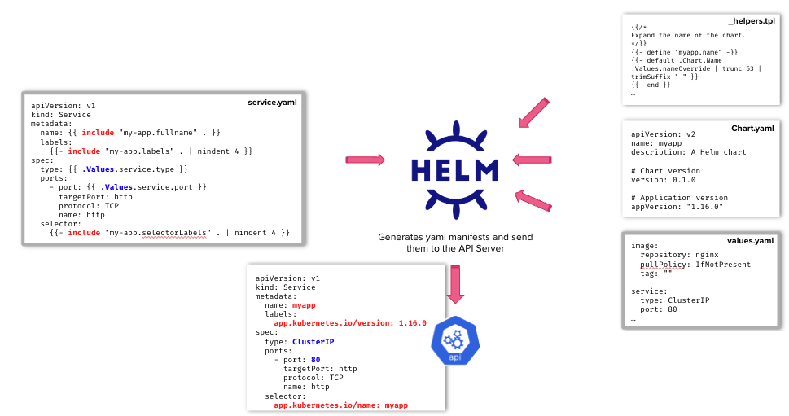
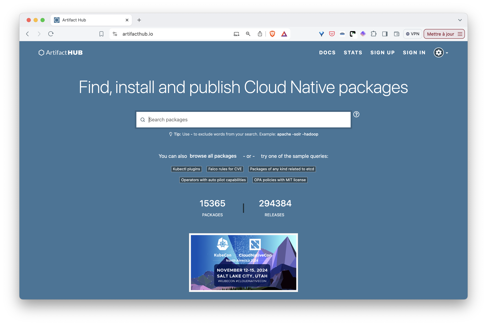
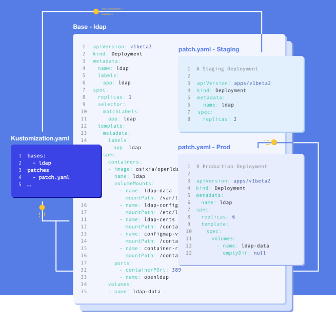

This section gives an overview of the essential tools for managing complex Kubernetes configurations: create custom resources with CRDs, deploy applications with [Helm](https://helm.sh), or using [Kustomize](https://kustomize.io).


These three tools address different aspects of Kubernetes configuration management:
- **CRDs** extend Kubernetes by creating new resource types for custom applications and operators
- **Helm** packages and deploys complete applications with templating and lifecycle management
- **Kustomize** customizes existing manifests through overlays without templates

Together, they provide a comprehensive toolkit for managing configurations from simple deployments to complex, multi-environment applications.


## CustomResourceDefinition (CRDs)

Kubernetes can be extended in many ways. A CustomResourceDefinition (a.k.a. CRD) is a specific Kubernetes resource which allows creating new resources. For example, CRDs are used a lot in operators which are controllers acting on their own resources.

If we try to list the resources of type Database, we'll get an error as this type is not known.

```bash
$ k get database
error: the server doesn't have a resource type "database"
```

Using a CRD we can define a Database resource and manipulate it using kubectl as any other resources. The following specification is an example of CRD defining a Database resource.

```yaml{filename="db-crd.yaml"}
apiVersion: apiextensions.k8s.io/v1
kind: CustomResourceDefinition
metadata:
  name: databases.learning.cka
spec:
  group: learning.cka
  scope: Namespaced
  names:
    kind: Database
    plural: databases
    singular: database
    shortNames:
    - db
    - dbs
  versions:
  - name: v1
    served: true      # This version can be served via the API
    storage: true     # This version is used for storing objects in etcd
    schema:
      openAPIV3Schema:
        type: object
        properties:
          spec:
            type: object
            properties:
              type:
                type: string
```


The `served` and `storage` fields are **required** for each version:
- `served: true` enables the API version for client requests (can be disabled for deprecated versions)
- `storage: true` designates which version is used for persistence in etcd (exactly one version must have this set to true)

These fields cannot be omitted and are essential for version management when evolving your CRD schema.


Basically, it defines a new resource of type Database in the `learning.cka` group, which contains a simple *type* property of type string under its *spec* field.  
We create it as any other Kubernetes resources.

```bash
$ k apply -f db-crd.yaml
customresourcedefinition.apiextensions.k8s.io/databases.learning.cka created
```

Next, we verify Kubernetes recognizes the Database resource type.

```bash
$ kubectl api-resources | grep database
databases                           db,dbs       learning.cka/v1                     true         Database
```

Next, we create the specification of a Database resource, as follows.

```yaml{filename=db.yaml}
apiVersion: learning.cka/v1
kind: Database
metadata:
  name: db
spec:
  type: mongo
```

Then, we create it.

```bash
$ kubectl apply -f db.yaml
database.learning.cka/db created
```


This Database CRD is not very useful on its own as it does not trigger the creation of a real database under the hood. For this to be possible, we need an operator in charge of watching for new resources of type Database and creating the database accordingly.  
A project can use CRDs to define and manipulate its own structures (similar to a Java class, to some extent), but also to provide a simple interface to the user hiding some internal complexity.


## Helm

### Main concepts

Helm is a Package Manager for Kubernetes, it allows packaging, installing, upgrading and deleting applications.  
A Helm Chart is an application packaged with Helm, it has a strict folder structure similar to the following one.

```bash
$ tree my-app
my-app
├── Chart.yaml
├── charts
├── templates
│   ├── NOTES.txt
│   ├── _helpers.tpl
│   ├── deployment.yaml
│   ├── ingress.yaml
│   ├── service.yaml
│   ├── serviceaccount.yaml
│   └── tests
│       └── test-connection.yaml
└── values.yaml
```

This structure is mainly composed of:
- YAML template: Kubernetes manifests containing instructions, like conditional logic, in Go templating language
- value files: containing configuration properties

The Helm Client is a binary used to manipulate application packaged with Helm, it can be installed following [these instructions](https://helm.sh/docs/intro/install/). The schema below is an overview showing that helm can create Kubernetes manifests from YAML templates (containing instructions in the templating language) and value files containing configuration properties.



### ArtifactHub

The [ArtifactHub](https://artifacthub.io) is the place where many applications are distributed and ready to be deployed, using Helm, in a Kubernetes cluster.



### Searching repository

The helm client allows searching for existing Charts, within the ArtifactHub or in the local repositories. The command below search for Chart containing the `grafana` keyword in the ArtifactHub.

```bash
helm search hub grafana
```



When selecting a Chart, make sure you use one that is either official or heavily maintained by the community.


### Installing a chart

An application installed from a Chart is called a release. In this example, we'll install the official Grafana Chart. Before installing a Chart, we need to add the repository it is living in. First, we add the *grafana* repo.

```bash
helm repo add grafana https://grafana.github.io/helm-charts
```


The repository's path is provided in the Chart installation instructions in the ArtifactHub


Next, we install the Chart.

```bash
helm install my-grafana grafana/grafana --version 9.3.0
```


This command creates a release using the default values. We could provide our own value files to override these values. 


Many applications can be installed directly from an OCI registry, removing the need to add the helm repository. The example below installs the redis Chart that way.

```bash
helm install redis oci://registry-1.docker.io/bitnamicharts/redis
```

### Base commands

- Creating (or upgrading) a release

```bash
helm upgrade --install my-release CHART_URL [-f values.test.yaml]
```

- Getting the status of a release

```bash
helm status my-release
```

- Getting the rollout history of a release

```bash
helm history my-release
```

- Rolling back a release

```bash
helm rollback my-release REVISION
```

- Getting information about a given release

```bash
helm get all/hooks/manifest/notes/values my-release
```

- Listing existing releases

```bash
helm list
```

- Removing a release

```bash
helm delete my-release
```

### Creating a Helm Chart to package an application

The following command creates a sample Chart containing resources to deploy a nginx server:

```bash
helm create my-app
```

The folder structure created is as follows.

```bash
$ tree my-app
my-app
├── Chart.yaml
├── charts
├── templates
│   ├── NOTES.txt
│   ├── _helpers.tpl
│   ├── deployment.yaml
│   ├── ingress.yaml
│   ├── service.yaml
│   ├── serviceaccount.yaml
│   └── tests
│       └── test-connection.yaml
└── values.yaml
```

Let's describe the files/folders some more:

- Chart.yaml contains the application metadata and the dependencies list
- charts is a folder used to store the dependent Charts
- NOTES.txt provides the post install instructions to the user
- _helpers.tpl contains functions and variables to simplify the templating
- the YAML files in the templates' folder contain specifications with templating code
- values.yaml defines the configuration values for the application

To package your application, you can start from this scaffold, replacing the manifests within the `templates` folder with the ones of your application.

## Kustomize

Kustomize allows you to customize application configuration without using templates. It allows to define a base layer and to apply overlays on top of it.  
kubectl can manage Kustomize applications using ```kubectl apply -k```, which is very handy.



In the next sections, we'll see how to package a simple application with Kustomize and to configure it for various environments.

### Creating a base layer

We will consider a Deployment managing one nginx Pod and a Service exposing it. The specification of these resources are defined below.



  
  ```yaml
    apiVersion: apps/v1
    kind: Deployment
    metadata:
      labels:
        app: nginx
      name: nginx
    spec:
      replicas: 1
      selector:
        matchLabels:
          app: nginx
      template:
        metadata:
          labels:
            app: nginx
        spec:
          containers:
          - image: nginx:1.28
            name: nginx
  ```
  
  
  
  ```yaml
    apiVersion: v1
    kind: Service
    metadata:
      labels:
        app: nginx
      name: nginx
    spec:
      ports:
      - port: 80
        protocol: TCP
        targetPort: 80
      selector:
        app: nginx
  ```
  
  


First, we create a *base* folder and add both specification inside it.

```bash
$ tree .
.
└── base
    ├── deploy.yaml
    └── service.yaml
```

Next, we create a file named *kustomization.yaml*, which defines the resources Kustomize should take into account.

```yaml{filename="kustomization.yaml"}
resources:
- deploy.yaml
- service.yaml
```

```bash
$ tree .                
.
└── base
    ├── deploy.yaml
    ├── kustomization.yaml
    └── service.yaml
```

Then, we use kubectl to deploy this content, pointing the folder containing the kustomization.yaml file

```bash
$ kubectl apply -k base 
service/nginx created
deployment.apps/nginx created
```

Kustomize really shines when it comes to applying changes to the configuration without modifying the content in the base layer.

### Creating an overlay per environment

Let's consider 2 environments, dev and test, with the following requirements:
- *dev* should use nginx:1.29
- *test* should run 3 replicas of the nginx Pod 

For each environment, we'll create a new folder with the changes we need to apply on top of the base layer.

#### Dev 

First, we create the *dev* folder next to the *base* one. In this folder we will define:
- kustomization.yaml, which specifies the base layer to use and the patches to apply
- deploy.yaml, which contains the new image to use



  
  ```yaml
  resources:
  - ../base

  patches:
  - path: deploy.yaml
    target:
      kind: Deployment
      name: nginx
  ```
  

  
  ```yaml
    apiVersion: apps/v1
    kind: Deployment
    metadata:
      name: nginx
    spec:
      template:
        spec:
          containers:
          - image: nginx:1.29
            name: nginx
  ```
  
  


The folder structure is now:

```bash
$ tree .
.
├── base
│   ├── deploy.yaml
│   ├── kustomization.yaml
│   └── service.yaml
└── dev
    ├── deploy.yaml
    └── kustomization.yaml
```

Before applying, you can preview the changes using `kubectl kustomize dev` to see the final manifests.

Next, we apply the dev overlay on the base resources.

```bash
$ k apply -k dev           
service/nginx unchanged
deployment.apps/nginx configured
```

Then, we can verify the Deployment is now based on the *nginx:1.29* image.

```bash
$ k get deploy nginx -o jsonpath='{.spec.template.spec.containers[0].image}'
nginx:1.29
```

#### Test

We'll follow the same approach for the test environment.  

First, we create the *test* folder next to the *base* one. In this folder we will define:
- kustomization.yaml, which specifies the base layer to use and the patches to apply
- deploy.yaml, which contains the new number of replicas



  
  ```yaml
  resources:
  - ../base

  patches:
  - path: deploy.yaml
    target:
      kind: Deployment
      name: nginx
  ```
  

  
  ```yaml
    apiVersion: apps/v1
    kind: Deployment
    metadata:
      name: nginx
    spec:
      replicas: 3
  ```
  
  


The folder structure is now:

```bash
$ tree .
.
├── base
│   ├── deploy.yaml
│   ├── kustomization.yaml
│   └── service.yaml
├── dev
│   ├── deploy.yaml
│   └── kustomization.yaml
└── test
    ├── deploy.yaml
    └── kustomization.yaml
```

Next, we apply the test overlay on the base resources.

```bash
$ k apply -k test           
service/nginx unchanged
deployment.apps/nginx configured
```

Then, we can verify the Deployment now manages 3 Pods.

```bash
$ k get po -l app=nginx
NAME                     READY   STATUS    RESTARTS   AGE
nginx-7b95dc7d4d-cskm4   1/1     Running   0          15s
nginx-7b95dc7d4d-g6q4m   1/1     Running   0          18s
nginx-7b95dc7d4d-zpwld   1/1     Running   0          16s
```


The [kustomize binary](https://kubectl.docs.kubernetes.io/installation/kustomize/) can be used for more advance Kustomize usage


## --- Practice ---

You can now jump to the [Exercises part](./exercises/) to learn and practice the concepts above.
