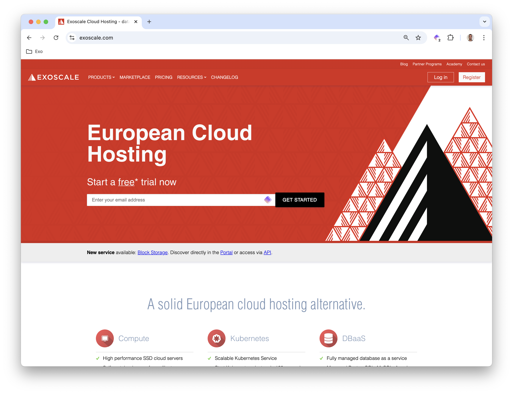
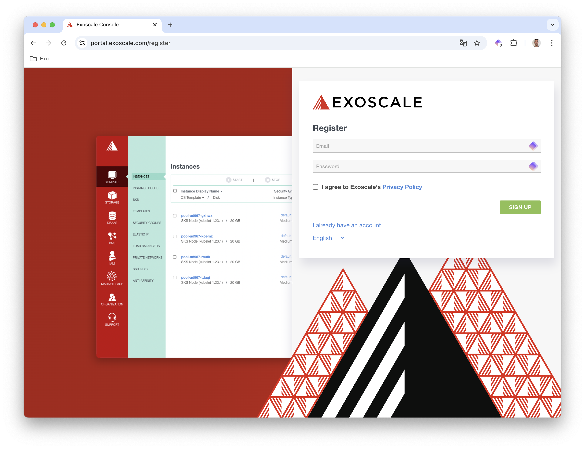
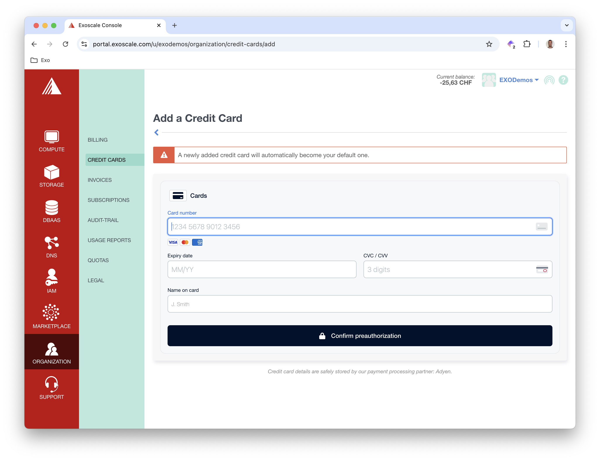
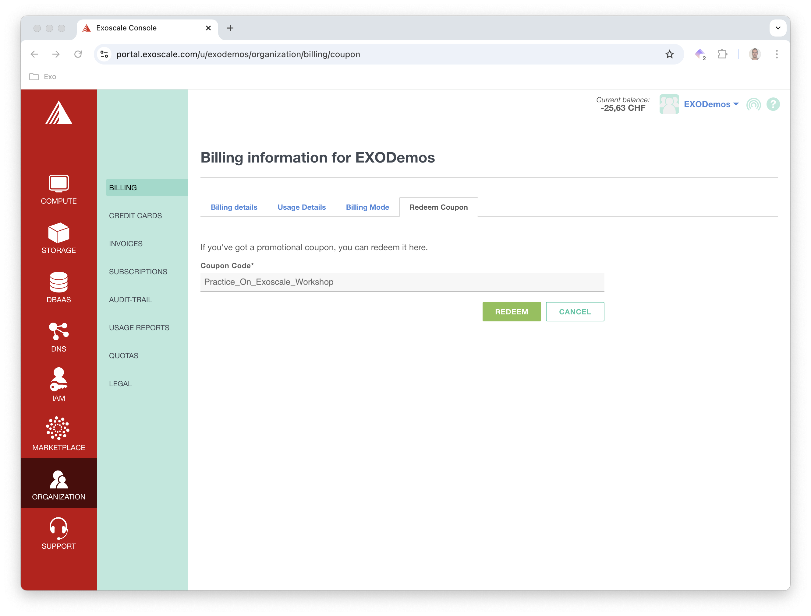
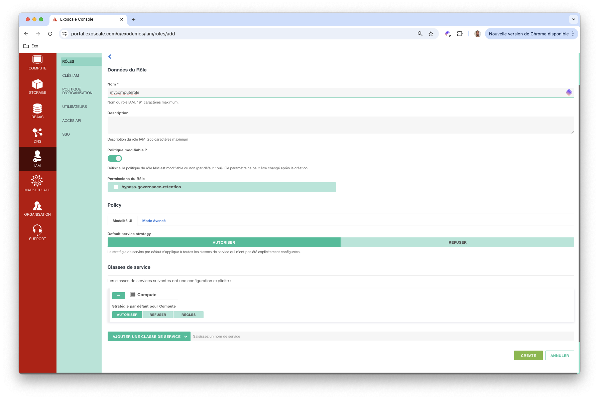
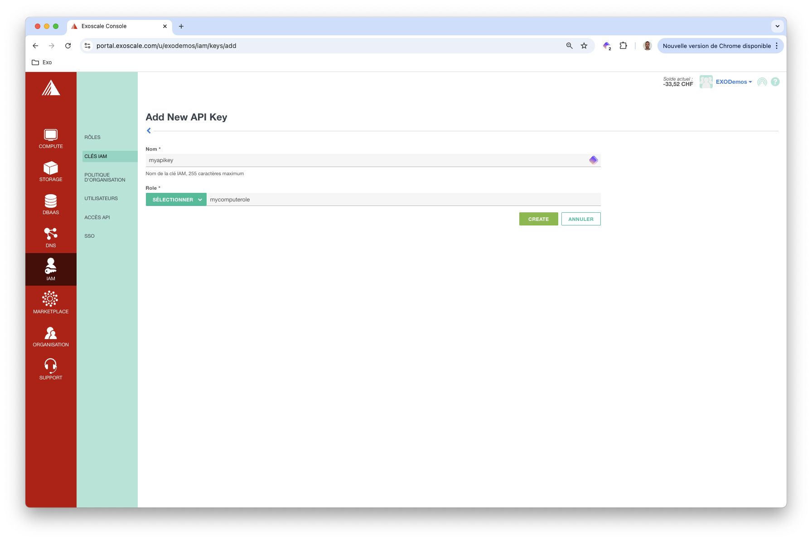
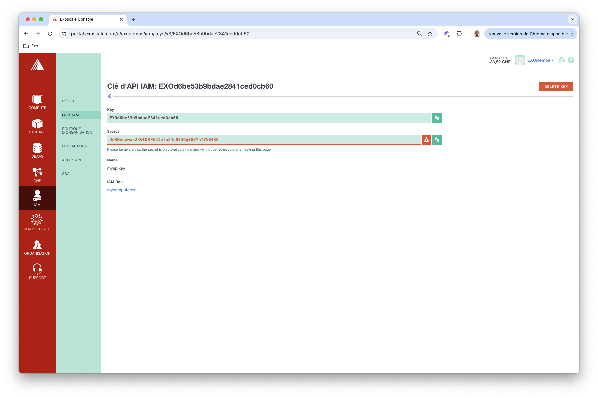

## Creating an account

First, go to the [Exoscale Portal](https://exoscale.com).

Next, click the *Registration* button and enter your email address and password.

## Validating your account

To protect against fraud, Exoscale must validate your account. You can do so by entering a credit card number or adding a small amount of money (e.g., 5€) to your account (you can use PayPal for that purpose).

## Getting free credits

Once your account is validated, you are credited 20€ to test the Exoscale platform for free. On top of this, because you follow this workshop, you can redeem additional free credits by entering the coupon code *Practice_On_Exoscale_Workshop* in your [personal organization](https://portal.exoscale.com/organization/billing/coupon)

These credits are available for the workshop, but you can use the remaining to discover other features of the Exoscale platform.

## Get your API Key

The last step is to generate an API Key; you need this key pair to configure the tool in charge of creating the cluster (exo cli, Terraform, or Pulumi)

First, go to the IAM menu and create a role. Exoscale offers a very granular and unique role configuration. In this example you will make a role with rights on the compute service. You can select the *Compute* service class and allow all the operations.

Then, create a key associated with this role; you can give this key the name of your choice. Associate the role you created above.

This process generates a key pair.


The key and secret represented in the screenshot below are dummy ones


Store these keys in the EXOSCALE_API_KEY and EXOSCALE_API_SECRET environment variables as you need them in the next step.
 
Now you have an account, select one of the following approaches to create your cluster.


 
 
 
