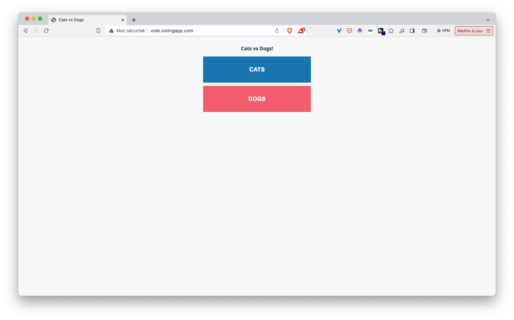

1. The specification for the Ingress resource is as follows:

```yaml {filename="ingress.yaml"}
apiVersion: networking.k8s.io/v1
kind: Ingress
metadata:
  name: vote
spec:
  ingressClassName: traefik
  rules:
  - host: vote.votingapp.com
    http:
      paths:
      - path: /
        pathType: Prefix
        backend:
          service:
            name: vote-ui
            port:
              number: 80
  - host: result.votingapp.com
    http:
      paths:
      - path: /
        pathType: Prefix
        backend:
          service:
            name: result-ui
            port:
              number: 80
```

2. Deploy the application with the following command from the *manifests* directory:

``` bash
kubectl apply -f .
```

You can then access the different interfaces using real domain names instead of a port number.




3. Delete the application with the following command from the *manifests* directory:

``` bash
kubectl delete -f .
```