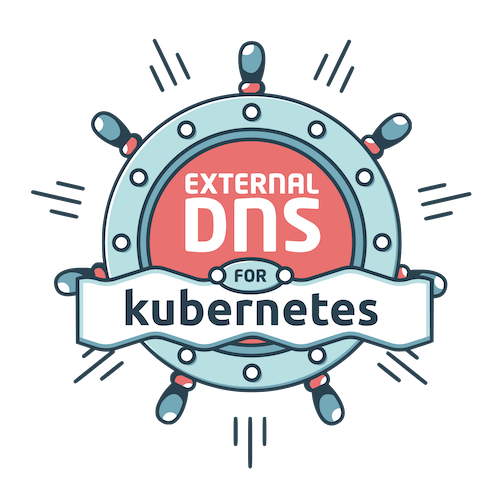
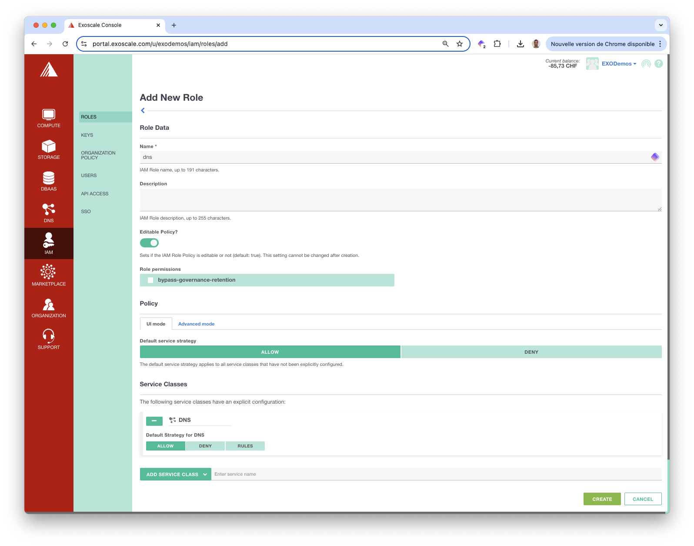
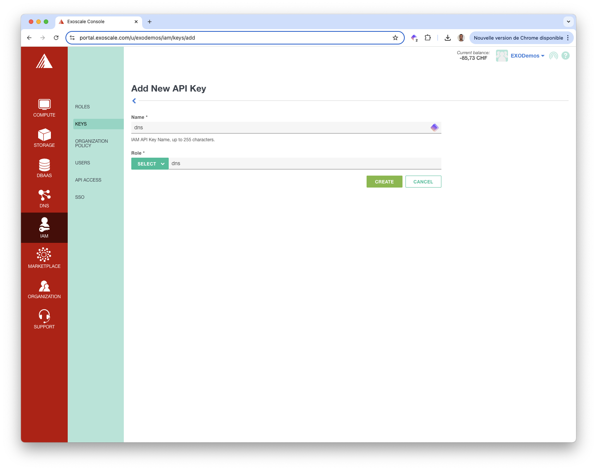
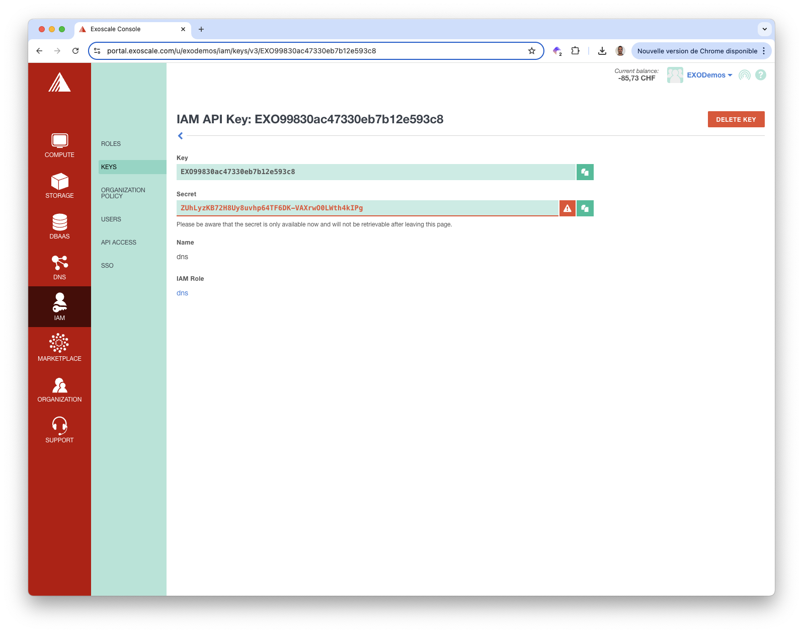
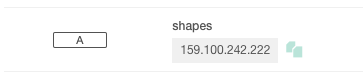
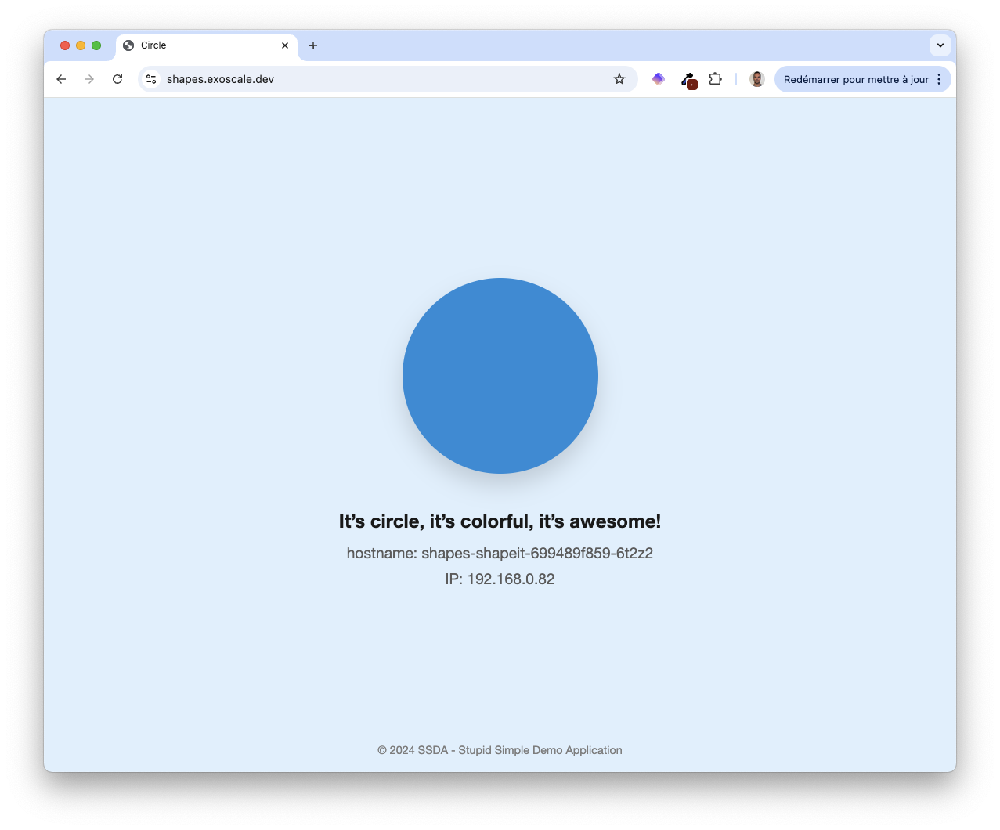

In this section we present [ExternalDNS](https://kubernetes-sigs.github.io/external-dns), a tool allowing to control DNS records dynamically via Kubernetes resources.




You may not be able to follow the exact same steps described in this section, as it involves the manipulation of DNS entries.However, feel free to adapt it to your own context. 


## Prerequisites

We need a Kubernetes cluster, which can be created following [these instructions](../../sks/). We also need the kubectl binary configured with the cluster's kubeconfig, and the helm binary. 

## Creating an IAM role

Since *ExternalDNS* requires access to DNS records, we must provide the necessary credentials. From the Exoscale portal, we first create a role giving access to the DNS service.



Next we create an API Key associated with this role.



We save the Key and Secret in the *API_KEY* and *API_SECRET* environment variables. We'll use them in a next section.



```
export EXOSCALE_API_KEY=...
export EXOSCALE_API_SECRET=...
```


The API Key and API Secret in the screenshot above are dummy ones
    

## Installing Traefik

Since we'll expose applications to the outside, we install Traefik Ingress Controller:

``` bash
helm repo add traefik https://traefik.github.io/charts
helm install traefik traefik/traefik --version 33.1.0 -n traefik --create-namespace
```


We selected Traefik in this example, but there are many other Ingress Controller implementations including Nginx, HAProxy, Kong.


## Installing Cert-Manager

Cert-manager automates the certificate issuance and renewal process. We’re installing Cert-manager using Helm:

```bash
helm repo add cert-manager https://charts.jetstack.io
helm install cert-manager cert-manager/cert-manager --set crds.enabled=true --version 1.16.2 -n cert-manager --create-namespace
```

Next we define a ClusterIssuer responsible for issuing certificate through Let's Encrypt: 

```bash
cat <<EOF | kubectl apply -f -
apiVersion: cert-manager.io/v1
kind: ClusterIssuer
metadata:
  name: letsencrypt
spec:
  acme:
    email: devops@techwhale.io
    server: https://acme-v02.api.letsencrypt.org/directory
    privateKeySecretRef:
      name: acme-account-key
    solvers:
    - http01:
       ingress:
         class: traefik
EOF
```


This [section](../cert-manager/) provides additional details about cert-manager


## Installing ExternalDNS

Before installing ExternalDNS, we create a Secret containing the API Key and Secret in the *external-dns* namespace:

```bash
kubectl create ns external-dns

kubectl -n external-dns create secret generic exo \
--from-literal=exoscale_api_key=$API_KEY \
--from-literal=exoscale_api_token=$API_SECRET
```

Next we install the *ExternalDNS* Helm Chart:

```bash
helm install -n external-dns external-dns \
  --set provider=exoscale \
  --set exoscale.secretName=exo \
  --version "8.6.1" \
  oci://registry-1.docker.io/bitnamicharts/external-dns
```

The environment is set up. In the next section, we'll deploy a simple application and verify that our setup is working correctly. 

## Deploying a sample application

We consider a [demo application](https://gitlab.com/shape-it), which is a web frontend displaying a colorful geometrical shape. This GitLab group contains 2 repositories:  

- *www*: source code
- *helm*: Helm packaging of the application

Since we use Helm to deploy the application, we first create a *values.yaml* file which ensures the application is exposed through TLS on a specific subdomain 

```bash {filename="values.yaml"}
ingress:
  enabled: true
  annotations:
    cert-manager.io/cluster-issuer: letsencrypt
  className: traefik
  tls:
    host: shapes.exoscale.dev
    secretName: shapes-tls
  hosts:
  - host: shapes.exoscale.dev
    paths:
    - path: /
      pathType: ImplementationSpecific
```

Next we install the application:

```bash
helm install shapes oci://registry-1.docker.io/lucj/shapeit --version "v1.0.7" -n shapes --create-namespace -f ./values.yaml
```

Then, we verify the application Pod is running:

```bash
$ kubectl get po -n shapes
NAME                              READY   STATUS    RESTARTS   AGE
shapes-shapeit-699489f859-6t2z2   1/1     Running   0          17m
```

Through the Ingress resource, we see that the application is exposed on **shapes.exoscale.dev**, as requested:

```bash
$ kubectl get ingress -n sh
apes
NAME             CLASS     HOSTS                 ADDRESS           PORTS     AGE
shapes-shapeit   traefik   shapes.exoscale.dev   159.100.242.222   80, 443   17m
```

The IP address associated with the Ingress resource corresponds to the Load balancer Service exposing the Traefik Ingress Controller:

```bash
$ kubectl get svc -n traefik
NAME      TYPE           CLUSTER-IP      EXTERNAL-IP       PORT(S)                      AGE
traefik   LoadBalancer   10.109.66.195   159.100.242.222   80:32406/TCP,443:32708/TCP   19m
```

Thanks to ExternalDNS, a new DNS A record was automatically created, mapping **shapes.exoscale.dev** to this specific IP address. This record was created because ExternalDNS continuously watches Ingress resources (as well as other Kubernetes resources) and manages DNS records based on the annotations and content of these resources.



Additionally, thanks to cert-manager, a TLS certificate was automatically issued, enabling secure access to the application over HTTPS. This certificate was created based on the annotation in the Ingress resource that exposes the application.

```yaml
annotations:
    cert-manager.io/cluster-issuer: letsencrypt
```

The application is accessible at [https://shapes.exoscale.dev](https://shapes.exoscale.dev)




We've only explored the usage of eExternalDNS on a simple example. Feel free to explore its features in [more details](https://kubernetes-sigs.github.io/external-dns/).


## Cleanup

We remove our demo application, ExternalDNS, cert-manager and Traefik Ingress Controller:

```bash
helm uninstall -n shapes shapes
helm uninstall -n external-dns external-dns
helm uninstall -n cert-manager cert-manager
helm uninstall -n traefik traefik
```

