In this section, we present [Argo CD](https://argo-cd.readthedocs.io/en/stable/) and illustrate its usage to deploy several applications the GitOps way.


You may not be able to follow the exact same steps described in this section, as it involves specific GitLab repositories. However, feel free to adapt it to your own context.


## Prerequisites

We need a Kubernetes cluster and the kubectl binary configured with the cluster's kubeconfig. We also need the helm binary.

## The GitOps approach

GitOps is a term defined by WeaveWorks in 2017. The main concept is to use Git as the source of truth for infrastructure and application configuration. Changes are triggered by updates in Git repositories (Commit, Pull Requests). GitOps tools automate the deployment process by aligning the current state (actual system state) with the desired state (specifications stored in Git)

Argo CD and Flux CD are some major GitOps tools in the ecosystem. Both are CNCF graduated projects.

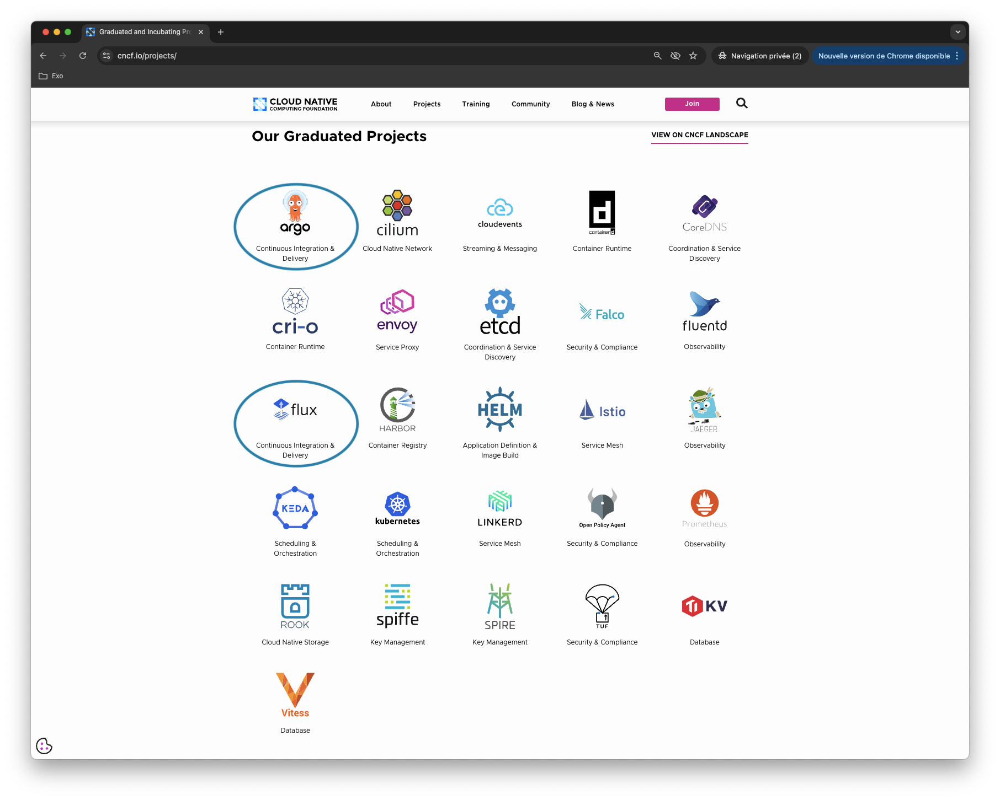

### CI/CD push based

The regular (non GitOps) approach applies YAML manifests to the cluster from outside. For instance, it uses kubectl or helm to create or update applications directly from the CI pipeline. With this approach, credentials (read: kubeconfig) are exposed outside the cluster.

The following illustration (source: WeaveWorks) shows a push based pipeline.

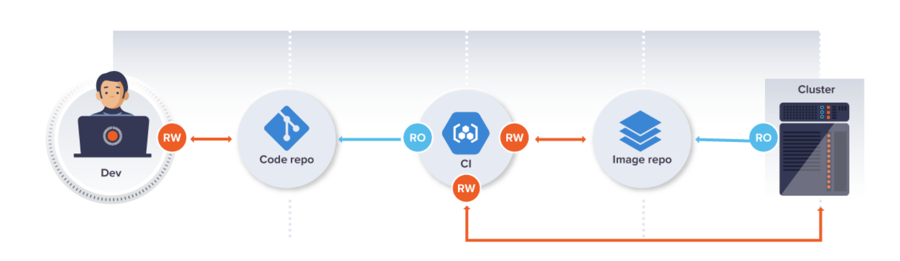

### CI/CD pull based

The GitOps approach is based on Git repositories containing application configuration (YAML, helm, …). An operator running inside the cluster is responsible for the reconciliation. In this approach, specifications are applied to the cluster from inside. Credentials are exposed inside the cluster.

The following illustration (source: WeavveWorks) shows a pull (GitOps) based pipeline.

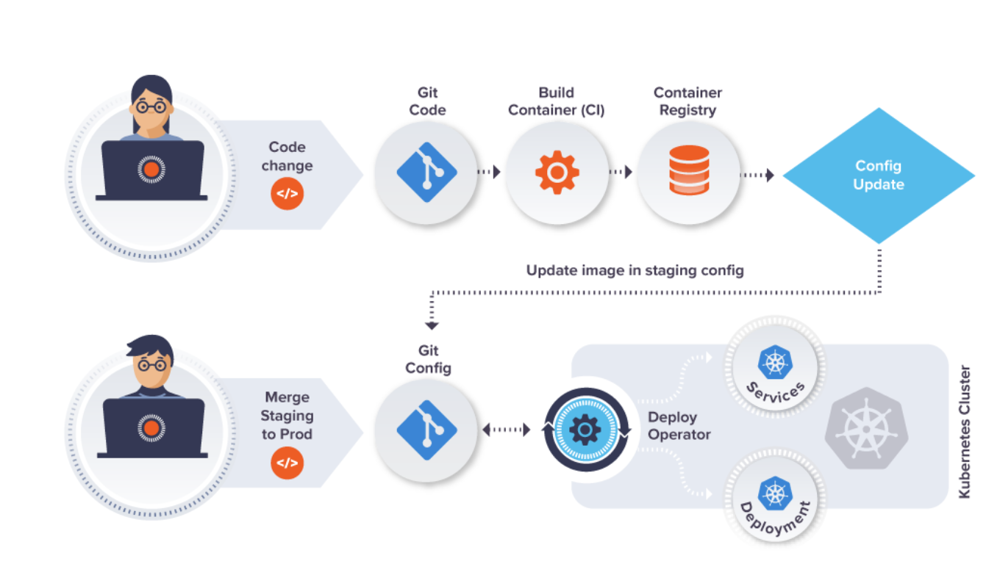

## What is Argo CD ?

Argo CD is a tool from the Argo family which contains:

- Argo CD
- Argo Workflows
- Argo Rollouts
- Argo Events

It is defined as the "Declarative, GitOps continuous delivery tool for Kubernetes".

Internally, it consists of several controllers:  
  
- ApplicationController
- ApplicationSetController
- ProjectController

These controllers manage the following Customer Resources Definitions (CRDs):  
  
- Application represents a deployment of an application in the cluster
- ApplicationSet allows defining multiple Application resources dynamically, it is useful when considering multi-cluster deployment
- AppProject allows grouping Applications and enforce policies on them

The Argo CD's controllers are continuously reconciling the actual state in the cluster with the desired state (what's inside the Git repositories).

Let's install Argo CD and use it to deploy a demo application.

## Installing Argo CD

The preferred way to install Argo CD is using [Helm](https://helm.sh):

``` bash
helm install argocd oci://ghcr.io/argoproj/argo-helm/argo-cd --version 7.6.8 -n argocd --create-namespace
```


In this example, we install Argo CD from the Chart distributed via an OCI registry.


## Access the Argo CD web UI

Once Argo CD is installed we can access the web UI.  
  
First we get the admin password from a Secret created during the installation:

``` bash
kubectl -n argocd get secret argocd-initial-admin-secret -o jsonpath="{.data.password}" | base64 -d
```

Next we expose the UI using a port-forward:

``` bash
kubectl port-forward service/argocd-server -n argocd 8080:443
```

Then we can access the UI (we need to accept the security warning first as a self-signed certificate is used) and use the credentials to log in.

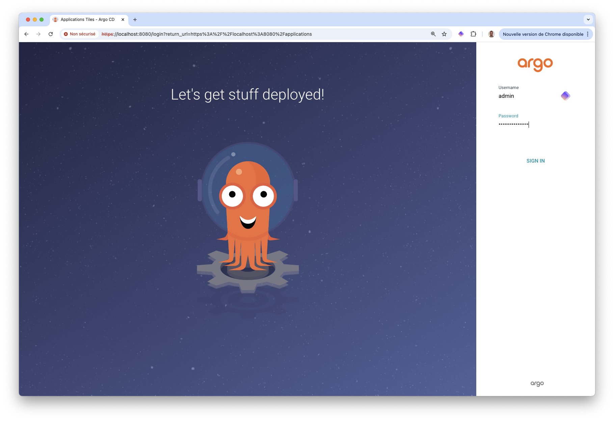

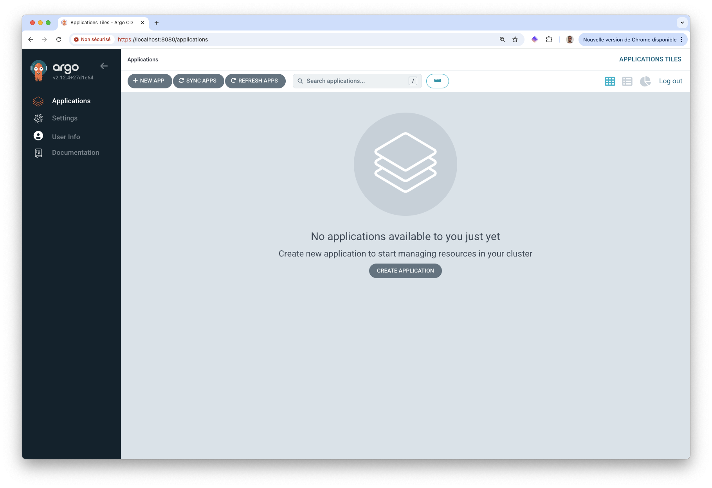

This dashboard is empty as we haven't deployed any applications yet. 

## Creating an Application referencing a Helm chart

An Argo CD Application represents a deployment of an application in the cluster. The following is an example of such an Application:

``` yaml {filename="shapeit.yaml"}
apiVersion: argoproj.io/v1alpha1
kind: Application
metadata:
  name: shapes
  namespace: argocd
  finalizers:
    - resources-finalizer.argocd.argoproj.io
spec:
  project: default
  source:
    repoURL: registry-1.docker.io/lucj
    chart: shapeit
    targetRevision: v1.0.5
    helm:
      releaseName: shapeit
  destination:
    server: https://kubernetes.default.svc
    namespace: shapes
  syncPolicy:
    automated:
      prune: true
      selfHeal: false
    syncOptions:
    - CreateNamespace=true
```

This Application is used to deploy version v1.0.5 of the Helm chart distributed in the DockerHub at registry-1.docker.io/lucj/shapeit. The application packaged in this chart is a simple Python web app.

Going a bit further:  

- *source* contains the definition of the application to deploy 
- *destination* specifies the cluster to deploy the application to. In this case, the cluster is the one running Argo CD
- *syncPolicy* configures the reconciliation process

Let's create this Application

``` bash
kubectl apply -f shapeit.yaml
```

We verify the application is running:

``` bash
$ kubectl get deploy,po,svc -n shapes
NAME                      READY   UP-TO-DATE   AVAILABLE   AGE
deployment.apps/shapeit   1/1     1            1           26s

NAME                          READY   STATUS    RESTARTS   AGE
pod/shapeit-f494c56d7-tnpfw   1/1     Running   0          26s

NAME              TYPE        CLUSTER-IP     EXTERNAL-IP   PORT(S)    AGE
service/shapeit   ClusterIP   10.97.109.19   <none>        5000/TCP   26s
```

The application now appears in the Argo CD dashboard

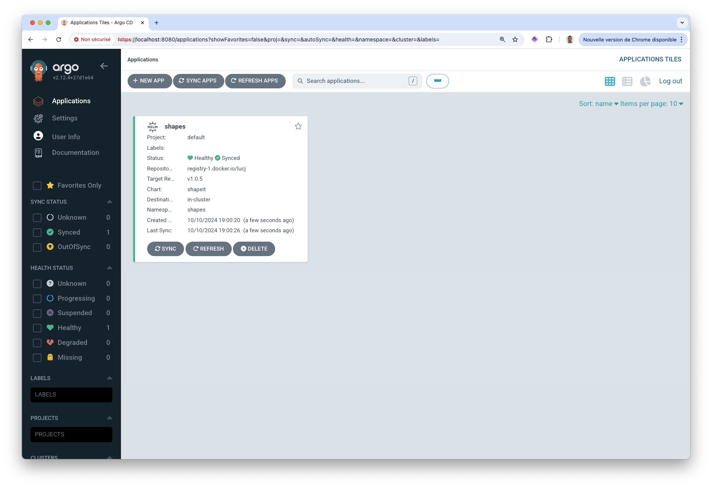

A quick port-forward on the Service allows to access this web app:

``` bash
$ kubectl -n shapes port-forward svc/shapeit 5000:5000
Forwarding from 127.0.0.1:5000 -> 5000
Forwarding from [::1]:5000 -> 5000
```

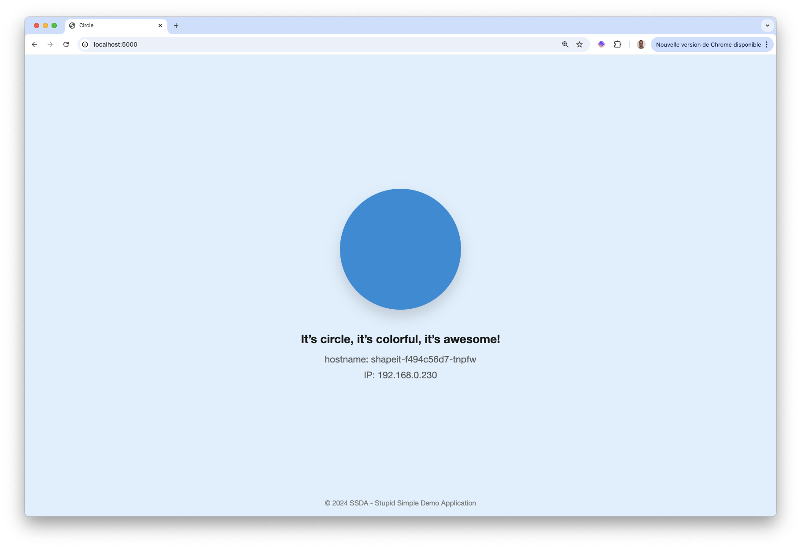

In this example we use Argo CD to deploy an application from an Application resource. You might be thinking, "Why not use Helm to deploy this application directly?". You're right, there's no GitOps involved yet.  

Where Argo CD really shines is in its ability to continuously monitor a Git repository and reconcile the current state of the cluster with the content of the repository, which serves as the source of truth.  

In the following we'll consider another example, but let's remove the Application first.

``` bash
kubectl delete -f shapeit.yaml
```

This automatically removes our demo application.

## Creating an Application referencing a GitLab folder

Let's consider the following GitLab repository to perform some testing: [https://gitlab.com/techwhale/config](https://gitlab.com/techwhale/config). We add the *shapes-deploy.yaml* file inside it, this one defines a Deployment for our demo application.

``` yaml {filename="shapes-deploy.yaml"}
apiVersion: apps/v1
kind: Deployment
metadata:
  name: shapes
  namespace: shapes
spec:
  replicas: 1
  selector:
    matchLabels:
      app: shapes
  template:
    metadata:
      labels:
        app: shapes
    spec:
      containers:
      - image: lucj/shapes:v1.0.7
        name: shapes
```

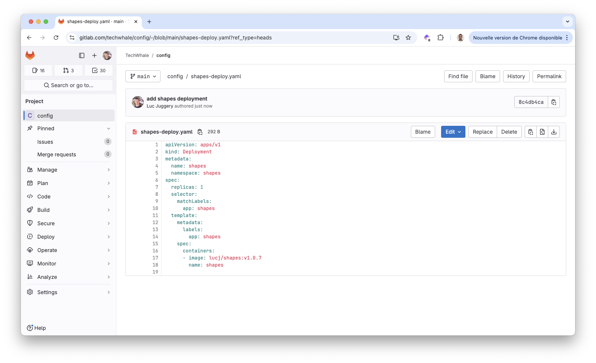

We'll use Argo CD to continuously monitor this repository and automatically apply its content to the cluster. For this purpose, we create the following Argo CD Application. The .spec.source.repoURL property references our GitLab config repository.


``` yaml {filename="app.yaml"}
apiVersion: argoproj.io/v1alpha1
kind: Application
metadata:
  name: app
  namespace: argocd
  finalizers:
    - resources-finalizer.argocd.argoproj.io
spec:
  project: default
  source:
    repoURL: https://gitlab.com/techwhale/config.git
    path: .
    targetRevision: main
  destination:
    server: https://kubernetes.default.svc
  syncPolicy:
    automated:
      prune: true
      selfHeal: false
    syncOptions:
    - CreateNamespace=true
```

```
kubectl apply -f app.yaml
```

This triggers the creation of the Deployment which specification is inside the config repository.

``` bash
$ kubectl -n shapes get po
NAME                      READY   STATUS    RESTARTS   AGE
shapeit-99549969d-g84f6   1/1     Running   0          32s
```

Running a port-forward on that Pod allows to access the web app

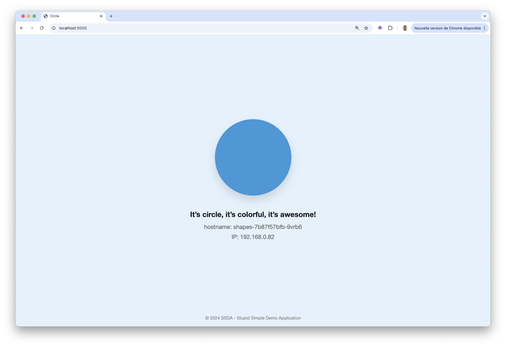

This Argo CD Application detects the changes done in the config repo. Let's illustrate this feature modifying the shapes-deploy.yaml specification. We add 2 environment variables as follows:

``` yaml {filename="shapes-deploy.yaml"}
apiVersion: apps/v1
kind: Deployment
metadata:
  name: shapes
  namespace: shapes
spec:
  replicas: 1
  selector:
    matchLabels:
      app: shapes
  template:
    metadata:
      labels:
        app: shapes
    spec:
      containers:
      - image: lucj/shapes:v1.0.7
        name: shapes
        env:
        - name: SHAPE_TYPE
          value: square
        - name: SHAPE_COLOR
          value: "red"
```

Next we commit and push these changes into git.

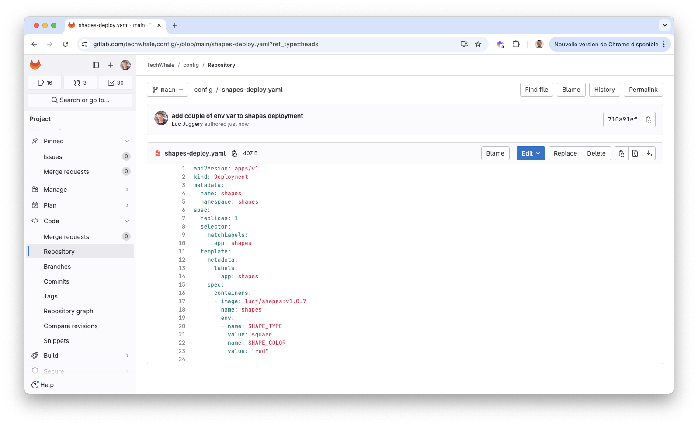

It takes a few tens of seconds to Argo CD to detect the changes. When it does, it updates the Deployment. This triggers the replacement of the Pod.

``` bash
$ kubectl -n shapes get po
NAME                     READY   STATUS    RESTARTS   AGE
shapes-b4b58d984-cldwt   1/1     Running   0          10s
```

Running a port-forward on this new Pod allows to access the web UI and see the new version of the application.

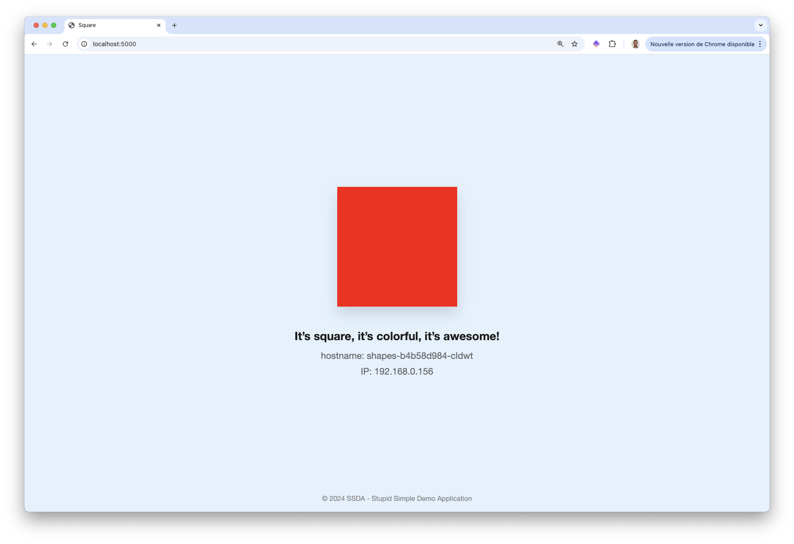

New YAML manifests added in the config repository would automatically be taken into account by Argo CD and deployed in the cluster. The config repository is considered as the source of truth. Every change made in this repository is applied to the cluster by Argo CD, this is the main GitOps principle.

Let's now remove the Argo CD Application

``` bash
kubectl delete -f app.yaml
```

## Quick intro to ApplicationSet

An ApplicationSet allows defining multiple Application resources dynamically, it is useful when considering multi-cluster deployment. For instance, if we have several clusters we can declare them in Argo CD and use an ApplicationSet to deploy the same application in all the clusters at the same time. Also, we could set labels (key / value pairs) on some clusters and use those labels in the ApplicationSet specification (under the *generators*  property) to ensure an application is only deployed on these specific clusters.

Below is an example of an ApplicationSet which is configured to deploy the same shapeit application on all the clusters defined in Argo CD.

``` yaml {filename="applicationset.yaml"}
apiVersion: argoproj.io/v1alpha1
kind: ApplicationSet
metadata:
  name: shapes
  namespace: argocd
spec:
  generators:
    - clusters: {}
  goTemplate: true
  template:
    metadata:
      name: shapes
      finalizers:
        - resources-finalizer.argocd.argoproj.io
    spec:
      project: default
      source:
        repoURL: registry-1.docker.io/lucj
        chart: shapeit
        targetRevision: v1.0.5
        helm:
          releaseName: shapeit
      destination:
        server: '{{ .server }}'
        namespace: shapes
      syncPolicy:
        automated:
          prune: true
          selfHeal: false
        syncOptions:
          - CreateNamespace=true
```

We won't go into further details about ApplicationSets, just keep in mind that they are used for multi-cluster use cases.

## "App Of Apps" pattern

"App of Apps" is a common pattern in the GitOps approach where an application is in charge of deploying other applications. We will illustrate this pattern considering the same [config repository](https://gitlab.com/techwhale/config) as we did previously. This time we add the 3 following specifications inside it:  


  
  ``` yaml
  apiVersion: argoproj.io/v1alpha1
  kind: Application
  metadata:
    name: traefik
    namespace: argocd
    finalizers:
      - resources-finalizer.argocd.argoproj.io
  spec:
    project: default
    source:
      repoURL: https://traefik.github.io/charts
      chart: traefik
      targetRevision: 32.1.0
      helm:
        releaseName: traefik
    destination:
      server: https://kubernetes.default.svc
      namespace: traefik
    syncPolicy:
      automated: {}
      syncOptions:
      - CreateNamespace=true
    ```
  
  
  ``` yaml
  apiVersion: argoproj.io/v1alpha1
  kind: Application
  metadata:
    name: cert-manager
    namespace: argocd
    finalizers:
      - resources-finalizer.argocd.argoproj.io
  spec:
    project: default
    source:
      repoURL: https://charts.jetstack.io
      chart: cert-manager
      targetRevision: v1.13.3
      helm:
        releaseName: cert-manager
        parameters:
          - name: installCRDs
            value: "true"
    destination:
      server: https://kubernetes.default.svc
      namespace: cert-manager
    syncPolicy:
      automated: {}
      syncOptions:
      - CreateNamespace=true
  ```
  
  
  ``` yaml
  apiVersion: apps/v1
  kind: Deployment
  metadata:
    name: shapes
    namespace: shapes
  spec:
    replicas: 1
    selector:
      matchLabels:
        app: shapes
    template:
      metadata:
      labels:
          app: shapes
      spec:
          containers:
          - image: lucj/shapes:v1.0.7
            name: shapes
  ```
  


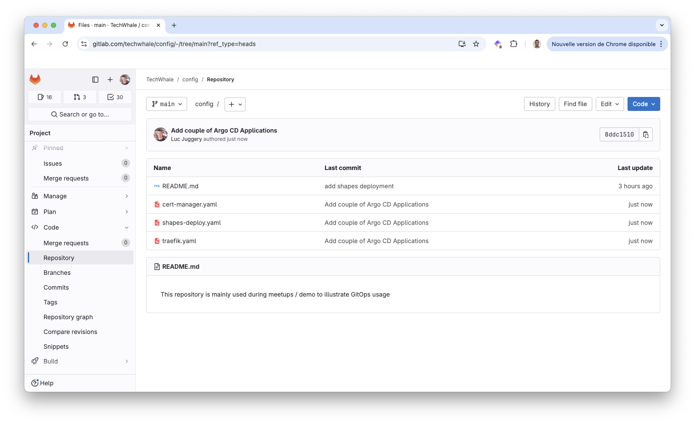

Next we create an Argo CD Application in charge of monitoring this repository:

``` yaml {filename="app-of-app.yaml"}
apiVersion: argoproj.io/v1alpha1
kind: Application
metadata:
  name: app
  namespace: argocd
  finalizers:
    - resources-finalizer.argocd.argoproj.io
spec:
  project: default
  source:
    repoURL: https://gitlab.com/techwhale/config.git
    path: .
    targetRevision: main
  destination:
    server: https://kubernetes.default.svc
  syncPolicy:
    automated:
      prune: true
      selfHeal: false
    syncOptions:
    - CreateNamespace=true
```

``` bash
kubectl apply -f app-of-apps.yaml
```

It takes a few tens of seconds for Argo CD to reconcile the state of the cluster with the content of the Git repository. Then we can see the Applications in the dashboard.

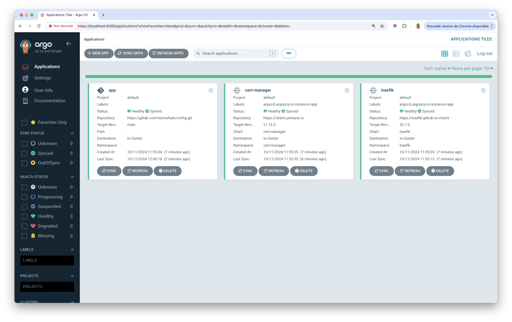

The details of the main Application shows the applications it manages.

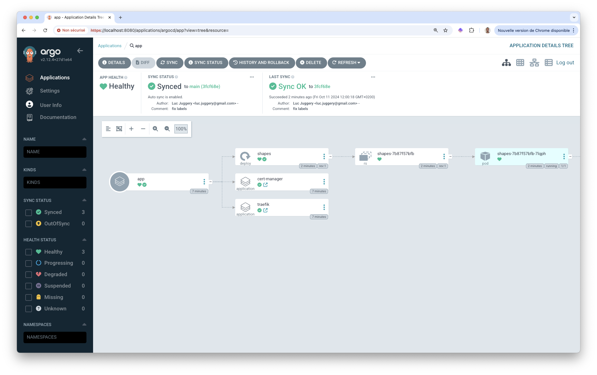


We've only scratched the surface of Argo CD and demonstrated its basic principles. Feel free to explore its [wide range of capabilities](https://argo-cd.readthedocs.io/en/stable/).


## Cleanup

We delete the main app, this triggers the deletion of the managed applications.

``` bash
kubectl delete -f app-of-apps.yaml
```

We can also remove Argo CD

``` bash
helm uninstall argocd -n argocd
```


In a GitOps paradigm, Argo CD can be the only component to install on a fresh cluster. It is responsible to manage all the other applications needed in the cluster.
