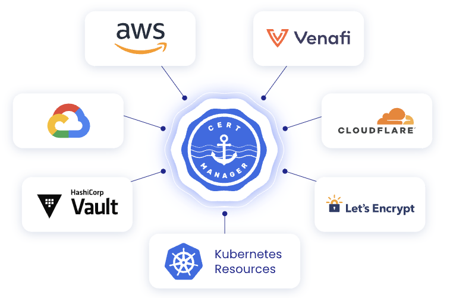
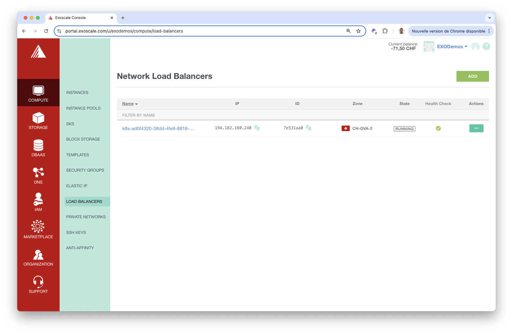
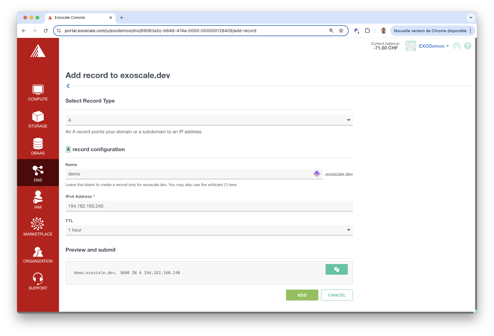
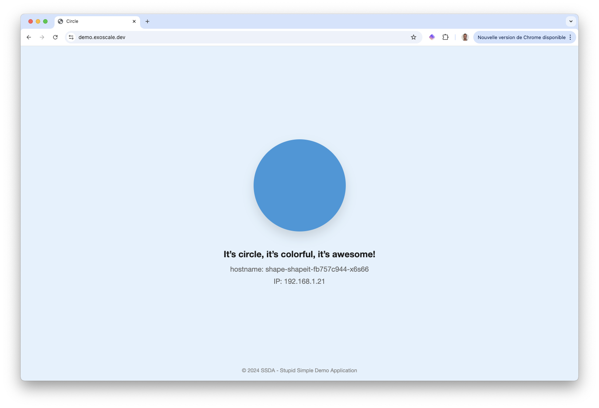

In this section we present [cert-manager](https://cert-manager.io/), a tool commonly used in a Kubernetes cluster to automate the issuance and management of TLS certificates. Cert-Manager can obtain certificates from a variety of issuers.


 

You may not be able to follow the exact same steps described in this section, as it involves the manipulation of DNS entries.However, feel free to adapt it to your own context.


## Prerequisites

We need a Kubernetes cluster and the kubectl binary configured with the cluster's kubeconfig. We also need the helm binary.

## Installing Traefik

First we install a Traefik based Ingress Controller in the cluster:

``` bash
helm repo add traefik https://traefik.github.io/charts
helm install traefik traefik/traefik --version 32.1.1 -n traefik --create-namespace
```

Next we get the IP Address of the LoadBalancer used to expose this Ingress Controller:

``` bash
$ kubectl -n traefik get svc
NAME      TYPE           CLUSTER-IP    EXTERNAL-IP       PORT(S)                      AGE
traefik   LoadBalancer   10.110.8.55   194.182.160.240   80:30989/TCP,443:30760/TCP   75s
```


We can get this IP Address from the Exoscale Portal, in the Compute / Load Balancer menu



Then we create a DNS A record so the *demo.exoscale.dev* domain name resolves to this external IP. The screenshot below illustrates how to create this A record using DNS on the Exoscale platform.



## Installing cert-manager

Next we install cert-manager using Helm:

``` bash
helm repo add cert-manager https://charts.jetstack.io
helm install cert-manager cert-manager/cert-manager --set crds.enabled=true --version 1.16.1 -n cert-manager --create-namespace
```

## About cert-manager CRDs

Cert-manager defines several CRDs, they can be devided in 2 groups:  

- Issuer and ClusterIssuer define the Certificate Authority (CA). An Issuer is scoped to a specific Namespace while a ClusterIssuer is global to the cluster
- Certificate, CertificateRequest, Order and Challenge are the CRDs responsible for requesting and verifying certificates

Let's detail how these CRDs are used in the certificate issuance workflow:  

- first, a certificate is requested using the *Certificate* CRD, it specifies the domain name, the secret holding the certificate's data, and the reference to the *Issuer* or *ClusterIssuer*
- it automatically creates a *CertificateRequest* used by cert-manager to track the certificate issuing process
- the *CertificateRequest* triggers the creation of an *Order*, which defines how the certificate will be obtained from the Certificate Authority (CA)
- then, a *Challenge* is created to verify the ownership of the domain associated with the certificate
- once the *Challenge* is successfully completed, cert-manager retrieves the signed certificate from the CA and stores it in the specified Kubernetes *Secret*

## Definition of an Issuer

We define a *ClusterIssuer*, which is the entity in charge of the certificate generation. In this case, the *ClusterIssuer* is configured to request certificates from the Let's Encrypt Certificate Authority.

``` yaml title="letencrypt-cluster-issuer.yaml"
apiVersion: cert-manager.io/v1
kind: ClusterIssuer
metadata:
  name: letsencrypt
spec:
  acme:
    email: devops@techwhale.io
    server: https://acme-v02.api.letsencrypt.org/directory
    privateKeySecretRef:
      name: acme-account-key
    solvers:
    - http01:
       ingress:
         class: traefik
```

``` bash
kubectl apply -f letencrypt-cluster-issuer.yaml
```

In the next sections we will explore 2 ways to request a certificate.

## Sample application

We consider a simple demo application which is a basic web frontend displaying a colorful geometrical shape. The application code is in this [GitLab group](https://gitlab.com/shape-it), which contains 2 repositories:  

- *www*: source code
- *helm*: Helm packaging of the application

Let's install this application using Helm:

``` bash
helm upgrade --install shape oci://registry-1.docker.io/lucj/shapeit --version v1.0.7 -n shapes --create-namespace
```

By default, it creates a Deployment and a ClusterIP Service. 

``` bash
$ kubectl get deploy,po,svc -n shapes
NAME                            READY   UP-TO-DATE   AVAILABLE   AGE
deployment.apps/shape-shapeit   1/1     1            1           36s

NAME                                READY   STATUS    RESTARTS   AGE
pod/shape-shapeit-fb757c944-x6s66   1/1     Running   0          36s

NAME                    TYPE        CLUSTER-IP      EXTERNAL-IP   PORT(S)    AGE
service/shape-shapeit   ClusterIP   10.107.223.49   <none>        5000/TCP   37s
```

In the next step, we will add an Ingress resource manually and ensure it exposes the application via HTTPS.

## Create certificate manually

First we create the following resource which define a Certificate for domain name *demo.exoscale.dev*:

``` yaml title="shapes-cert.yaml"
apiVersion: cert-manager.io/v1
kind: Certificate
metadata:
  name: shapes
  namespace: shapes
spec:
  secretName: tls-cert
  dnsNames:
  - demo.exoscale.dev
  issuerRef:
    kind: ClusterIssuer
    name: letsencrypt
```

``` bash
kubectl apply -f shapes-cert.yaml
```

We can verify the Certificate, CertificateRequest, Order and Challenge CRDs have been created:

``` bash
$ kubectl -n shapes get certificate
NAME     READY   SECRET     AGE
shapes   False   tls-cert   6s

$ kubectl -n shapes get certificateRequest
NAME       APPROVED   DENIED   READY   ISSUER        REQUESTER                                         AGE
shapes-1   True                False   letsencrypt   system:serviceaccount:cert-manager:cert-manager   12s

$ kubeclt -n shapes get order
NAME                STATE     AGE
shapes-1-37735903   pending   21s

$ kubectl -n shapes get challenge
NAME                           STATE     DOMAIN                 AGE
shapes-1-37735903-2335959476   pending   demo.exoscale.dev   25s
```

It takes a few tens of seconds for the certificate to be Ready. 

``` bash
$ kubectl get Certificate -n shapes
NAME     READY   SECRET     AGE
shapes   True    tls-cert   49s
```

The certificate and the associated private key are stored in the secret specified in the Certificate specification (tls-cert in this case).

Next we create an Ingress resource to forward all the traffic targeting *demo.exoscale.dev* to our demo application. It defines the tls configuration for the *demo.exoscale.dev* domain, referencing the tls-cert Secret containing the certification information.

``` yaml title="shapes-ingress.yaml"
apiVersion: networking.k8s.io/v1
kind: Ingress
metadata:
  name: shapes
  namespace: shapes
spec:
  ingressClassName: traefik
  rules:
  - host: demo.exoscale.dev
    http:
      paths:
      - backend:
          service:
            name: shape-shapeit
            port:
              number: 5000
        path: /
        pathType: ImplementationSpecific
  tls:
  - hosts:
    - demo.exoscale.dev
    secretName: tls-cert
```

```
kubectl apply -f shapes-ingress.yaml
```

Then we can access the application through HTTPS.



Everything is working fine, let's now delete the Certificate and Ingress resource.

```
kubectl delete -f shapes-ingress.yaml -f shapes-cert.yaml
```

In the next section, we will see how to create a certificate without directly using the Certificate CRD.

## Use annotation on an Ingress resource

To automate the process we illustrated above, we can simply use an annotation on the Ingress resource. The following specification defines the Ingress exposing our demo application, it specifies the annotation `cert-manager.io/cluster-issuer: letsencrypt`.

``` yaml title="shapes-ingress.yaml"
apiVersion: networking.k8s.io/v1
kind: Ingress
metadata:
  name: shapes
  namespace: shapes
  annotations:
    cert-manager.io/cluster-issuer: letsencrypt
spec:
  ingressClassName: traefik
  rules:
  - host: demo.exoscale.dev
    http:
      paths:
      - backend:
          service:
            name: shape-shapeit
            port:
              number: 5000
        path: /
        pathType: ImplementationSpecific
  tls:
  - hosts:
    - demo.exoscale.dev
    secretName: shapes-tls
```

```
kubectl apply -f shapes-ingress.yaml
```

Using this specific annotation, which references the ClusterIssuer existing in the cluster, cert-manager automatically create the Certificate for the domain name specified in the Ingress resource.

```
$ kubectl -n shapes get certificate
NAME         READY   SECRET       AGE
shapes-tls   True    shapes-tls   12s
```

We can access the application through HTTPS as we did previously.



We've only illustrated the usage of cert-manager on a simple example. Feel free to explore its features in more details at  [https://cert-manager.io](https://cert-manager.io/).


## Cleanup

We remove our demo application, cert-manager and Traefik ingress controller

```bash
helm uninstall -n shapes shape
helm uninstall -n cert-manager cert-manager
helm uninstall -n traefik traefik
```