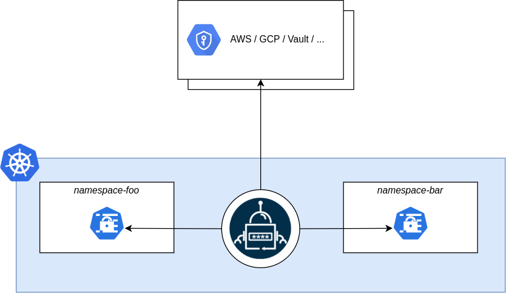
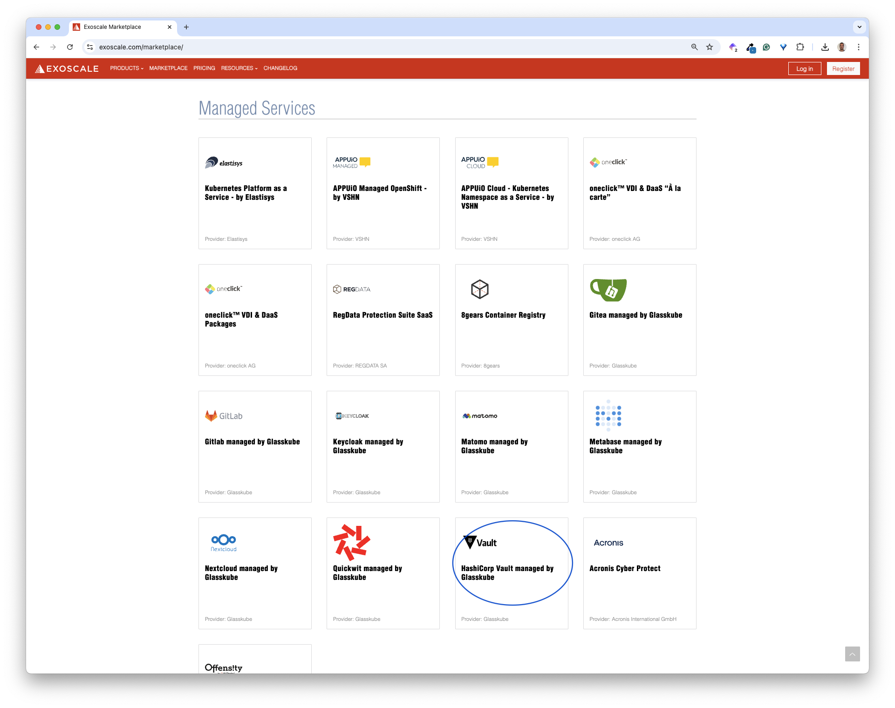

In this section, we present [External Secrets Operator](https://external-secrets.io), a tool that automates the creation of Kubernetes Secrets.


## Prerequisites

We need a Kubernetes cluster. We can create one following [these instructions](../../sks/). We also need the kubectl binary configured with the cluster's kubeconfig, and the helm binary. 

## About External Secrets

External-secret is in charge of creating Kubernetes Secrets from sensitive data stored in secure backends including [HashiCorp Vault](https://www.vaultproject.io/), [Doppler](https://www.doppler.com/), ...



## Installing External Secrets

```bash
helm repo add external-secrets-operator https://charts.external-secrets.io/
helm install external-secrets external-secrets-operator/external-secrets --version 0.12.1 -n external-secret --create-namespace
```

## Using a Secure backend

In this example, we use a [Hashicorp Vault](https://www.vaultproject.io/) instance launched from the [Exoscale Marketplace](https://www.exoscale.com/marketplace/)




We will not go into the details of deploying Vault. Please follow the instructions from [this article](https://www.exoscale.com/syslog/glasskube-vault/) if you want to install Vault in your Exoscale organization.


Next, we save its URL in the VAULT_ADDR environment variable as we will manage it from the command line.

```bash
export VAULT_ADDR=https://vault3.exodemos.exo.gkube.eu
```

We unseal the Vault using the unseal keys provided at launch time.

```bash
vault operator unseal
```

Next, we log in using the ROOT token.

```bash
vault login 
```

Then, we create a new kv secrets engine mounted at *my-app*.


We use the newest, version 2, kv secrets engine, which allows versioning. 


```bash
$ vault secrets enable -path=my-app -version=2 kv
Success! Enabled the kv secrets engine at: my-app/
```

In the next section, we'll store sensitive data in this secret engine.

## Storing a piece of data in Vault

We create a secret containing the admin password of our application.

```bash
$ vault kv put my-app/admin password=45Ssdfljkshd4r

== Secret Path ==
my-app/data/admin

======= Metadata =======
Key                Value
---                -----
created_time       2025-01-21T19:32:29.396078149Z
custom_metadata <nil>
deletion_time      n/a
destroyed          false
version            1
```

Next, we define a policy allowing read access to the data within the *my-app* kv secrets engine.

```hcl {filename="policy.hcl"}
path "my-app/data/admin" {
 capabilities = ["read"]
}
```

Next, we create this policy.

```bash
$ vault policy write my-app-readonly policy.hcl

Success! Uploaded policy: my-app-readonly
```

Then, create a token attached to this policy.

```bash
$ vault token create -policy=my-app-readonly

Key                  Value
---                  -----
token                hvs.CAESILb6Gfc9vJhJcG-iPIUAoVOxCpd2KFF2V128wSLG4O2HGh4KHGh2cy5hRGtQcDFzZU5taWtBTHpzV293ZE5MWGs
token_accessor       eapSkHp5lUglAp637ZYPUhX8
token_duration       768h
token_renewable      true
token_policies ["default" "my-app-readonly"]
identity_policies []
policies ["default" "my-app-readonly"]
```

Then, we log in using this token.

```bash
vault login
```


We also save this token in the VAULT_TOKEN environment variable.

```bash
export VAULT_TOKEN="hvs.CAESILb6Gfc9vJhJcG-iPIUAoVOxCpd2KFF2V128wSLG4O2HGh4KHGh2cy5hRGtQcDFzZU5taWtBTHpzV293ZE5MWGs"
```


Finally, we verify we can read the content of the secret.

```bash
$ vault kv get my-app/admin

== Secret Path ==
my-app/data/admin

======= Metadata =======
Key                Value
---                -----
created_time       2025-01-21T19:32:29.396078149Z
custom_metadata <nil>
deletion_time      n/a
destroyed          false
version            1

====== Data ======
Key         Value
---         -----
password    45Ssdfljkshd4r
```

## Creating a Secret Store

Now, we need to tell external-secrets where to fetch sensitive data.

First, we create a Kubernetes Secret containing the token to access Vault.

```bash
kubectl create secret generic vault-token --from-literal=token=$VAULT_TOKEN
```

Next, we create a SecretStore and specify where the secrets are stored. In this example, they are stored in Vault running at a specific URL.

```bash
cat <<EOF | kubectl apply -f -
apiVersion: external-secrets.io/v1beta1
kind: SecretStore
metadata:
  name: vault
spec:
  provider:
    vault:
      server: "${VAULT_ADDR}"
      path: my-app
      version: "v2"
      auth:
        tokenSecretRef:
          name: "vault-token"
          key: "token"
EOF
```

## Testing

Since External-secret is in charge of creating a Kubernetes Secret from a resource of type ExternalSecret, we first define the specification of an ExternalSecret as follows. 

```yaml {filename="external-secret.yaml"}
apiVersion: external-secrets.io/v1beta1
kind: ExternalSecret
metadata:
  name: example
spec:
  refreshInterval: "15s"
  secretStoreRef:
    name: Vault
    kind: SecretStore
  target:
    name: example
  data:
 - secretKey: password
    remoteRef:
      key: my-app/data/admin
      property: password
```

Next, we create the resource.

```bash
kubectl apply -f external-secret.yaml
```

Using this CRD, external-secrets will trigger the creation of a Kubernetes Secret containing the *password* set at *my-app/admin*.

In the background, this creates a Kubernetes Secret named *example*.
```bash
$ kubectl get secret
NAME          TYPE     DATA   AGE
example       Opaque   1      5s     # <-- This one
vault-token   Opaque   1      7m
```

This secret has the property *password* in its data section.

```bash
$ kubectl describe secret example
Name:         example
Namespace:    default
Labels:       reconcile.external-secrets.io/created-by=45b719e2f6ed40358b2fb7face01965d
Annotations:  reconcile.external-secrets.io/data-hash: 3013839b15f8dcff348bbaf62d71a39f

Type:  Opaque

Data
====
password:  14 bytes
```

Decoding the value, we verify it contains the password stored in Vault.

```bash
$ kubectl get secret example -o jsonpath='{.data.password}' | base64 --decode
45Ssdfljkshd4r
```

## Key takeaways

This example highlights how the External Secrets Operator creates a bridge between Vault and Kubernetes by
automatically generating and updating standard Kubernetes Secrets based on the Vault data. This enables a workflow where teams can manage sensitive information centrally in Vault and applications can request specific secrets through ExternalSecret resources.