In this section we present [kube-prometheus-stack](https://artifacthub.io/packages/helm/prometheus-community/kube-prometheus-stack), a collection of components used to monitor a Kubernetes cluster. It based on the [Prometheus Operator](https://github.com/prometheus-operator/prometheus-operator) which is responsible for managing and automating the deployment, configuration and operation of Prometheus instances on a Kubernetes cluster.

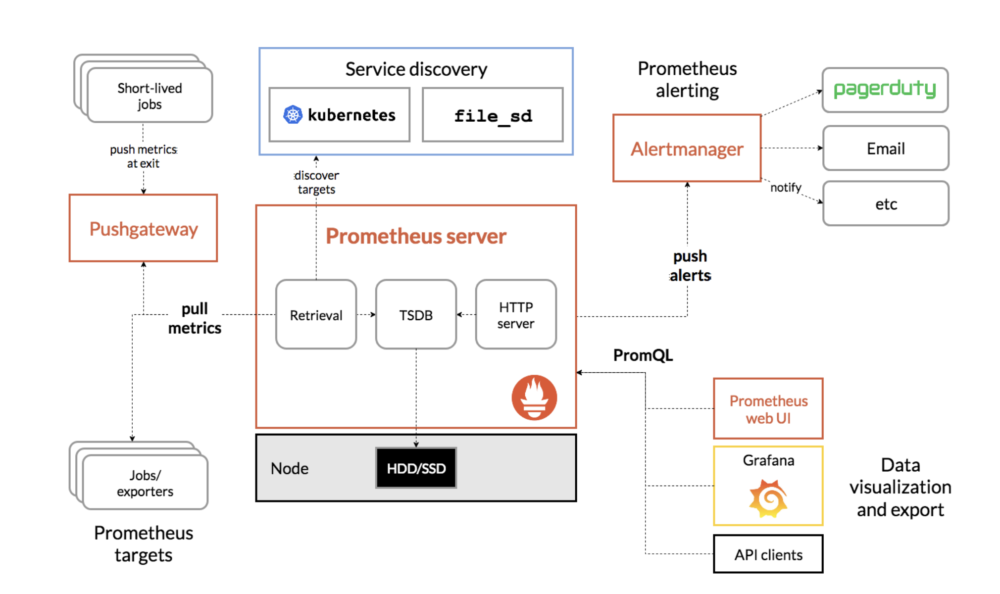
 
## Prerequisites

We need a Kubernetes cluster and the kubectl binary configured with the cluster's kubeconfig. We also need the helm binary.

## About the metrics in Kubernetes

### Several metrics to collect

In a Kubernetes cluster, we can get metrics at different levels:

- Cluster metrics (CPU, RAM, Disk, Network) and metrics related to its state (number of Nodes, Pods, etc.)
- Internal metrics related to the Control Plane (API Server, Scheduler, Controller, Etcd)
- Node metrics provide information about CPU, RAM, Disk and Network for each node
- Pod / Container metrics to assist with scheduling
- Application metrics are used to monitor the health of applications (Request Rate, Error Rate, etc.)

### Several sources of metrics

Different components are in charge of exposing those metrics:  

- cAdvisor, integrated in kubelet, exposes metrics for containers (CPU, RAM, IO)
- Metrics Server aggregates resource usage across the cluster. It is used by the Horizontal Pod Autoscaler (HPA) resource and accessible via ```kubectl top```
- Kubernetes API Server exposes critical metrics such as Request Rate, Error Rate, and Duration (RED metrics)
- Node Exporters are Prometheus exporters that monitor node-level metrics (CPU, RAM, storage, I/O, etc.)
- Kube-state-metrics is an agent that generates metrics related to cluster resources (Deployment, Pod, Node, etc.)

## About the Prometheus Operator

The [Prometheus Operator](https://github.com/prometheus-operator/prometheus-operator) manages
Prometheus instances using several CRDs:  

- Prometheus: defines a Prometheus instance
- PrometheusRule: defines alerting rules for Prometheus
- Alertmanager: defines an AlertManager instance, it is used to manage alerts sent from Prometheus and handles alert deduplication, grouping, and routing.
- ServiceMonitor: specifies how to monitor a set of Services in the cluster
- PodMonitor: specifies how to monitor a set of Pods in the cluster 
- Probe: defines to monitor external endpoints
- ThanosStore / ThanosRuler / ThanosQuerier: used to configure Thanos related components if installed alongside the Prometheus Operator


Thanos is a tool used to provide long-term storage to Prometheus metrics, it also facilitates querying and aggregating metrics from multiple Prometheus instances.


## About the Kube Prometheus Stack

The [Kube Prometheus Stack](https://artifacthub.io/packages/helm/prometheus-community/kube-prometheus-stack) is maintained by the Prometheus community. It deploys several components in a cluster:  

- The Prometheus Operator
- Prometheus: the Prometheus instance in charge of collection metrics from several sources
- Alertmanager: the components in charge of generating alerts based on user defined queries
- Grafana: the web frontend used to visualize and query metrics
- Kube-state-metrics: agent generating metrics related to cluster resources
- Node Exporter: agent running on each node, it is responsible for exposing metrics related to the specific node 


Several types of metrics are exposed by different components for Prometheus to scrape on a specified intervals


## Installing the kube-prometheus-stack

First we add the Helm repository:

``` bash
helm repo add prometheus-community https://prometheus-community.github.io/helm-charts
helm repo update
```

Next we install the Chart in a dedicated namespace:

``` bash
helm install kube-prometheus prometheus-community/kube-prometheus-stack -n monitoring --create-namespace
```

Then we verified the Prometheus related Pods are up and running:

``` bash
kubectl get po -n monitoring
NAME                                                     READY   STATUS    RESTARTS   AGE
alertmanager-kube-prometheus-kube-prome-alertmanager-0   2/2     Running   0          2m
kube-prometheus-grafana-7cf7bd5cc5-kmr2j                 3/3     Running   0          2m
kube-prometheus-kube-prome-operator-7bf7dd6849-8khxt     1/1     Running   0          2m
kube-prometheus-kube-state-metrics-74d9467f6f-mdl4h      1/1     Running   0          2m
kube-prometheus-prometheus-node-exporter-9gsw6           1/1     Running   0          2m
kube-prometheus-prometheus-node-exporter-p9npm           1/1     Running   0          2m
kube-prometheus-prometheus-node-exporter-q29v5           1/1     Running   0          2m
prometheus-kube-prometheus-kube-prome-prometheus-0       2/2     Running   0          2m
```

We can also get the list of the Services exposing these Pods:

``` bash
$ kubectl get svc -n monitoring
NAME                                       TYPE        CLUSTER-IP      EXTERNAL-IP   PORT(S)                      AGE
alertmanager-operated                      ClusterIP   None            <none>        9093/TCP,9094/TCP,9094/UDP   2m
kube-prometheus-grafana                    ClusterIP   10.101.85.104   <none>        80/TCP                       2m
kube-prometheus-kube-prome-alertmanager    ClusterIP   10.98.24.48     <none>        9093/TCP,8080/TCP            2m
kube-prometheus-kube-prome-operator        ClusterIP   10.99.71.116    <none>        443/TCP                      2m
kube-prometheus-kube-prome-prometheus      ClusterIP   10.98.132.63    <none>        9090/TCP,8080/TCP            2m
kube-prometheus-kube-state-metrics         ClusterIP   10.99.24.226    <none>        8080/TCP                     2m
kube-prometheus-prometheus-node-exporter   ClusterIP   10.101.25.73    <none>        9100/TCP                     2m
prometheus-operated                        ClusterIP   None            <none>        9090/TCP                     2m
```

## Access Prometheus web UI

To access the Prometheus web interface we use ```kubectl port-forward```

``` bash
kubectl -n monitoring port-forward svc/kube-prometheus-kube-prome-prometheus 9090:9090
```

The dashboard is available on [http://localhost:9090](http://localhost:9090)

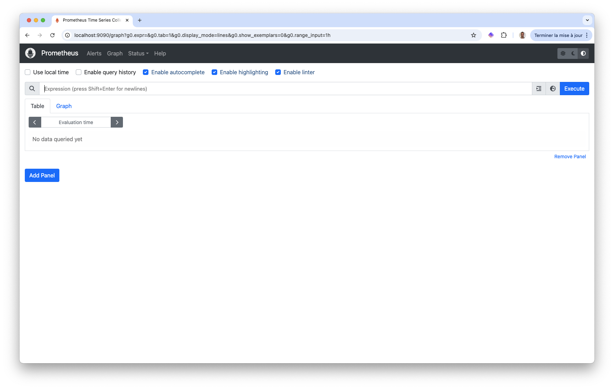

In the free text field, we can select the metrics we want to display the evolution of. We can also enter advanced [PromQL](https://prometheus.io/docs/prometheus/latest/querying/basics/) expressions.

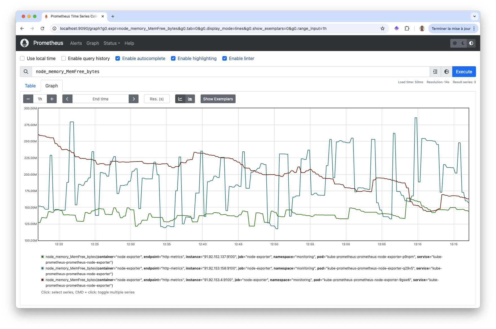


Prometheus provides a functional query language called PromQL (Prometheus Query Language) that lets the user select and aggregate time series data in real time..


The Alerts tab provides an overview of the default Prometheus Alerts (the ones defines when installing the Kube Prometheus Stack)

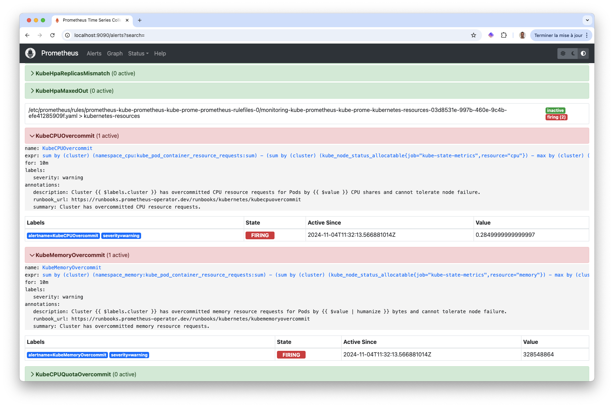

## Access Grafana web UI

To visualize the evolution of metrics, we usually use [Grafana](https://grafana.com), it provides a clean, easy to use, extensible web interface. To access the Grafana web interface we use ```kubectl port-forward``` as we've done previously.

``` bash
kubectl -n monitoring port-forward svc/kube-prometheus-grafana 8080:80
```

The dashboard is available on [http://localhost:8080](http://localhost:8080)

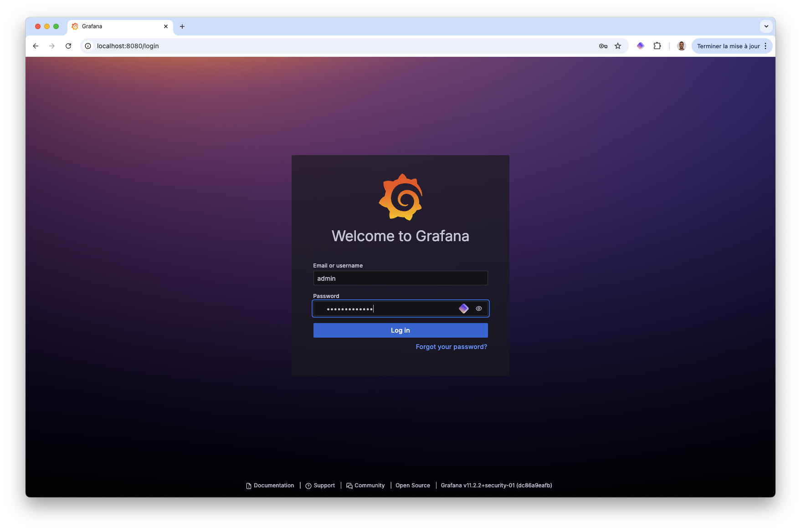

Using the default credentials (admin / prom-operator) we can log in.

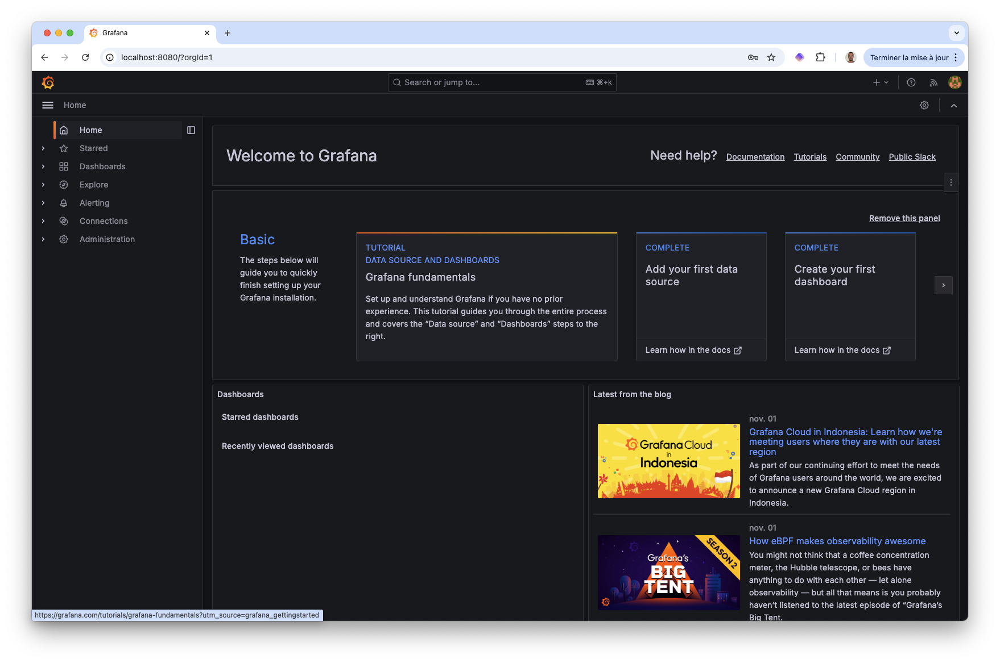

Several Grafana dashboards are provided out of the box when installing the Kube Prometheus Stack

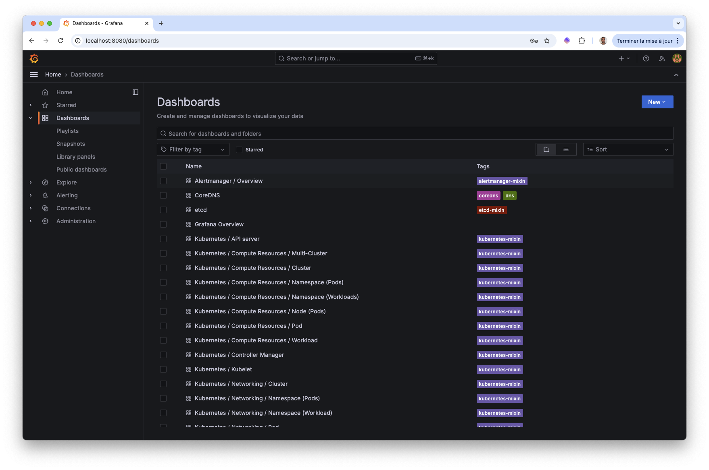

The following illustrates the "Kubernetes / Compute Resources / Cluster" dashboard; it provides many indicators and graphics to show the evolution of single and aggregated metrics.

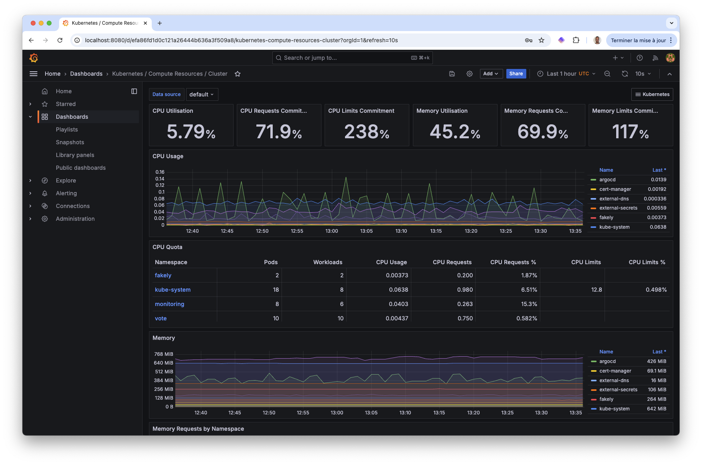

The "Explore / Metrics" menu is very handy as it displays the evolution of all the metrics in just one click.

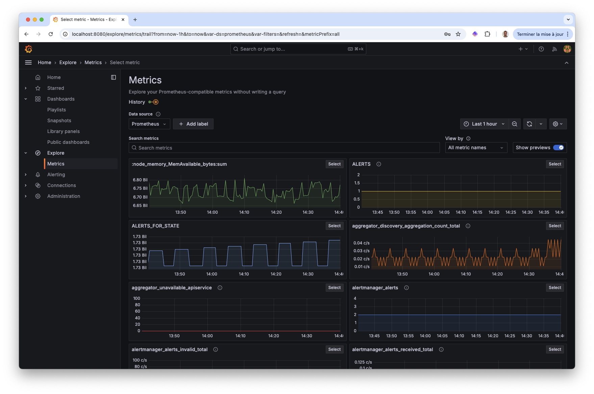

Grafana also has a built-in alerting system. It allows you to visualize the alerts created from PrometheusRules and enables the creation of Grafana alerts directly through the web interface. The Screenshot below displays the Prometheus alerts.

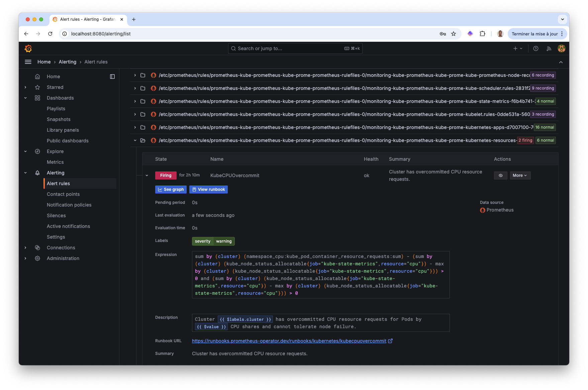


Grafana alerts system is very handy, however, AlertManager is recommended for Prometheus based alerting as it is more deeply integrated with Prometheus, and it is better for complex Kubernetes monitoring needs.


Grafana is a very powerful tool and we've only scratched its surface. Feel free to explore it on your own.

## Access AlertManager web UI

The Kube Prometheus Stack also comes with AlertManager, a component of the Prometheus ecosystem dedicated to the management of alerts. From the official website: "The Alertmanager handles alerts sent by client applications such as the Prometheus server. It takes care of deduplicating, grouping, and routing them to the correct receiver integration such as email, PagerDuty, or OpsGenie. It also takes care of silencing and inhibition of alerts."

To access the AlertManager web interface we use ```kubectl port-forward``` as we've done previously.

```bash
kubectl -n monitoring port-forward svc/kube-prometheus-kube-prome-alertmanager 9093:9093
```

The dashboard is available on [http://localhost:9093](http://localhost:9093)

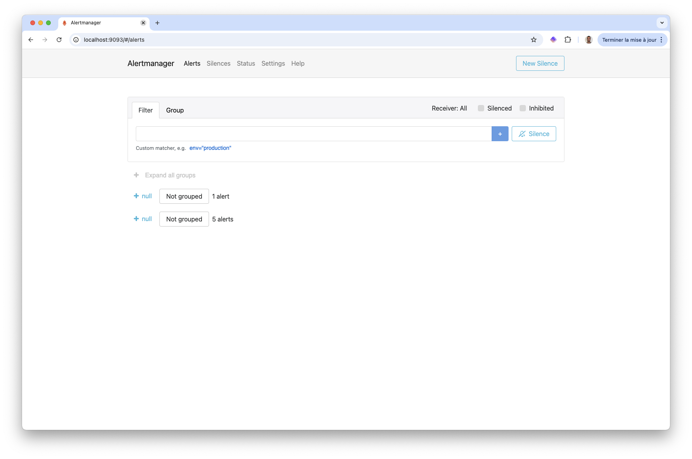

AlertManager allows filtering alerts based on their applied labels. Several actions can be configured, such as sending these alerts to specific receivers. We will not dive into the details of AlertManager here. For an in-depth look of the main concept, feel free to explore the official [documentation](https://prometheus.io/docs/alerting/latest/alertmanager/).

## Key takeaways

A monitoring stack is one of the first components to deploy on a Kubernetes cluster. It ensures that the cluster and its applications are running fine and sends alerts if any issues arise. The kube-prometheus-stack is an excellent solution that can be easily installed using Helm and provides many useful features out of the box.

## Cleanup

Once we are done we can remove the kube-prometheus-stack:

```bash
helm -n monitoring uninstall kube-prometheus
```